# Course Map

---

> **Course Objective**
>
> Use this map to understand why the modules appear in this order, what evidence each module must produce, and when a learner is ready to continue.

## Module Path

| Module | Why it exists | Progress gate |
|---|---|---|
| [00. Orientation, Safety, Lab Architecture, and Course Map](../modules/00-orientation/README.md) | Build and validate the reusable Windows malware research lab, toolchain, workspace, safety boundaries, snapshots, and evidence workflow that every later hands-on lesson depends on. | validated lab environment with VM inventory, isolated network notes, baseline snapshots, installed tool checklist, repository workspace, evidence notebook structure, and first benign build-run-inspect smoke test |
| [01. Windows Internals and Native Development Foundations](../modules/01-windows-foundations/README.md) | Build native Windows, C, memory, PE, loader, debugging, and assembly foundations required for every later module. | source-to-runtime evidence pack showing source code, build artifacts, PE structure, loaded image, memory regions, and debugger observations |
| [02. PE Loading, Shellcode, and Payload Execution Fundamentals](../modules/02-payload-execution/README.md) | Teach how executable logic is represented, stored, transformed, prepared, and executed in a controlled local lab. | payload lifecycle diagram and evidence notes explaining storage, transformation, memory preparation, control transfer, observations, and cleanup |
| [03. Code Injection, Remote Execution, and Manual Loading](../modules/03-injection-loading/README.md) | Teach remote-process interaction and injection/loading families as controlled mechanics with prerequisites, tradeoffs, and observable side effects. | compare remote execution families by prerequisites, execution trigger, memory model, stability, artifacts, and validation method |
| [04. Static Stealth, Import Obfuscation, and Anti-Analysis Fundamentals](../modules/04-static-stealth-anti-analysis/README.md) | Teach how binaries change their static shape, how analysts triage them, and why static stealth is limited. | before/after static triage report explaining what changed, what did not change, what an analyst can still infer, and what requires runtime validation |
| [05. Security Telemetry and Detection Surfaces](../modules/05-telemetry-detection-surfaces/README.md) | Teach what defenders, analysts, and endpoint security products observe so learners understand detection surfaces before advanced evasion claims. | telemetry matrix for representative behaviors from Modules 02-04, separating direct observations, inferences, and validation steps |
| [06. Advanced Execution Paths, Syscalls, Unhooking, Patchless Concepts, and Threadless Patterns](../modules/06-advanced-execution-evasion/README.md) | Teach advanced execution-path ideas as engineering tradeoffs, with emphasis on assumptions, fragility, portability, and observable side effects. | advanced execution tradeoff review explaining what each path changes, what it does not change, what can still be observed, and why complexity may not be justified |
| [07. Implant Architecture, Staging, Profiles, and C2 Design](../modules/07-implant-architecture-c2/README.md) | Shift learners from isolated mechanisms to implant-system design using local-only, controlled architecture exercises. | local-only beacon simulation architecture with component boundaries, task schema, config model, timing model, and observability review |
| [08. Persistence, Sideloading, and Launch Chains](../modules/08-persistence-launch-chains/README.md) | Teach re-execution, launch chains, and trusted-loading concepts as architectural choices with residue, cleanup, and safety costs. | persistence and launch-chain design review including purpose, mechanism family, residue, cleanup, telemetry, and justification |
| [09. Runtime Stealth, Sleep Obfuscation, and In-Memory Survival](../modules/09-runtime-stealth/README.md) | Teach how runtime behavior and memory state change over time, especially during idle periods. | active/idle runtime state timeline with memory observations, timing behavior, residual signals, and validation limits |
| [10. Full Implant Architecture and Capstone Project](../modules/10-capstone/README.md) | Integrate all prior modules into a controlled, local-only reference architecture and evaluate reasoning, not real-world deployability. | final evidence pack with architecture diagram, component map, lab notes, telemetry matrix, safety review, analyst review, and design defense |

---

## Dependency Flow

| From | To | Dependency carried forward |
|---|---|---|
| 00 | 01 | Advanced maldev topics are not understandable without process, memory, binary, and debugger literacy. |
| 01 | 02 | Learners now understand PE files, memory, and debugging. They are ready to reason about payload forms and local execution. |
| 02 | 03 | Learners now understand local payload execution and Windows process/memory foundations. |
| 03 | 04 | Learners understand payloads and loading. They can now reason about what binaries reveal before and during early execution. |
| 04 | 05 | Learners have seen payloads, injection, and static stealth. They now need a defender visibility model. |
| 05 | 06 | Learners first need telemetry foundations before claims about evasion can make sense. |
| 06 | 07 | Learners now understand execution, loading, static visibility, telemetry, and advanced path tradeoffs. |
| 07 | 08 | Persistence makes sense after learners understand what an implant lifecycle is preserving. |
| 08 | 09 | Learners understand execution, telemetry, implant architecture, and lifecycle controls. |
| 09 | 10 | Learners now have the foundations, execution models, telemetry reasoning, architecture concepts, persistence tradeoffs, and runtime-state models needed for synthesis. |

---

## Course Spine

```mermaid
flowchart LR
    M00["00 Safety and Lab"] --> M01["01 Windows Foundations"] --> M02["02 Payload Execution"] --> M03["03 Injection and Loading"]
    M03 --> M04["04 Static Stealth"] --> M05["05 Telemetry"] --> M06["06 Advanced Execution"]
    M06 --> M07["07 Implant Architecture"] --> M08["08 Persistence"] --> M09["09 Runtime Stealth"] --> M10["10 Capstone"]
```

---

## Readiness Rule

A module is complete only when the learner can explain:

- what they inspected or built
- which artifacts changed on disk
- which state changed in memory or runtime behavior
- what evidence supports each conclusion
- what remains inference
- what cleanup or reset was performed
