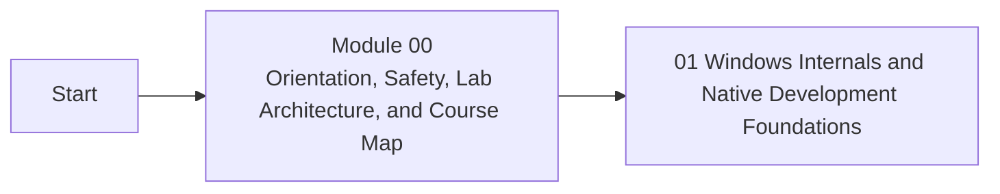

<div align="center">

# Module 00 - Orientation, Safety, Lab Architecture, and Course Map

*Build and validate the reusable Windows malware research lab, toolchain, workspace, safety boundaries, snapshots, and evidence workflow that every later hands-on lesson depends on.*

</div>

---

> **Start Here**
>
> Work through the lessons in order, complete the lab, then submit the module checkpoint evidence. Keep this module local-only, snapshot-backed, and evidence-driven.

## At a Glance

| Area | Details |
|---|---|
| Course | Malware Development and Implant Engineering |
| Module | 00 - Orientation, Safety, Lab Architecture, and Course Map |
| Role | Build and validate the reusable Windows malware research lab, toolchain, workspace, safety boundaries, snapshots, and evidence workflow that every later hands-on lesson depends on. |
| Why here | The rest of the course is hands-on. Learners need a working isolated lab, installed tools, repeatable folders, and a smoke-tested build-run-inspect loop before abstract concepts will make sense. |
| Prepares next | Module 01 native Windows development and every later build, run, debug, inspect, telemetry, and cleanup exercise. |

| Builds On | Core Artifact | Safety Boundary |
|---|---|---|
| Course entry, safety orientation, and learner-owned lab commitment | validated lab environment with VM inventory, isolated network notes, baseline snapshots, installed tool checklist, repository workspace, evidence notebook structure, and first benign build-run-inspect smoke test | Local-only or isolated lab artifacts |

---

## Module Position



---

## Lesson Path

| Lesson | Role in the Journey | Required practice |
|---|---|---|
| [0.1 - What Malware Development Means in This Course](lessons/module-00-lesson-0-1-what-malware-development-means-in-this-course.md) | Define controlled malware research and implant engineering education, not unauthorized operations | personal scope statement and hands-on boundary statement |
| [0.2 - Legal, Ethical, and Operational Safety Boundaries](lessons/module-00-lesson-0-2-legal-ethical-and-operational-safety-boundaries.md) | Make responsible use, allowed targets, network boundaries, and lab-only execution rules explicit before hands-on work | safety boundary checklist and allowed-target inventory |
| [0.3 - Building the Malware Research Lab](lessons/module-00-lesson-0-3-building-the-malware-research-lab.md) | Install or validate the Windows analysis VM, isolated network, folder layout, and snapshot workflow | VM inventory, isolated network proof, and snapshot table |
| [0.4 - Developer Environment and Tooling Workflow](lessons/module-00-lesson-0-4-developer-environment-and-tooling-workflow.md) | Install and verify compilers, editors, debuggers, PE tools, process tools, and telemetry utilities | tool installation checklist and version notes |
| [0.5 - Repository Workspace, Evidence Notebook, and Artifact Discipline](lessons/module-00-lesson-0-5-repository-workspace-evidence-notebook-and-artifact-discipline.md) | Create the repeatable course workspace, evidence folders, source-code folders, screenshot paths, and observation notes used in every module | repository workspace and evidence notebook template |
| [0.6 - First Build-Run-Inspect Smoke Test](lessons/module-00-lesson-0-6-first-build-run-inspect-smoke-test.md) | Compile and run a benign Windows program, inspect its PE shape and process state, and prove the lab can support Module 01 | benign build output, PE inspection note, process observation, and cleanup note |
| [0.7 - Course Roadmap and Lab Readiness Gate](lessons/module-00-lesson-0-7-course-roadmap-and-lab-readiness-gate.md) | Show why the course is ordered the way it is and confirm the lab is ready for hands-on work | annotated dependency map and readiness sign-off |

---

## Hands-On Requirement

Module 00 is complete only when the learner has a working isolated Windows lab, installed tools, baseline snapshots, a reusable `maldev-lab/` workspace, and proof that a benign program can be built, run, inspected, documented, cleaned up, and reset.

Use this loop throughout the module:

```text
build or prepare -> run or simulate -> inspect -> interpret -> clean up
```

---

## Learning Arcs

### Arc 00A - Course Frame and Safety

| Lesson | Title | Purpose | Practice |
|---|---|---|---|
| 0.1 | What Malware Development Means in This Course | Define controlled malware research and implant engineering education, not unauthorized operations | personal scope statement and hands-on boundary statement |
| 0.2 | Legal, Ethical, and Operational Safety Boundaries | Make responsible use, allowed targets, network boundaries, and lab-only execution rules explicit before hands-on work | safety boundary checklist and allowed-target inventory |

### Arc 00B - Lab and Learning Workflow

| Lesson | Title | Purpose | Practice |
|---|---|---|---|
| 0.3 | Building the Malware Research Lab | Install or validate the Windows analysis VM, isolated network, folder layout, and snapshot workflow | VM inventory, isolated network proof, and snapshot table |
| 0.4 | Developer Environment and Tooling Workflow | Install and verify compilers, editors, debuggers, PE tools, process tools, and telemetry utilities | tool installation checklist and version notes |
| 0.5 | Repository Workspace, Evidence Notebook, and Artifact Discipline | Create the repeatable course workspace, evidence folders, source-code folders, screenshot paths, and observation notes used in every module | repository workspace and evidence notebook template |

### Arc 00C - Roadmap and Readiness

| Lesson | Title | Purpose | Practice |
|---|---|---|---|
| 0.6 | First Build-Run-Inspect Smoke Test | Compile and run a benign Windows program, inspect its PE shape and process state, and prove the lab can support Module 01 | benign build output, PE inspection note, process observation, and cleanup note |
| 0.7 | Course Roadmap and Lab Readiness Gate | Show why the course is ordered the way it is and confirm the lab is ready for hands-on work | annotated dependency map and readiness sign-off |

---

## Required Artifacts

| Artifact | Path |
|---|---|
| Module lab | [labs/module-00-lab-01-lab-installation-tooling-and-readiness-gate.md](labs/module-00-lab-01-lab-installation-tooling-and-readiness-gate.md) |
| Module checkpoint | [checkpoints/module-00-checkpoint.md](checkpoints/module-00-checkpoint.md) |
| Reference cheat sheet | [references/module-00-reference-cheat-sheet.md](references/module-00-reference-cheat-sheet.md) |
| Gap analysis | [references/module-00-gap-analysis.md](references/module-00-gap-analysis.md) |

## Optional Deep Dives

- No optional deep dives in the core scaffold.

Deep dives are optional. They should not block the core path.

---

## Module Navigation

| Previous | Next |
|---|---|
| Start | [01 - Windows Internals and Native Development Foundations](../01-windows-foundations/README.md) |
