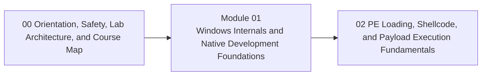

<div align="center">

# Module 01 - Windows Internals and Native Development Foundations

*Build native Windows, C, memory, PE, loader, debugging, and assembly foundations required for every later module.*

</div>

---

> **Start Here**
>
> Work through the lessons in order, complete the lab, then submit the module checkpoint evidence. Keep this module local-only, snapshot-backed, and evidence-driven.

## At a Glance

| Area | Details |
|---|---|
| Course | Malware Development and Implant Engineering |
| Module | 01 - Windows Internals and Native Development Foundations |
| Role | Build native Windows, C, memory, PE, loader, debugging, and assembly foundations required for every later module. |
| Why here | Advanced maldev topics are not understandable without process, memory, binary, and debugger literacy. |
| Prepares next | Module 02 payload representation and local execution. |

| Builds On | Core Artifact | Safety Boundary |
|---|---|---|
| Prior module checkpoint evidence and lab discipline | source-to-runtime evidence pack showing source code, build artifacts, PE structure, loaded image, memory regions, and debugger observations | Local-only or isolated lab artifacts |

---

## Module Position



---

## Lesson Path

| Lesson | Role in the Journey | Required practice |
|---|---|---|
| [1.1 - Why Native Code Matters for Windows Internals](lessons/module-01-lesson-1-1-why-native-code-matters-for-windows-internals.md) | Explain why C and native Windows programming are the first learning lens | native vs managed comparison |
| [1.2 - Toolchain, Project Layout, and Your First Windows Program](lessons/module-01-lesson-1-2-toolchain-project-layout-and-your-first-windows-program.md) | Build a reliable edit-build-run-inspect loop and compile a minimal WinAPI program | compile and inspect a simple program |
| [1.3 - Types, Pointers, Buffers, and Addresses](lessons/module-01-lesson-1-3-types-pointers-buffers-and-addresses.md) | Build raw-memory literacy without drowning in C minutiae | pointer and address inspection |
| [1.4 - Strings, Unicode, Structs, and Data Layout](lessons/module-01-lesson-1-4-strings-unicode-structs-and-data-layout.md) | Teach Windows data shapes learners will constantly see | string and struct layout inspection |
| [1.5 - Functions, Calling Conventions, Errors, and Heap Allocation](lessons/module-01-lesson-1-5-functions-calling-conventions-errors-and-heap-allocation.md) | Teach function boundaries, return values, GetLastError, and allocation choices | trace success, failure, and allocation behavior |
| [1.6 - Processes, Threads, and Execution Context](lessons/module-01-lesson-1-6-processes-threads-and-execution-context.md) | Explain how Windows represents running programs | process and thread views |
| [1.7 - User Mode, Kernel Mode, and API Layers](lessons/module-01-lesson-1-7-user-mode-kernel-mode-and-api-layers.md) | Clarify WinAPI, NTAPI, DLL boundaries, and syscall transitions | API layer map |
| [1.8 - Virtual Memory, Regions, and Page Protections](lessons/module-01-lesson-1-8-virtual-memory-regions-and-page-protections.md) | Teach address-space reasoning and memory permissions | inspect memory regions and protections |
| [1.9 - Handles, Access Masks, Modules, PEB, and TEB](lessons/module-01-lesson-1-9-handles-access-masks-modules-peb-and-teb.md) | Explain object access gates and process self-knowledge | module, handle, and context notes |
| [1.10 - From Source to PE: Compiler, Linker, CRT, and Entry Points](lessons/module-01-lesson-1-10-from-source-to-pe-compiler-linker-crt-and-entry-points.md) | Walk from source file to executable image | inspect build artifacts |
| [1.11 - PE Headers, Sections, RVAs, Imports, and Exports](lessons/module-01-lesson-1-11-pe-headers-sections-rvas-imports-and-exports.md) | Build the core PE map | annotated PE layout |
| [1.12 - Relocations, ASLR, Disk Layout, and Image Layout](lessons/module-01-lesson-1-12-relocations-aslr-disk-layout-and-image-layout.md) | Compare file representation with mapped memory | file offset to memory mapping |
| [1.13 - How the Windows Loader Maps and Initializes an Image](lessons/module-01-lesson-1-13-how-the-windows-loader-maps-and-initializes-an-image.md) | Teach mapping, imports, relocations, TLS, and transfer of control | loader stage diagram |
| [1.14 - Debugging Essentials: x64dbg, Registers, Stack, and Assembly Patterns](lessons/module-01-lesson-1-14-debugging-essentials-x64dbg-registers-stack-and-assembly-patterns.md) | Teach minimum debugger and x64 literacy required later | step through a tiny program |
| [1.15 - Synthesis: Following a Program From Source to Runtime State](lessons/module-01-lesson-1-15-synthesis-following-a-program-from-source-to-runtime-state.md) | Integrate code, PE layout, loader behavior, memory, and debugger observations | module synthesis lab |

---

## Hands-On Requirement

This module should not be read passively. Each lesson should produce a lab artifact: code, build output, debugger/process/PE observations, a telemetry note, an architecture diagram, or a checkpoint worksheet.

Use this loop throughout the module:

```text
build or prepare -> run or simulate -> inspect -> interpret -> clean up
```

---

## Learning Arcs

### Arc 01A - Native C and Memory Literacy

| Lesson | Title | Purpose | Practice |
|---|---|---|---|
| 1.1 | Why Native Code Matters for Windows Internals | Explain why C and native Windows programming are the first learning lens | native vs managed comparison |
| 1.2 | Toolchain, Project Layout, and Your First Windows Program | Build a reliable edit-build-run-inspect loop and compile a minimal WinAPI program | compile and inspect a simple program |
| 1.3 | Types, Pointers, Buffers, and Addresses | Build raw-memory literacy without drowning in C minutiae | pointer and address inspection |
| 1.4 | Strings, Unicode, Structs, and Data Layout | Teach Windows data shapes learners will constantly see | string and struct layout inspection |
| 1.5 | Functions, Calling Conventions, Errors, and Heap Allocation | Teach function boundaries, return values, GetLastError, and allocation choices | trace success, failure, and allocation behavior |

### Arc 01B - Windows Process and Memory Model

| Lesson | Title | Purpose | Practice |
|---|---|---|---|
| 1.6 | Processes, Threads, and Execution Context | Explain how Windows represents running programs | process and thread views |
| 1.7 | User Mode, Kernel Mode, and API Layers | Clarify WinAPI, NTAPI, DLL boundaries, and syscall transitions | API layer map |
| 1.8 | Virtual Memory, Regions, and Page Protections | Teach address-space reasoning and memory permissions | inspect memory regions and protections |
| 1.9 | Handles, Access Masks, Modules, PEB, and TEB | Explain object access gates and process self-knowledge | module, handle, and context notes |

### Arc 01C - PE Files, Loader Behavior, and Debugging

| Lesson | Title | Purpose | Practice |
|---|---|---|---|
| 1.10 | From Source to PE: Compiler, Linker, CRT, and Entry Points | Walk from source file to executable image | inspect build artifacts |
| 1.11 | PE Headers, Sections, RVAs, Imports, and Exports | Build the core PE map | annotated PE layout |
| 1.12 | Relocations, ASLR, Disk Layout, and Image Layout | Compare file representation with mapped memory | file offset to memory mapping |
| 1.13 | How the Windows Loader Maps and Initializes an Image | Teach mapping, imports, relocations, TLS, and transfer of control | loader stage diagram |
| 1.14 | Debugging Essentials: x64dbg, Registers, Stack, and Assembly Patterns | Teach minimum debugger and x64 literacy required later | step through a tiny program |
| 1.15 | Synthesis: Following a Program From Source to Runtime State | Integrate code, PE layout, loader behavior, memory, and debugger observations | module synthesis lab |

---

## Required Artifacts

| Artifact | Path |
|---|---|
| Module lab | [labs/module-01-lab-01-windows-foundations-synthesis.md](labs/module-01-lab-01-windows-foundations-synthesis.md) |
| Module checkpoint | [checkpoints/module-01-checkpoint.md](checkpoints/module-01-checkpoint.md) |
| Reference cheat sheet | [references/module-01-reference-cheat-sheet.md](references/module-01-reference-cheat-sheet.md) |
| Gap analysis | [references/module-01-gap-analysis.md](references/module-01-gap-analysis.md) |

## Optional Deep Dives

- WinDbg essentials
- PE resources, manifests, and signing
- deeper x64 assembly
- Rust comparison
- CMake and Ninja multi-target projects

Deep dives are optional. They should not block the core path.

---

## Module Navigation

| Previous | Next |
|---|---|
| [00 - Orientation, Safety, Lab Architecture, and Course Map](../00-orientation/README.md) | [02 - PE Loading, Shellcode, and Payload Execution Fundamentals](../02-payload-execution/README.md) |
