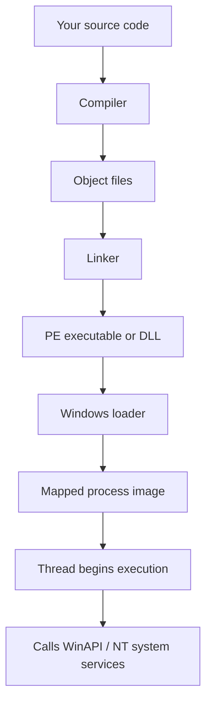
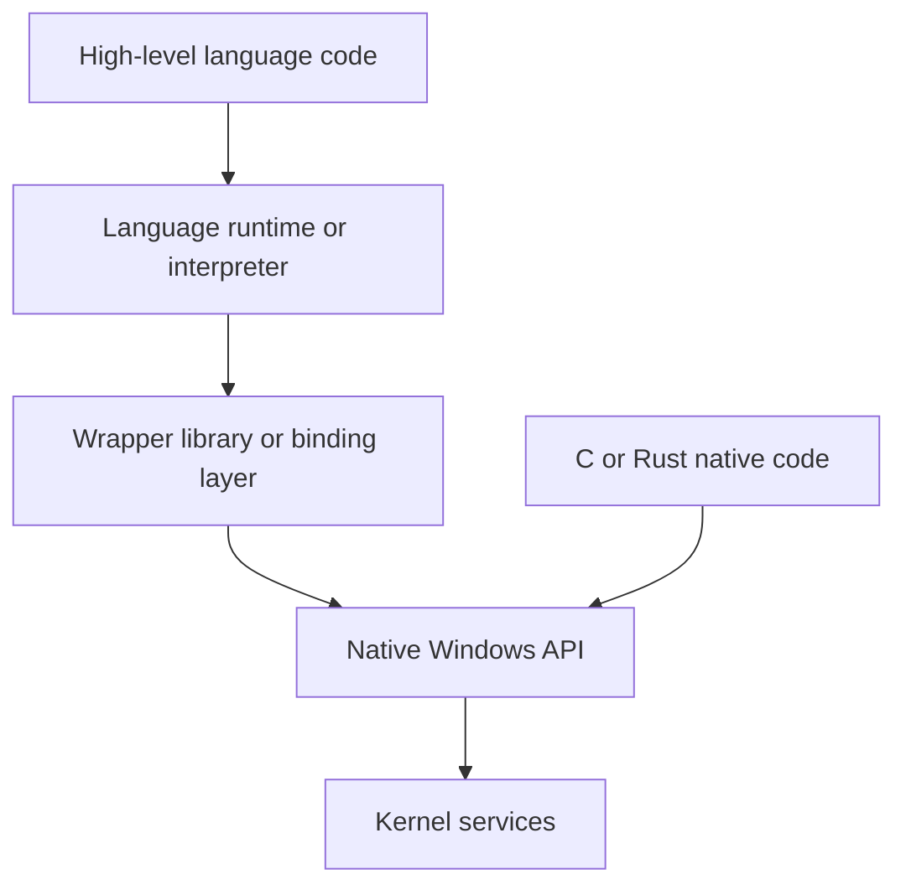
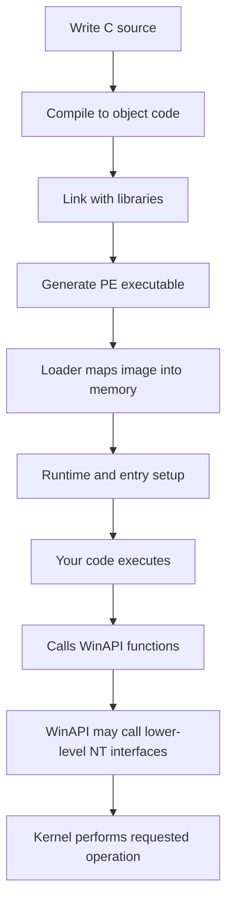
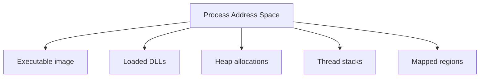
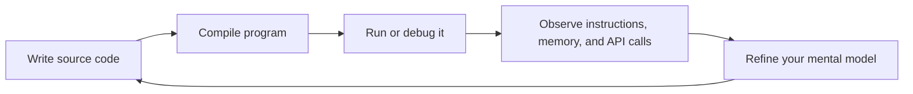
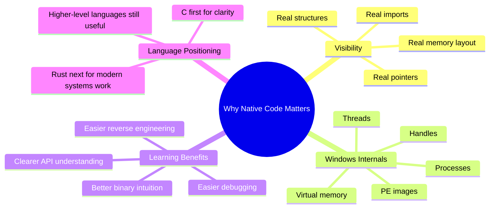
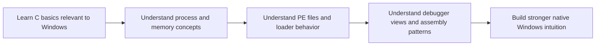

# Lesson 1.1 — Why Native Code Matters for Windows Internals

> **Module 1A:** Foundations for Native Windows Development  
> **Lesson Goal:** Build the mental model for *why* this course begins with C and native Windows programming, *where* Rust fits, and *why* native code is the clearest lens for understanding Windows execution, memory, and low-level API interaction.

---

## Table of Contents

1. [Why this lesson comes first](#why-this-lesson-comes-first)
2. [What “native code” means](#what-native-code-means)
3. [Why Windows internals are easiest to understand from the native layer](#why-windows-internals-are-easiest-to-understand-from-the-native-layer)
4. [Why this course starts with C](#why-this-course-starts-with-c)
5. [Where Rust fits in the picture](#where-rust-fits-in-the-picture)
6. [Native code vs higher-level languages](#native-code-vs-higher-level-languages)
7. [The Windows execution stack: from source code to OS behavior](#the-windows-execution-stack-from-source-code-to-os-behavior)
8. [Why memory awareness matters immediately](#why-memory-awareness-matters-immediately)
9. [Why APIs matter more when you can see the real types and buffers](#why-apis-matter-more-when-you-can-see-the-real-types-and-buffers)
10. [How native code improves reverse engineering and debugging](#how-native-code-improves-reverse-engineering-and-debugging)
11. [Common misconceptions](#common-misconceptions)
12. [Mental models to keep](#mental-models-to-keep)
13. [Mini case studies](#mini-case-studies)
14. [Lesson summary](#lesson-summary)
15. [Knowledge check](#knowledge-check)
16. [Preview of the next lessons](#preview-of-the-next-lessons)

---

## Why this lesson comes first

Before you write your first Windows C program, you need to understand **why** this course is using native code as its foundation.

A lot of learners can already script. Many can write Python, PowerShell, or maybe even some C#. Those skills are useful. But when your goal is to truly understand:

- how a Windows program starts,
- how code reaches operating system functionality,
- how memory is laid out,
- how binaries are linked and loaded,
- how debuggers display a process,
- and why low-level behavior looks the way it does,

then **native code gives you the clearest view**.

This lesson is not about saying higher-level languages are bad. They are often excellent choices. This lesson is about understanding that when you are trying to learn **Windows internals**, you want the least fog between your code and the operating system.

---

## Learning Objectives

By the end of this lesson, you should be able to:

- define what native code is on Windows,
- explain why C is the main teaching language for this course,
- describe how Rust relates to the same low-level world,
- explain why abstractions can hide important internals,
- describe how native code connects to memory, APIs, binaries, and debugging,
- and articulate why native development is a foundational skill even if you later prefer other languages.

---

## What “native code” means

At a high level, **native code** is code compiled into machine instructions that the target CPU can execute directly.

On a modern 64-bit Windows system, that usually means:

- your source code is compiled for **x64**, and
- the output is a **Portable Executable (PE)** file such as an `.exe` or `.dll`,
- containing machine code that the Windows loader can map into memory and execute.

### Plain-English definition

If a program is **native**, the CPU can run its instructions directly after the operating system loads it.

That does **not** mean there is no runtime involved at all. Many native programs still rely on runtime libraries. But the core point is that the program is not fundamentally waiting for a virtual machine or interpreter to translate its logic at execution time.

### Compare three broad categories

| Category | Example | How it runs | What it hides |
| --- | --- | --- | --- |
| **Native compiled code** | C, C++, Rust | Compiled to machine code for the CPU | Least hidden by default |
| **Managed / VM-based code** | C# / .NET, Java | Runs inside a managed runtime / VM | Memory management, object model, runtime services |
| **Interpreted / scripting** | PowerShell, Python, JavaScript | Executed by an interpreter or engine | Even more execution details and lower-level representation |

### Important nuance

“Native” does **not** mean “simple.” It means **closer to the machine and OS interface**.

That is why native code is powerful for learning internals:

- you see real addresses,
- real buffers,
- real structures,
- real calling conventions,
- real imports,
- real binaries,
- and real interactions with the Windows API.

---

## Why Windows internals are easiest to understand from the native layer

Windows internals are ultimately expressed through concrete mechanisms:

- executable images,
- sections,
- imports,
- handles,
- threads,
- stacks,
- heaps,
- page protections,
- object access,
- and function calls into system libraries.

Those mechanisms are **not imaginary concepts**. They are represented in memory, in data structures, and in machine code behavior.

When you stay near the native layer, you can draw a straight line between:

1. what you wrote,
2. what the compiler produced,
3. what the linker assembled,
4. what the loader mapped,
5. and what the debugger shows you.

That straight-line visibility is the entire reason this course starts here.

### Abstraction stack diagram



At each stage in this chain, native code is visible and inspectable.

Now compare that with a heavily abstracted environment where much more is hidden behind:

- runtime type systems,
- garbage collection,
- JIT compilation,
- metadata-driven execution,
- reflection,
- wrappers around OS APIs,
- or engine-specific object models.

Those layers can be useful, but they make it harder for a beginner to see the underlying Windows mechanisms clearly.

---

## Why this course starts with C

C is not the only systems language, but it is still the most direct teaching language for this subject.

### Why C is such a strong teaching language

C gives you:

- simple syntax relative to C++,
- direct access to pointers and raw memory,
- very little hidden language machinery,
- a close match to how Windows APIs are documented,
- and a natural bridge into assembly, PE structure, loaders, and debugging.

### C is “honest” about the machine

That is one of the best reasons to learn it.

In C, the language does not pretend memory is magical.

You will have to think about:

- where data lives,
- how big it is,
- whether a pointer is valid,
- what type a function expects,
- and what happens when you pass raw addresses to APIs.

That can feel harder at first. But that difficulty is educational. It builds the exact instincts you need for Windows internals.

### C maps cleanly to Windows documentation

A huge amount of Windows API documentation and historical examples are written in a C-oriented style.

You will frequently see things like:

- pointer parameters,
- output buffers,
- structure pointers,
- wide-character strings,
- opaque handles,
- size fields,
- and explicit error handling.

C lets you see those concepts directly instead of encountering them only through wrappers.

### C teaches the shape of the problem

Even when you later use another language, understanding the C representation of a Windows API teaches you:

- what data the API really expects,
- how arguments are laid out,
- what ownership model is implied,
- what buffer sizes matter,
- and where errors are likely to happen.

That knowledge transfers.

---

## Where Rust fits in the picture

Rust absolutely belongs in modern native Windows development.

It gives you many of the same benefits as C:

- native compilation,
- direct systems access,
- explicit data layout when needed,
- FFI support,
- the ability to call Windows APIs,
- and strong suitability for low-level tooling.

### So why not start with Rust?

Because Rust adds a second learning problem at the beginning:

1. learning Windows internals, and
2. learning Rust’s ownership, borrowing, lifetimes, safety model, and ecosystem patterns.

Rust is excellent, but for a true beginner to this niche, that can make the first steps more cognitively expensive.

### The course position on Rust

Think of the relationship like this:

- **C** is the clearest first lens for understanding the raw mechanics.
- **Rust** is a powerful systems language you can grow into once you understand the underlying model.

### Teaching sequence idea


### Important takeaway

Learning C first is not a rejection of Rust.

It is a way of making sure that when you later write Rust, you are not relying on the language to understand the operating system for you.

---

## Native code vs higher-level languages

Higher-level languages are useful because they remove friction.

That is also exactly why they can hide important internals.

### Example comparison

Suppose you want to allocate memory, write bytes into it, and pass it to an API.

In a scripting language, you may just create an object or byte array and call a wrapper function. That is convenient.

But many details may be hidden:

- where the memory lives,
- whether it moved,
- who owns it,
- how it is represented internally,
- what exact pointer the OS API eventually receives,
- and what the wrapper did before or after the call.

In native C, those questions are harder to ignore.

That friction is not just inconvenience. It is visibility.

### Relationship diagram



The lower path is shorter. Fewer layers mean fewer hidden transformations.

### This does not mean “always use native code”

You should not walk away from this lesson thinking native code is automatically the best choice for every task.

That would be an overcorrection.

Sometimes the right answer is:

- Python for speed of development,
- PowerShell for administration,
- C# for enterprise tooling,
- or Rust for safer systems programming.

But when the goal is **learning internals**, **understanding binary behavior**, or **reasoning about execution at a low level**, native code is the cleanest starting point.

---

## The Windows execution stack: from source code to OS behavior

One reason native code matters so much is that it lets you follow the full lifecycle of a program.

### End-to-end lifecycle



Every major block in this diagram becomes easier to understand when your source language is close to the resulting machine representation.

### Why this matters educationally

Over the rest of Module 1, you will study:

- compilation,
- linking,
- PE layout,
- imports and exports,
- loader behavior,
- memory layout,
- calling conventions,
- debugging,
- and process inspection.

C fits naturally across all of those topics.

You can look at a function in C and then later see:

- its compiled assembly,
- its stack frame,
- its imported API calls,
- and its binary layout.

That continuity is extremely valuable for self-study.

---

## Why memory awareness matters immediately

Windows internals are deeply tied to memory.

A process is not just “a running app.” It is a structured memory environment with:

- code sections,
- data sections,
- stack regions,
- heap allocations,
- loaded modules,
- and page permissions.

### Native code forces memory literacy

In C, many core concepts are impossible to avoid:

- pointers,
- addresses,
- arrays,
- structures,
- buffer sizes,
- null terminators,
- and alignment.

That is exactly what you need.

### Simple mental picture



If you do not understand raw memory concepts, many later lessons become blurry.

For example:

- Why does an API want a pointer to a structure?
- Why does a buffer need a length parameter?
- Why does a debugger show hexadecimal addresses everywhere?
- Why do relocations matter?
- Why can an invalid pointer crash a process?

C begins answering those questions early.

---

## Why APIs matter more when you can see the real types and buffers

Windows APIs are often not conceptually hard. They are just explicit.

A lot of beginners struggle because the APIs expect you to understand the shape of data.

### Typical Windows API expectations

An API may expect:

- a handle,
- a pointer to an input structure,
- a pointer to an output structure,
- a buffer pointer,
- a buffer length,
- a wide string,
- and a return value that must be checked explicitly.

That pattern makes much more sense once you are comfortable reading C signatures.

### Example: conceptual shape of an API call

```c
BOOL SomeWindowsFunction(
    HANDLE hObject,
    INPUT_STRUCT* inData,
    OUTPUT_STRUCT* outData,
    DWORD outDataSize
);
```

Even without knowing the exact API, this already teaches you a lot:

- `HANDLE` is some OS-managed reference.
- `INPUT_STRUCT*` means the function reads structured data from memory.
- `OUTPUT_STRUCT*` means the function writes results into memory you provide.
- `DWORD outDataSize` means size matters and the API needs boundaries.
- `BOOL` means success/failure is explicit and likely needs follow-up error checking.

That is a Windows internals mindset.

### Higher-level wrappers often hide this

A wrapper may let you call something like:

```text
result = do_action(target)
```

Convenient? Yes.  
Educationally transparent? Not nearly as much.

---

## How native code improves reverse engineering and debugging

A major advantage of starting from native code is that **the debugger, disassembler, and binary analysis tools speak the same language as the compiled output**.

### The learning loop becomes tighter

You write a small C program. Then you can:

1. compile it,
2. open it in a debugger,
3. inspect imports,
4. step through its instructions,
5. examine registers and memory,
6. and connect that behavior back to your original source.

That is an incredibly effective way to learn.

### Debugging feedback loop



The more direct the relationship between source and runtime behavior, the better this loop works.

### Why this matters later

As you move deeper into Windows internals, you will repeatedly need to reason about:

- what the loader did,
- how imports were resolved,
- how stack arguments or registers are used,
- how structures appear in memory,
- and how runtime state differs from disk layout.

Native code makes these relationships visible.

---

## Why native code matters specifically on Windows

Windows is full of long-lived native interfaces and conventions.

Even when modern frameworks sit on top, the lower-level foundation still matters.

### Windows-specific realities

A Windows program commonly interacts with:

- the PE format,
- `kernel32.dll`,
- `user32.dll`,
- `advapi32.dll`,
- `ntdll.dll`,
- handles,
- access masks,
- threads,
- virtual memory,
- and subsystem-specific runtime behavior.

These are not abstract ideas. They are implemented through native binaries, native calling conventions, native structures, and native memory state.

### Big idea

If your goal is to understand Windows deeply, you eventually have to become comfortable with the native representation of those concepts.

This course is simply doing that from the beginning rather than postponing it.

---

## Common misconceptions

### Misconception 1: “Native code means assembly only.”

No. Assembly is the most direct textual representation of machine-level behavior, but C and Rust are also native languages when compiled to machine code.

### Misconception 2: “Higher-level languages are useless for Windows work.”

Not true. Higher-level languages are extremely useful. The issue is not usefulness. The issue is **visibility into internals**.

### Misconception 3: “C is chosen because it is old.”

C is chosen because it remains one of the clearest teaching tools for:

- raw memory,
- ABI-compatible data layout,
- function interfaces,
- compilation artifacts,
- and operating system interaction.

### Misconception 4: “If I learn Rust, I do not need C concepts.”

You still need the concepts. Rust may help you enforce safer behavior, but you still need to understand:

- pointers,
- layout,
- FFI,
- API signatures,
- process memory,
- and binary/runtime relationships.

### Misconception 5: “Low-level means better for everything.”

Also false. Native code gives clarity and control, but it also increases responsibility and complexity. The right tool always depends on the job.

---

## Mental models to keep

### 1. Native code shortens the distance between intent and mechanism

The fewer layers between your code and the OS, the easier it is to learn what the OS is actually doing.

### 2. Abstractions are helpful, but they are also concealment layers

They simplify development by hiding details. That is useful in production, but not always ideal while learning internals.

### 3. C teaches the raw shape of Windows interfaces

Once you understand the raw shape, wrappers in other languages become easier to reason about.

### 4. Rust belongs *after* or *alongside* fundamentals, not necessarily *instead of* fundamentals

Rust is powerful, but the learner still benefits from first understanding the low-level model clearly.

### 5. Memory is not an optional topic

On Windows, understanding execution and binaries requires understanding memory layout and representation.

---

## Mini case studies

### Case Study 1: Opening a file

At a high level, “open a file” sounds simple.

In native Windows terms, the operation may involve:

- a function call into a Windows library,
- passing a file path in a specific string format,
- specifying access rights,
- specifying sharing mode,
- receiving a handle,
- checking for failure,
- and understanding that the handle is your process’s reference to a kernel-managed object.

Even this simple example teaches:

- explicit parameters,
- ownership,
- representation,
- and OS object interaction.

### Case Study 2: Getting process information

A high-level tool might return a neat object like:

```text
{ pid: 1234, name: "demo.exe" }
```

That is nice and convenient.

But underneath, somewhere, there was still a native representation involving:

- enumeration APIs,
- buffers,
- structures,
- handles,
- and specific process-related metadata.

Learning the native shape of the task teaches you what the object really represents.

### Case Study 3: Allocating memory

In a high-level language, allocation can feel automatic.

In native code, allocation forces important questions:

- Which allocator is being used?
- How large is the allocation?
- Is the pointer valid?
- Who frees it?
- What is stored in it?
- Does an API expect writable memory, readable memory, executable memory, or aligned data?

Those questions connect directly to later lessons on heaps, virtual memory, and page protections.

---

## Visual summary: why native code matters



---

## Native vs managed vs scripted: what changes for the learner?

| Question | Native C / Rust | Managed Runtime | Script / Shell |
| --- | --- | --- | --- |
| Do you think about pointers? | Often | Sometimes indirectly | Rarely directly |
| Do you see binary layout clearly? | Yes | Less directly | Usually no |
| Are OS API signatures exposed clearly? | Yes | Often wrapped | Usually wrapped heavily |
| Is memory representation easy to ignore? | No | More often | Very often |
| Best for learning Windows internals fundamentals? | Strongest choice | Helpful later | Helpful later |

---

## Practical consequences for this course

Because this course starts from native code, the rest of Module 1 will make more sense.

You are about to build a chain of understanding that looks like this:



This lesson is the foundation for that chain.

---

## Lesson summary

Native code matters because it gives you the most direct educational path into Windows internals.

C is the main teaching language in this course because it:

- exposes memory and data layout directly,
- matches the shape of Windows APIs closely,
- keeps abstractions to a minimum,
- and creates a clean bridge to binaries, debugging, and assembly.

Rust is also an important native systems language, but it fits best once you understand the lower-level Windows model and can appreciate what the language is helping you manage more safely.

Higher-level languages remain useful, but they introduce abstraction layers that can hide the exact mechanics you need to see while building foundational understanding.

The core idea to remember is simple:

> **If you want to understand how Windows really executes programs, represents memory, loads binaries, and exposes operating system functionality, native code is the clearest place to start.**

---

## Key Terms

- **Native code** — machine code compiled for the target CPU that the operating system can load and run directly.
- **Managed code** — code that runs under a runtime or virtual machine such as .NET.
- **Interpreter** — software that reads and executes code or commands rather than running precompiled machine code directly.
- **WinAPI** — the user-mode Windows application programming interface exposed by system libraries.
- **PE (Portable Executable)** — the executable file format used by Windows for programs and DLLs.
- **Pointer** — a value representing a memory address.
- **Runtime** — supporting code or environment needed during program execution.
- **FFI (Foreign Function Interface)** — a mechanism that allows one language to call functions written in another language.

---

## Knowledge check

Use these questions to test your understanding before moving on.

1. What is the simplest practical definition of native code?
2. Why does C make Windows API documentation easier to understand?
3. Why can higher-level languages make Windows internals harder to learn at first?
4. Why is Rust still relevant even though this course starts with C?
5. What is the relationship between native code and debugging visibility?
6. Why is memory awareness essential for learning Windows internals?
7. What does it mean to say that C is “honest” about the machine?

### Suggested answers

1. Native code is machine code compiled for the target CPU that Windows can load and run directly.
2. Because many Windows APIs are documented in a C-oriented style using pointers, structures, buffers, and explicit return/error handling.
3. Because wrappers, runtimes, and interpreters can hide data layout, memory handling, and the exact API interactions.
4. Because Rust is also a native systems language and becomes even more powerful once the learner understands the low-level model underneath.
5. Native code creates a tighter relationship between source, binary, assembly, memory, and debugger output.
6. Because processes, modules, structures, buffers, and API interactions all depend on how data exists in memory.
7. It means C exposes low-level responsibilities directly instead of hiding them behind strong abstractions.

---

## Preview of the next lessons

Now that you understand **why** the course begins with native code, the next lessons will start turning that philosophy into practical skill.

### Coming next

- **Lesson 1.2 — Building the Lab: Toolchain, Compilers, and Project Layout**  
  You will set up the environment needed to compile and inspect native Windows programs reliably.

- **Lesson 1.3 — Your First Windows C Program**  
  You will write and run a minimal Windows-oriented C program and begin the compile-run-inspect loop.

- **Lesson 1.4 — Core C Types, Pointers, Arrays, and Addresses**  
  You will develop the memory literacy that makes all later Windows internals topics easier to understand.

---

## Final takeaway

Do not think of this lesson as “why C is better than everything else.”

Think of it as:

- **why native code is the cleanest educational starting point**, and
- **why learning the lower-level model first makes every later tool, language, and abstraction more understandable**.

That is the foundation this course is built on.
