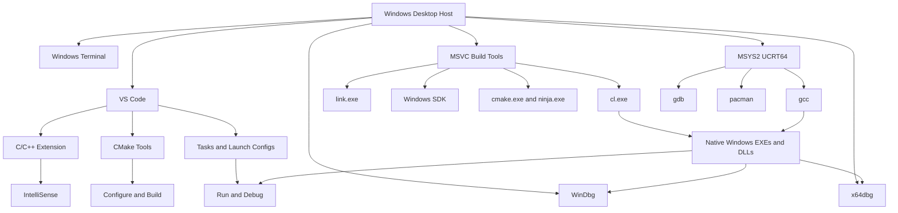
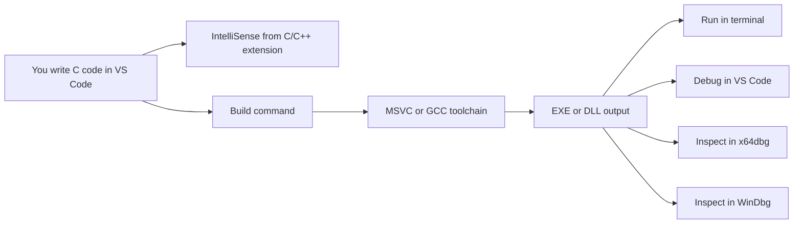

# Lesson 1.2 — Building the Lab: Toolchain, Compilers, and Project Layout (VS Code Edition)

> **Module 1A:** Foundations for Native Windows Development  
> **Lesson Goal:** Build a friction-free Windows development lab so you can write, build, run, inspect, and debug native Windows programs throughout the course using **VS Code** as your primary editor.

---

## Table of Contents

1. [Why this lesson matters](#why-this-lesson-matters)
2. [Learning objectives](#learning-objectives)
3. [What we are building](#what-we-are-building)
4. [Lab philosophy](#lab-philosophy)
5. [Recommended host assumptions](#recommended-host-assumptions)
6. [Core toolchain overview](#core-toolchain-overview)
7. [How the pieces fit together](#how-the-pieces-fit-together)
8. [Step 0 — Prepare the Windows host](#step-0--prepare-the-windows-host)
9. [Step 1 — Install VS Code](#step-1--install-vs-code)
10. [Step 2 — Install the Microsoft C/C++ build toolchain](#step-2--install-the-microsoft-cc-build-toolchain)
11. [Step 3 — Install the core VS Code extensions](#step-3--install-the-core-vs-code-extensions)
12. [Step 4 — Set up the terminal strategy](#step-4--set-up-the-terminal-strategy)
13. [Step 5 — Install WinDbg](#step-5--install-windbg)
14. [Step 6 — Install x64dbg](#step-6--install-x64dbg)
15. [Step 7 — Install MSYS2 and the secondary GCC toolchain](#step-7--install-msys2-and-the-secondary-gcc-toolchain)
16. [Step 8 — Install supporting utilities](#step-8--install-supporting-utilities)
17. [Step 9 — Create the course workspace](#step-9--create-the-course-workspace)
18. [Step 10 — Configure VS Code for low-friction native work](#step-10--configure-vs-code-for-low-friction-native-work)
19. [Step 11 — Build a reusable project skeleton](#step-11--build-a-reusable-project-skeleton)
20. [Step 12 — Add workspace files for build and debug](#step-12--add-workspace-files-for-build-and-debug)
21. [Step 13 — Verify the lab end-to-end](#step-13--verify-the-lab-end-to-end)
22. [Recommended daily workflow](#recommended-daily-workflow)
23. [Common problems and how to fix them](#common-problems-and-how-to-fix-them)
24. [Mental models to keep](#mental-models-to-keep)
25. [Lesson summary](#lesson-summary)
26. [Lab checklist](#lab-checklist)
27. [Preview of Lesson 1.3](#preview-of-lesson-13)

---

## Why this lesson matters

Before we write meaningful Windows-native code, we need a lab that stays out of the way.

A lot of self-learners lose momentum because the environment is inconsistent:

- the editor opens the code, but the compiler is missing,
- the compiler exists, but only in one special shell,
- IntelliSense appears to work, but the build fails,
- the program runs, but the debugger is not attached correctly,
- one project builds with MSVC while another silently uses GCC,
- the workspace fills with random build artifacts,
- or the learner spends more time fixing setup issues than learning Windows internals.

That is exactly what this lesson is meant to prevent.

The goal is not simply to “make one file compile once.”  
The goal is to create a repeatable native Windows development environment that supports the entire course:

- small experiments,
- structured labs,
- debugger walkthroughs,
- PE inspection,
- repeatable builds,
- side-by-side compiler comparison,
- and a clean workspace that scales as projects become more complex.

By the end of this lesson, you should have a Windows desktop lab where you can confidently do all of the following:

- write C code in **VS Code**,
- build with **MSVC**,
- build with **CMake + Ninja**,
- optionally build with **GCC via MSYS2/MinGW-w64**,
- debug in **VS Code**,
- inspect runtime behavior with **x64dbg**,
- inspect symbols and process state with **WinDbg**,
- and keep your source tree organized in a way that will still make sense ten lessons from now.

---

## Learning objectives

By the end of this lesson, you should be able to:

- explain the role of **VS Code** versus the role of the **compiler toolchain**,
- install and verify a working **MSVC** environment without relying on the full Visual Studio IDE,
- understand why we still install Microsoft build tools even though our editor is VS Code,
- set up **CMake** and **Ninja** as a repeatable build path,
- install a secondary **GCC/MinGW-w64** environment for comparison and portability checks,
- create a structured workspace for labs and experiments,
- configure **tasks**, **launch configurations**, and **workspace settings** in VS Code,
- and run a full **edit → build → run → debug** cycle with confidence.

---

## What we are building

At the end of this lesson, your environment should look conceptually like this:



### The practical goal

We want one machine where the following all work predictably:

| Capability | Primary Tool |
| --- | --- |
| Edit code | VS Code |
| IntelliSense / navigation | VS Code C/C++ extension |
| Native Windows compilation | MSVC Build Tools |
| Cross-project build orchestration | CMake |
| Fast local builds | Ninja |
| Debug from editor | VS Code launch configurations |
| User-mode runtime inspection | x64dbg |
| Lower-level runtime / symbols / process state | WinDbg |
| Secondary compiler and package manager | MSYS2 UCRT64 |
| Shell-driven lab work | Windows Terminal |

---

## Lab philosophy

This course uses a deliberate setup philosophy.

### 1. VS Code is the editor, not the compiler

This is one of the most important ideas in the entire lesson.

**VS Code does not come with a native Windows compiler.**

VS Code gives us:

- an editor,
- an integrated terminal,
- extension-driven IntelliSense,
- debugger integration,
- task automation,
- and workspace configuration.

But the actual compilation still comes from an external toolchain.

That means we deliberately pair VS Code with:

- **MSVC** for the main Windows-native toolchain,
- and **MSYS2/MinGW-w64 GCC** as a secondary toolchain.

### 2. Prefer the shortest path from source to Windows behavior

At the beginning, we want as few layers as possible between:

**source code → compiler → executable → debugger → observable Windows behavior**

That is why the default lab is a **native Windows desktop**, not a container-first setup, not a remote-first setup, and not a WSL-first setup.

We may use WSL later for selected workflows, but the default for this course is:

- local Windows host,
- local toolchain,
- local debuggers,
- local binaries,
- local inspection.

### 3. Keep two build paths available

We want a primary path and a comparison path.

#### Primary path

- **MSVC**
- best fit for Windows headers, SDK integration, PDB symbols, and Microsoft’s native ecosystem

#### Secondary path

- **GCC via MSYS2/MinGW-w64**
- useful for comparing compiler behavior, portability, warnings, and build assumptions

This gives you stronger instincts than using only one compiler forever.

### 4. Keep source and generated output separate

We want the source tree to stay readable.

So we will strongly prefer:

- `src/` for source files,
- `include/` for headers,
- `build/` for generated build directories,
- `artifacts/` for final copied binaries,
- `.vscode/` for editor configuration,
- `tools/` for optional helper binaries or utility scripts,
- `notes/` for your own observations.

### 5. Default to x64

The course assumes a modern 64-bit Windows environment.

That means our default target is:

- **x64 architecture**,
- x64 debugger views,
- x64 calling convention concepts,
- x64 pointer sizes,
- x64 PE inspection,
- x64 process behavior.

We may discuss 32-bit concepts later when useful, but the lab should be built around **x64 first**.

---

## Recommended host assumptions

This lesson assumes:

- a Windows desktop or laptop,
- Windows 10 or Windows 11 x64,
- administrator rights for installing developer tools,
- enough free space for SDKs, tools, and debuggers,
- and a user account that can create a dedicated workspace.

### Practical baseline

You do not need an extreme workstation, but a smoother experience usually means:

- **16 GB RAM or more**,
- an SSD,
- stable internet for initial installs and symbol downloads,
- and tens of gigabytes of free space.

### Recommended workspace root

Use a short, predictable root such as:

```text
C:\CourseLab
```

This is not mandatory, but it is strongly recommended.

Why?

Because short paths reduce friction involving:

- quoting,
- long nested build directories,
- generated object paths,
- debugger launch paths,
- and copy/paste mistakes during labs.

---

## Core toolchain overview

### Required core tools

| Tool | Purpose | Why it belongs in this lab |
| --- | --- | --- |
| **VS Code** | Primary editor and workspace manager | Fast editing, navigation, terminal, extensions, and debug integration |
| **C/C++ extension** | IntelliSense and debug support | Makes VS Code usable for native C/C++ development |
| **MSVC Build Tools** | Main Windows-native compiler toolchain | Gives us `cl.exe`, `link.exe`, headers, libraries, and Windows SDK integration |
| **CMake** | Build orchestration | A repeatable way to configure and build projects across compilers |
| **Ninja** | Fast backend build tool | Useful for fast, clean local builds |
| **WinDbg** | Microsoft debugger | Useful for symbols, runtime state, and deeper inspection |
| **x64dbg** | User-mode debugger | Great for program flow, stepping, breakpoints, memory views |
| **Windows Terminal** | Shell hub | Keeps the lab easier to operate than scattered cmd windows |
| **MSYS2 UCRT64** | Secondary package and GCC environment | Lets us compare compiler behavior and use a Unix-like package manager |

### Optional but highly recommended tools

| Tool | Why it helps |
| --- | --- |
| **Git for Windows** | Makes it easy to clone, version, and sync course lab work |
| **7-Zip** | Useful for extracting archives, symbols, and tool packages |
| **Sysinternals Suite** | Helpful later for process, handle, and system inspection |
| **PowerShell 7** | Nice quality-of-life shell, though Windows PowerShell is sufficient |

---

## How the pieces fit together

One common beginner mistake is to think of “the IDE” as a single magical thing.

That is not how this lab actually works.



### The mental separation

Keep these roles separate in your head:

| Layer | What it does |
| --- | --- |
| **Editor** | lets you write, navigate, and organize code |
| **Extension** | adds language features and debug integration |
| **Compiler** | turns source into object code |
| **Linker** | resolves symbols and creates the final binary |
| **Build system** | decides how the project should be compiled |
| **Debugger** | lets you observe program execution and state |
| **Workspace** | keeps projects, settings, and artifacts organized |

When a build or debug issue appears, this separation helps you diagnose the correct layer instead of guessing blindly.

---

## Step 0 — Prepare the Windows host

Before installing tools, do a basic cleanup pass.

### 0.1 Update Windows

Do the simple things first:

- install pending Windows updates,
- reboot if needed,
- and avoid installing major dev tools during a half-finished update cycle.

### 0.2 Choose your workspace root

Create:

```text
C:\CourseLab
```

Later we will place projects, notes, tools, and artifacts under this root.

### 0.3 Decide your install philosophy

For this course, the cleanest default is:

- **VS Code** as the editor,
- **Build Tools for Visual Studio** for MSVC,
- **Windows Terminal** as the shell hub,
- **MSYS2 UCRT64** as the secondary toolchain,
- **WinDbg** and **x64dbg** as inspection tools.

This avoids the confusion of mixing a full Visual Studio IDE workflow with a VS Code workflow.

---

## Step 1 — Install VS Code

VS Code is our primary editor and workspace shell.

### 1.1 Install method

Use the standard Windows installer.

### 1.2 Recommended install behavior

During or after installation, make sure these quality-of-life behaviors are enabled:

- add VS Code to your **PATH**,
- enable “Open with Code” context menu entries if you like them,
- allow auto-updates unless you have a strong reason not to.

### 1.3 First-launch checks

After installation, verify:

```powershell
code --version
```

If that fails, close and reopen your terminal and test again.

### 1.4 Why PATH matters

A lot of the course workflow assumes this command works:

```powershell
code .
```

That command opens the current folder as your VS Code workspace.

That matters because many of our labs will follow this pattern:

1. open terminal,
2. `cd` into a lab folder,
3. `code .`,
4. build and inspect inside that workspace.

---

## Step 2 — Install the Microsoft C/C++ build toolchain

Even though our editor is VS Code, we still need Microsoft’s native compiler toolchain.

### 2.1 What to install

Install **Build Tools for Visual Studio 2022** rather than the full Visual Studio IDE unless you personally want the full IDE for side work.

For the course, the key workload is:

- **Desktop development with C++**

### 2.2 Why this matters

This gives us the core Windows-native toolchain:

- `cl.exe` (compiler)
- `link.exe` (linker)
- Windows headers
- Windows libraries
- Windows SDK pieces
- command-line build environment
- CMake/Ninja support depending on selected components

### 2.3 Recommended installation details

Inside the installer, prefer the C++ desktop toolchain and make sure you have at least the essentials for:

- MSVC x64/x86 build tools,
- a recent Windows SDK,
- CMake tools,
- Ninja,
- and the standard command-line build environment.

You do **not** need every optional component under the sun.
The goal is a clean native C toolchain, not a giant unrelated workload dump.

### 2.4 Why we still install Microsoft tools without the IDE

This is important enough to say twice.

We are **not** using the Visual Studio IDE as our default editor, but we **are** using Microsoft’s native build stack.

That means:

- **VS Code is the front-end editing environment**
- **MSVC is the primary compiler/linker environment**

These are complementary, not contradictory.

### 2.5 Verify the install from the correct shell

Open the **Developer PowerShell for VS 2022** or **Developer Command Prompt for VS 2022**.

Then run:

```powershell
cl
```

You should see the compiler banner and a message that no source files were specified.

Also verify:

```powershell
where cl
where link
where cmake
where ninja
```

If `cl` is not found in a normal PowerShell window, that is not automatically a problem.
It usually means you are not in the Visual Studio developer environment yet.

---

## Step 3 — Install the core VS Code extensions

Now we make VS Code actually useful for native development.

### 3.1 Required extensions

Install these first:

- **C/C++** (Microsoft)
- **CMake Tools** (Microsoft)
- **CMake** (Microsoft)

### 3.2 What each one does

#### C/C++

This gives you:

- syntax awareness,
- IntelliSense,
- hover information,
- code navigation,
- debug integration,
- configuration awareness for native projects.

#### CMake Tools

This gives you:

- configure/build commands inside VS Code,
- kit and preset awareness,
- target selection,
- build output integration,
- easier project switching.

#### CMake

This provides CMake-language support for files like:

- `CMakeLists.txt`
- `CMakePresets.json`

### 3.3 Optional but useful extensions

These are optional quality-of-life additions:

- **PowerShell** — useful if you prefer PowerShell-heavy workflows
- **Hex Editor** — useful for small binary inspections inside VS Code
- **GitLens** — useful if you want stronger source control visibility
- **Error Lens** — useful if you want diagnostics to be more visually obvious

Do not overload your editor with random extensions on day one.  
Install the core set first and only add more if you know why you want them.

---

## Step 4 — Set up the terminal strategy

This is one of the biggest friction points for beginners.

### 4.1 The key rule

**MSVC depends on an environment that knows where the Microsoft build tools live.**

That means a plain PowerShell or plain cmd session often will **not** know where `cl.exe` is.

### 4.2 The simplest reliable pattern

Use this as your default habit:

1. open **Developer PowerShell for VS 2022**,
2. `cd` into your workspace,
3. run `code .`,
4. do your work from that VS Code window.

Why this works:

- the shell already contains the correct MSVC environment variables,
- VS Code inherits that environment,
- the integrated terminal inside that VS Code session usually inherits it too,
- and CMake/MSVC discovery becomes much less painful.

### 4.3 The shell roles in this course

| Shell | Recommended use |
| --- | --- |
| **Developer PowerShell for VS 2022** | Primary shell for MSVC work |
| **PowerShell / pwsh** | General scripting and non-MSVC tasks |
| **MSYS2 UCRT64 shell** | GCC/MinGW-w64 work |
| **Windows Terminal** | Central launcher for all shell profiles |

### 4.4 Recommended Windows Terminal profile strategy

A clean setup is to keep at least these profiles available:

- **Developer PowerShell for VS 2022**
- **PowerShell**
- **MSYS2 UCRT64**

That way you always know which environment you are using.

### 4.5 Why this matters so much

Many confusing toolchain bugs are actually just **wrong shell** bugs.

Examples:

- `cl` not found,
- `nmake` not found,
- CMake picking the wrong compiler,
- VS Code launch configs working but build tasks failing,
- mixing MinGW and MSVC libraries accidentally.

A clear shell strategy prevents a huge amount of wasted time.

---

## Step 5 — Install WinDbg

WinDbg is one of the most important supporting tools in the entire course.

### 5.1 Why we want it early

Even though we will not use every feature immediately, WinDbg becomes increasingly useful as we move into:

- process structures,
- loaded modules,
- symbols,
- memory state,
- exception handling,
- and deeper Windows runtime inspection.

### 5.2 Install methods

You can install WinDbg directly, via the Microsoft Store, or with `winget`.

A convenient command-line option is:

```powershell
winget install Microsoft.WinDbg
```

### 5.3 Initial validation

After installation:

- launch WinDbg once,
- confirm it starts cleanly,
- and make sure you know where it is installed.

### 5.4 Symbol mindset

You do not need to master symbols in this lesson, but you should already understand this:

**debuggers become dramatically more useful when symbols resolve correctly.**

Later lessons will revisit this in more detail.

---

## Step 6 — Install x64dbg

x64dbg gives us a very approachable user-mode debugging environment.

### 6.1 Why it belongs in this lab

It is especially useful for:

- stepping through program flow,
- setting breakpoints,
- watching registers,
- examining memory,
- observing imports and modules,
- and getting comfortable with runtime execution.

### 6.2 Recommended handling

- install or extract it into a predictable location,
- add a shortcut if desired,
- keep it available from day one even if you do not use it constantly yet.

A suggested path:

```text
C:\Tools\x64dbg
```

or under your course root:

```text
C:\CourseLab\tools\x64dbg
```

### 6.3 First check

Launch it once and confirm:

- it starts correctly,
- the x64 executable is available,
- you can at least locate the “open executable” workflow.

---

## Step 7 — Install MSYS2 and the secondary GCC toolchain

MSYS2 gives us an alternate Windows-native build environment with package management.

### 7.1 Why we want it

We are not installing MSYS2 because VS Code requires it.
We are installing it because it gives us:

- a GCC-based comparison path,
- `pacman` package management,
- a Unix-like shell environment,
- easy installation of build utilities,
- and another lens for understanding how code gets built.

### 7.2 Why UCRT64 is the preferred MSYS2 environment here

For a modern 64-bit Windows desktop lab, **UCRT64** is a good default choice.

That means our main MSYS2 shell for the course should be:

- **MSYS2 UCRT64**

### 7.3 Initial update cycle

After installing MSYS2, run the update cycle as instructed by MSYS2.

In practice, this usually means opening the MSYS2 shell and running:

```bash
pacman -Syu
```

Then, if prompted, close and reopen the shell and run the update again until fully current.

### 7.4 Install the secondary toolchain packages

Inside the **UCRT64** environment, install a sensible baseline such as:

```bash
pacman -S --needed \
  mingw-w64-ucrt-x86_64-toolchain \
  mingw-w64-ucrt-x86_64-cmake \
  mingw-w64-ucrt-x86_64-ninja \
  mingw-w64-ucrt-x86_64-gdb \
  mingw-w64-ucrt-x86_64-make \
  git
```

### 7.5 Verify the secondary toolchain

Inside the UCRT64 shell, verify:

```bash
gcc --version
g++ --version
gdb --version
cmake --version
ninja --version
```

### 7.6 Keep the environments mentally separate

This is critical.

**MSVC shell** and **MSYS2 shell** are not the same thing.

Do not casually assume that:

- headers are identical,
- runtime behavior is identical,
- warning sets are identical,
- libraries are interchangeable,
- or linker assumptions are identical.

That comparison is educational, but only if you stay aware of which environment you are using.

---

## Step 8 — Install supporting utilities

These are not the “core compiler path,” but they make the course much smoother.

### 8.1 Git for Windows

Recommended because it helps you:

- clone course repos or your own lab repos,
- track experiments,
- snapshot milestone states,
- and roll back mistakes cleanly.

Verify:

```powershell
git --version
```

### 8.2 7-Zip

Useful for:

- extracting tool archives,
- opening packaged downloads,
- inspecting compressed files quickly.

### 8.3 Sysinternals Suite

Useful later for:

- process visibility,
- handle inspection,
- startup tracing,
- system inspection,
- and troubleshooting.

### 8.4 Optional PowerShell 7

Nice to have, but not required.

It is mostly a quality-of-life improvement if you like a modern PowerShell experience.

---

## Step 9 — Create the course workspace

Now we create the filesystem structure that the rest of the course will use.

### 9.1 Suggested top-level layout

```text
C:\CourseLab
├── projects
├── artifacts
├── tools
├── notes
├── templates
└── scratch
```

### 9.2 What each folder is for

| Folder | Purpose |
| --- | --- |
| `projects` | your actual lesson and lab projects |
| `artifacts` | copied final binaries or packaged outputs |
| `tools` | helper utilities, unpacked tools, local helpers |
| `notes` | your observations, findings, and mini writeups |
| `templates` | reusable starter projects |
| `scratch` | temporary experiments that do not need long-term structure |

### 9.3 Suggested first project path

For Lesson 1.2, create:

```text
C:\CourseLab\projects\lesson-1-2-hello
```

This becomes our first reusable skeleton.

---

## Step 10 — Configure VS Code for low-friction native work

Now we make the editor feel like a real native development workstation.

### 10.1 Open the workspace correctly

Preferred method:

```powershell
cd C:\CourseLab\projects\lesson-1-2-hello
code .
```

If possible, do this from **Developer PowerShell for VS 2022** when you want the MSVC toolchain readily available.

### 10.2 Recommended workspace settings

Create:

```text
.vscode\settings.json
```

Example:

```json
{
  "files.trimTrailingWhitespace": true,
  "files.insertFinalNewline": true,
  "editor.formatOnSave": false,
  "editor.rulers": [100],
  "C_Cpp.default.intelliSenseMode": "windows-msvc-x64",
  "C_Cpp.default.configurationProvider": "ms-vscode.cmake-tools",
  "cmake.configureOnOpen": false,
  "cmake.useCMakePresets": "always",
  "terminal.integrated.defaultProfile.windows": "PowerShell"
}
```

### 10.3 Why these defaults help

- keeps whitespace noise down,
- avoids mystery formatting changes,
- gives you a visible width guide,
- tells IntelliSense to think in Windows/MSVC terms by default,
- and lets CMake Tools provide project configuration information.

### 10.4 Recommended visual habits

Turn on or keep visible:

- Explorer
- Terminal
- Problems panel
- Output panel
- Debug panel

These panels are where a lot of your real debugging feedback will come from.

---

## Step 11 — Build a reusable project skeleton

Now we create the structure that future lessons can reuse.

### 11.1 Folder layout

Inside `lesson-1-2-hello`, create:

```text
lesson-1-2-hello
├── .vscode
├── build
├── include
├── src
├── artifacts
├── notes
├── CMakeLists.txt
├── CMakePresets.json
└── README.md
```

### 11.2 Why this structure is worth adopting early

This teaches the difference between:

- **source**,
- **configuration**,
- **generated output**,
- **final artifacts**,
- and **notes/documentation**.

That separation becomes more important as lessons get more complex.

### 11.3 Create the first source file

Create:

```text
src\hello.c
```

Example:

```c
#include <stdio.h>
#include <windows.h>

int main(void)
{
    DWORD pid = GetCurrentProcessId();
    printf("Hello from native Windows C! PID=%lu\n", (unsigned long)pid);
    return 0;
}
```

This is intentionally simple.

It already gives us useful anchors:

- standard I/O,
- a Windows header,
- a WinAPI call,
- compilation,
- execution,
- debugger attachment,
- and a real executable to inspect.

### 11.4 Add a minimal README

Create `README.md` with a short note about:

- what the project is,
- how to build it,
- how to run it,
- and what you learned from it.

Get in the habit of documenting even tiny labs.

---

## Step 12 — Add workspace files for build and debug

This is where VS Code starts to feel integrated instead of “just a text editor.”

---

### 12.1 `CMakeLists.txt`

Create:

```cmake
cmake_minimum_required(VERSION 3.24)
project(lesson_1_2_hello C)

set(CMAKE_C_STANDARD 11)
set(CMAKE_C_STANDARD_REQUIRED ON)

add_executable(lesson_1_2_hello
    src/hello.c
)
```

### 12.2 Why this matters

This gives us a compiler-agnostic project definition.

That means the same source tree can be configured with:

- MSVC,
- or GCC via MSYS2,
- as long as the active environment matches the chosen compiler.

---

### 12.3 `CMakePresets.json`

Create:

```json
{
  "version": 3,
  "cmakeMinimumRequired": {
    "major": 3,
    "minor": 24,
    "patch": 0
  },
  "configurePresets": [
    {
      "name": "msvc-debug",
      "displayName": "MSVC Debug",
      "generator": "Ninja",
      "binaryDir": "${sourceDir}/build/msvc-debug",
      "cacheVariables": {
        "CMAKE_BUILD_TYPE": "Debug"
      }
    },
    {
      "name": "msvc-release",
      "displayName": "MSVC Release",
      "generator": "Ninja",
      "binaryDir": "${sourceDir}/build/msvc-release",
      "cacheVariables": {
        "CMAKE_BUILD_TYPE": "Release"
      }
    },
    {
      "name": "mingw-debug",
      "displayName": "MinGW Debug",
      "generator": "Ninja",
      "binaryDir": "${sourceDir}/build/mingw-debug",
      "cacheVariables": {
        "CMAKE_BUILD_TYPE": "Debug",
        "CMAKE_C_COMPILER": "gcc"
      }
    }
  ],
  "buildPresets": [
    {
      "name": "build-msvc-debug",
      "configurePreset": "msvc-debug"
    },
    {
      "name": "build-msvc-release",
      "configurePreset": "msvc-release"
    },
    {
      "name": "build-mingw-debug",
      "configurePreset": "mingw-debug"
    }
  ]
}
```

### 12.4 Important note about MSVC presets

For the **MSVC** presets to work cleanly, it is best to open the workspace from the **Developer PowerShell for VS 2022** so that `cl.exe` is already discoverable.

### 12.5 Important note about MinGW presets

For the **mingw-debug** preset, use the **MSYS2 UCRT64** shell or make sure the GCC toolchain is on the active PATH when configuring.

---

### 12.6 `.vscode/extensions.json`

Create:

```json
{
  "recommendations": [
    "ms-vscode.cpptools",
    "ms-vscode.cmake-tools",
    "twxs.cmake"
  ]
}
```

This makes the workspace self-explanatory for future you.

---

### 12.7 `.vscode/tasks.json`

This gives you direct build tasks even outside a full CMake flow.

Create:

```json
{
  "version": "2.0.0",
  "tasks": [
    {
      "label": "MSVC: build hello.c",
      "type": "shell",
      "command": "cl",
      "args": [
        "/nologo",
        "/W4",
        "/Zi",
        "/TC",
        "/Fe:${workspaceFolder}\\artifacts\\hello-msvc.exe",
        "${workspaceFolder}\\src\\hello.c"
      ],
      "group": {
        "kind": "build",
        "isDefault": true
      },
      "problemMatcher": ["$msCompile"],
      "options": {
        "cwd": "${workspaceFolder}"
      }
    },
    {
      "label": "MSVC: run hello-msvc",
      "type": "shell",
      "command": "${workspaceFolder}\\artifacts\\hello-msvc.exe",
      "dependsOn": "MSVC: build hello.c",
      "options": {
        "cwd": "${workspaceFolder}"
      }
    }
  ]
}
```

### 12.8 Why direct tasks are useful

Even if CMake becomes your main path, these tasks teach you the raw reality:

- what compiler is being called,
- what arguments are being passed,
- where the output lands,
- and how little magic is actually involved.

---

### 12.9 `.vscode/launch.json`

Create:

```json
{
  "version": "0.2.0",
  "configurations": [
    {
      "name": "Debug hello-msvc.exe",
      "type": "cppvsdbg",
      "request": "launch",
      "program": "${workspaceFolder}\\artifacts\\hello-msvc.exe",
      "args": [],
      "stopAtEntry": false,
      "cwd": "${workspaceFolder}",
      "environment": [],
      "console": "integratedTerminal",
      "preLaunchTask": "MSVC: build hello.c"
    }
  ]
}
```

### 12.10 Why this matters

This is the bridge between:

- your editor,
- your build task,
- and your debug session.

Once this pattern clicks, VS Code starts to feel integrated rather than improvised.

---

## Step 13 — Verify the lab end-to-end

Now we run the entire system like a real learner would.

### 13.1 Verification checklist for VS Code

In a terminal:

```powershell
code --version
```

### 13.2 Verification checklist for MSVC

In **Developer PowerShell for VS 2022**:

```powershell
cl
where cl
where link
where cmake
where ninja
```

### 13.3 Verification checklist for MSYS2

In **MSYS2 UCRT64**:

```bash
gcc --version
gdb --version
cmake --version
ninja --version
```

### 13.4 Verification checklist for the sample project

From Developer PowerShell:

```powershell
cd C:\CourseLab\projects\lesson-1-2-hello
code .
```

Then either:

#### Path A — direct VS Code task flow

- Run task: **MSVC: build hello.c**
- Run task: **MSVC: run hello-msvc**
- Press **F5** with the `Debug hello-msvc.exe` launch configuration

#### Path B — CMake flow

From the command line:

```powershell
cmake --preset msvc-debug
cmake --build --preset build-msvc-debug
```

Then run the output from:

```text
build\msvc-debug
```

### 13.5 What success looks like

You should be able to:

- build successfully,
- run successfully,
- see the process ID printed,
- launch a debugger session,
- and identify exactly where the binary was created.

If all of that works, your lab is ready for the rest of Module 1A.

---

## Recommended daily workflow

Use this as your default habit loop.


### Default MSVC workflow

1. Open **Developer PowerShell for VS 2022**
2. `cd` into the project
3. `code .`
4. Build with task or CMake preset
5. Run the program
6. Debug in VS Code
7. Use x64dbg or WinDbg when you want deeper inspection

### Default GCC workflow

1. Open **MSYS2 UCRT64**
2. `cd` into the project
3. `code .` or open the folder normally
4. Configure using the MinGW preset
5. Build and compare behavior/output

### Why this consistency matters

A consistent launch pattern reduces silent environment drift.

That means fewer mysteries like:

- “Why did this build yesterday?”
- “Why is IntelliSense different from the actual compile?”
- “Why is CMake picking a different compiler now?”

---

## Common problems and how to fix them

### Problem 1 — `cl` is not recognized

**Cause:** You are in a normal shell, not a Visual Studio developer shell.

**Fix:** Open **Developer PowerShell for VS 2022**, then launch VS Code from there.

---

### Problem 2 — IntelliSense works but the build fails

**Cause:** IntelliSense configuration and actual compiler environment are not the same thing.

**Fix:** Verify the real build toolchain in the terminal. Check:

```powershell
where cl
where gcc
```

Make sure the active shell matches the intended compiler.

---

### Problem 3 — CMake selects the wrong compiler

**Cause:** The current environment exposed the wrong toolchain first.

**Fix:**

- delete the affected build directory,
- reopen the workspace from the intended shell,
- reconfigure with the correct preset.

---

### Problem 4 — You accidentally mix MSVC and MinGW outputs

**Cause:** Same project, different compilers, unclear build folders.

**Fix:** Keep separate build directories such as:

- `build/msvc-debug`
- `build/msvc-release`
- `build/mingw-debug`

Do not dump everything into one generic `build/` directory without structure.

---

### Problem 5 — VS Code cannot launch the debugger target

**Cause:** `launch.json` points to the wrong path or the build did not actually produce the executable.

**Fix:**

- check the `program` path,
- verify the binary exists,
- ensure the pre-launch build task succeeded,
- and confirm you are targeting the expected output file.

---

### Problem 6 — You built x86 when you meant x64

**Cause:** Wrong environment or wrong kit/preset.

**Fix:**

- confirm you are using the x64 developer environment,
- confirm the build output is for x64,
- and do not casually switch architectures unless the lesson calls for it.

---

### Problem 7 — The integrated terminal behaves differently from your launch shell

**Cause:** VS Code was opened from a different environment than you think.

**Fix:** Close that VS Code window and reopen the workspace from the correct shell using:

```powershell
code .
```

This is one of the most reliable ways to keep the toolchain environment consistent.

---

## Mental models to keep

### 1. VS Code is not your compiler

VS Code is the control center.  
The compiler still lives outside it.

### 2. Environment matters

Many native build problems are just environment problems in disguise.

### 3. CMake is a description, not the compiler itself

CMake describes how to build.  
MSVC or GCC still does the actual compiling.

### 4. Separate the shells in your mind

- Developer PowerShell = MSVC world
- MSYS2 UCRT64 = GCC world

Do not blur them together.

### 5. Build folders are disposable

Your source is precious.  
Your build directories are rebuildable.

That means when configuration gets weird, deleting a build directory is often the correct move.

### 6. A clean workspace is a force multiplier

Good structure reduces future pain far more than beginners expect.

---

## Lesson summary

In this lesson, you built the development foundation for the rest of the course.

You now have a lab architecture built around:

- **VS Code** as the editor,
- **MSVC Build Tools** as the primary Windows-native toolchain,
- **CMake + Ninja** as a repeatable build workflow,
- **WinDbg** and **x64dbg** as debugger/inspection tools,
- **MSYS2 UCRT64** as a secondary GCC-based toolchain,
- and a structured workspace that keeps projects readable and repeatable.

Just as importantly, you now have the right mental model:

- editor and compiler are separate,
- environment selection matters,
- build systems are not the same thing as compilers,
- and a disciplined workspace saves real time.

That may sound simple, but it is one of the most important foundations in the entire course.

A learner who understands these relationships will move through later lessons with far less friction.

---

## Lab checklist

Use this checklist to confirm your environment is ready.

### Core tools

- [ ] VS Code installed
- [ ] `code --version` works
- [ ] C/C++ extension installed
- [ ] CMake Tools installed
- [ ] CMake extension installed
- [ ] Build Tools for Visual Studio installed
- [ ] Developer PowerShell for VS 2022 launches successfully
- [ ] `cl` works inside the developer shell
- [ ] `cmake` works inside the developer shell
- [ ] `ninja` works inside the developer shell
- [ ] WinDbg installed
- [ ] x64dbg installed
- [ ] MSYS2 installed
- [ ] UCRT64 environment updated
- [ ] `gcc` works in UCRT64
- [ ] `gdb` works in UCRT64

### Workspace

- [ ] `C:\CourseLab` exists
- [ ] `projects`, `artifacts`, `tools`, `notes`, `templates`, and `scratch` exist
- [ ] `lesson-1-2-hello` project exists
- [ ] `src\hello.c` exists
- [ ] `CMakeLists.txt` exists
- [ ] `CMakePresets.json` exists
- [ ] `.vscode\settings.json` exists
- [ ] `.vscode\tasks.json` exists
- [ ] `.vscode\launch.json` exists

### Verification

- [ ] MSVC build task works
- [ ] Program runs successfully
- [ ] VS Code debugger launches successfully
- [ ] CMake configure/build works
- [ ] Output locations are understood and predictable

---

## Preview of Lesson 1.3

Now that the lab is ready, we can finally start writing and inspecting a real Windows-native program.

In **Lesson 1.3 — Your First Windows C Program**, we will build from this foundation and focus on:

- `windows.h`,
- a minimal WinAPI-aware program,
- compile and link flow,
- what an executable actually depends on,
- and the basic build-run-inspect loop that the rest of the module will reuse.

At that point, the environment should no longer be the obstacle.  
It should be the platform that lets you learn.

