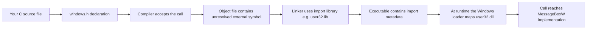
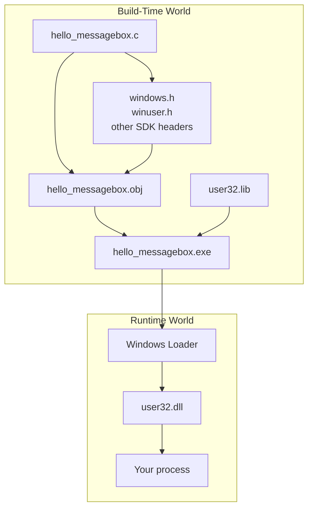
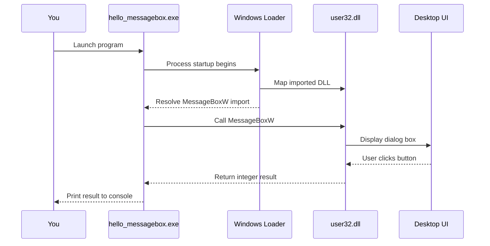
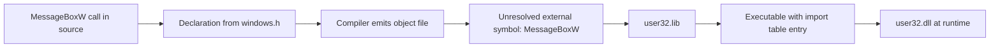
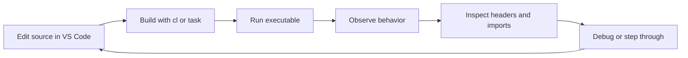
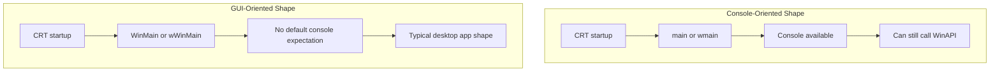
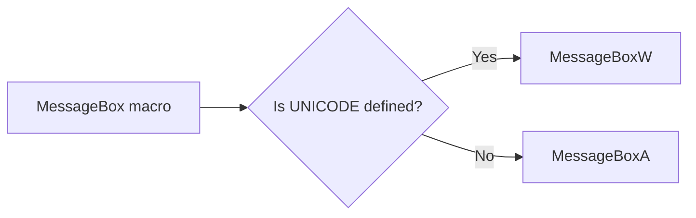
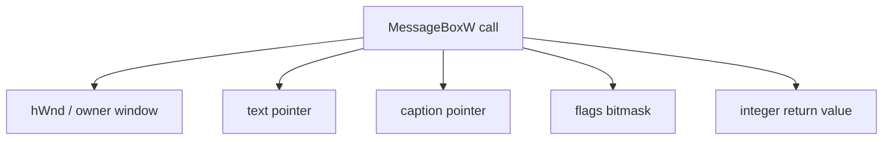
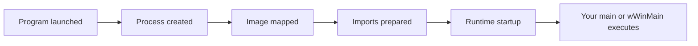
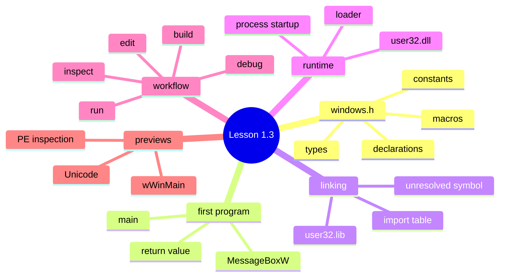

# Lesson 1.3 — Your First Windows C Program

## Where This Fits

**Module:** 1A — Native Foundations and First Contact with the Windows API  
**Lesson:** 1.3  
**Title:** Your First Windows C Program

---

## Why This Lesson Matters

This is the point where the course stops being abstract.

In Lesson 1.1, you built the mental model for *why native code matters*. In Lesson 1.2, you built the lab environment that lets you compile, debug, inspect, and iterate without unnecessary friction. Now you will write, build, run, and inspect your first real Windows-native C program.

The goal is **not** to build a complex application yet.

The goal is to understand the first important layer of reality:

- what `windows.h` actually gives you
- what a WinAPI call looks like in C
- how your source code becomes a Windows executable
- how imported API calls are resolved
- how to build a repeatable **compile → run → inspect** workflow

That workflow becomes the foundation for nearly everything that follows in this course.

---

## Learning Objectives

By the end of this lesson, you should be able to:

- explain what `windows.h` is and why it matters
- identify the difference between **your code**, **declarations in headers**, **import libraries**, and **DLLs loaded at runtime**
- write and compile a minimal C program that calls the Windows API
- understand why a program can call `MessageBoxW` even though your source file does not contain its implementation
- distinguish between a **console-style entry point** and a **Windows GUI-style entry point** at a conceptual level
- inspect a compiled executable to see imports and basic PE details
- follow a repeatable loop for editing, building, running, and inspecting programs in your Windows lab

---

## Prerequisites

Before starting this lesson, you should already have:

- a Windows desktop lab environment
- VS Code configured for C/C++
- the MSVC Build Tools or full Visual Studio Build Tools components installed
- the Windows SDK installed
- access to a developer shell or terminal with `cl.exe`, `link.exe`, and `dumpbin.exe`
- x64dbg and WinDbg available for later inspection steps

If you do not have that yet, complete Lesson 1.2 first.

---

## What We Are Building

We will build **two tiny programs**:

1. a **console-style C program** that calls a WinAPI function
2. a **Windows-style GUI entry-point program** that calls the same API

Why both?

Because the easiest way to learn the Windows API is **not** to start with a full event-driven GUI program. The easiest way is to stay in a familiar C shape first—`main()`—while still calling a native Windows function. Then we will briefly preview the Windows-style entry point so you can see the shape of a “real” Windows desktop app without getting buried in window classes and message loops too early.

---

## Big Picture First

Before touching code, anchor the high-level model.

### A Windows API Call Is Not Magic

When you write this:

```c
MessageBoxW(NULL, L"Hello", L"Lesson 1.3", MB_OK);
```

several different layers are involved.



That diagram is the core of this lesson.

Your source code does **not** contain the implementation of `MessageBoxW`. The header tells the compiler what the function looks like. The import library tells the linker where that symbol should come from. At runtime, the Windows loader makes the actual DLL-backed function available to your process.

---

## The Mental Model You Need

Think of the system in four layers:

### Layer 1 — Your Source Code
This is what you write.

It contains:
- variables
- function calls
- constants
- control flow

### Layer 2 — Headers
Headers declare the existence and shape of types, macros, constants, and functions.

They answer questions like:
- what is `HWND`?
- what parameters does `MessageBoxW` take?
- what does `MB_OK` mean?

### Layer 3 — Linking Artifacts
Import libraries such as `user32.lib` help the linker connect your code to functions implemented elsewhere.

### Layer 4 — Runtime Modules
At runtime, Windows loads DLLs such as `user32.dll`, and your process calls into them.

---

## Visual: Source vs Header vs Import Library vs DLL



A common beginner mistake is to mentally merge all of these into one thing.

Do not do that.

A major part of native Windows literacy is learning to separate:

- declaration
- compilation
- linkage
- runtime resolution

---

# Part I — Understanding `windows.h`

## What Is `windows.h`?

`windows.h` is the broad umbrella header traditionally used in Win32 development. It pulls in a large set of Windows API declarations, directly and indirectly, depending on configuration and feature macros. Microsoft documents that the Windows headers provide declarations for both ANSI and Unicode API variants and use data types intended to support both 32-bit and 64-bit Windows builds. citeturn741433search7turn741433search5

In practice, including `windows.h` gives you access to:

- core Windows types such as `DWORD`, `BOOL`, `HANDLE`, `HWND`, `HINSTANCE`
- macros such as `WINAPI`, `CALLBACK`, `TEXT`, and flag constants
- function declarations for large portions of the Win32 API
- transitive access to more specific headers such as `winuser.h`, `processthreadsapi.h`, `memoryapi.h`, and others depending on what you use

### What `windows.h` Does **Not** Mean

Including `windows.h` does **not** mean:

- all WinAPI code is compiled into your executable
- the actual implementation of functions is now in your source file
- your program automatically becomes a full GUI program

It simply means the compiler can now understand many Windows-native declarations.

---

## Why Windows Uses So Many Special Types and Macros

The Windows API is a C-based API surface with decades of historical compatibility and platform abstraction behind it. Microsoft’s documentation for traditional desktop apps explicitly notes that Win32 uses typedefs and macros heavily to abstract details such as calling conventions and platform-specific declarations. citeturn741433search4turn741433search5

So when you see this:

```c
int WINAPI wWinMain(
    HINSTANCE hInstance,
    HINSTANCE hPrevInstance,
    PWSTR pCmdLine,
    int nCmdShow
);
```

that signature is doing more work than it first appears to.

### Example Breakdown

- `int` → the return type
- `WINAPI` → calling-convention macro
- `wWinMain` → function name
- `HINSTANCE` → Windows-defined handle/type alias used for the current module instance
- `PWSTR` → pointer to a wide-character string

At this stage, do not try to memorize every Windows type. Instead, learn how to read them calmly.

Ask:

1. Is this a normal C type or a Windows alias?
2. Is this value a raw integer, pointer, string, or opaque handle?
3. Is the API Unicode-oriented or ANSI-oriented?
4. Is a macro hiding something important from me?

That habit will pay off later.

---

# Part II — Your Simplest Useful Windows Program

## Strategy: Start With `main()` and Call WinAPI

Your first Windows C program does **not** need to start with `WinMain`.

The easiest path is to write a normal C program with `main()` and make a WinAPI call from inside it. That gives you a familiar control-flow shape while still teaching the Windows-native pieces that matter.

We will use `MessageBoxW` because it is:

- short
- visible
- undeniably Windows-specific
- easy to link and inspect

Microsoft documents `MessageBox` / `MessageBoxW` as a Win32 API function that displays a modal dialog box and returns an integer indicating which button the user clicked. citeturn333732search0

---

## First Example — Console Program Calling `MessageBoxW`

Create a file named `hello_messagebox.c`.

```c
#define UNICODE
#define _UNICODE

#include <windows.h>
#include <stdio.h>

int main(void)
{
    int result = MessageBoxW(
        NULL,
        L"Hello from native Windows C.",
        L"Lesson 1.3",
        MB_OKCANCEL | MB_ICONINFORMATION
    );

    printf("MessageBoxW returned: %d\n", result);
    return 0;
}
```

---

## Read the Program Line by Line

### `#define UNICODE` and `#define _UNICODE`
These macros push the build toward wide-character / Unicode behavior for many Windows and CRT-adjacent APIs.

Windows documentation recommends Unicode as the preferred character encoding for Windows UI elements, filenames, and related API usage. Microsoft also documents that encoding-neutral macros often resolve to ANSI or Unicode variants depending on whether `UNICODE` is defined. citeturn741433search6turn741433search0turn741433search1

For this course, a strong default is:

- prefer explicit `W` APIs where practical
- use wide strings deliberately
- avoid ambiguity when you are learning

That is why this example uses `MessageBoxW` and `L"..."` string literals.

### `#include <windows.h>`
This gives us the declaration for `MessageBoxW`, plus relevant constants and types.

### `#include <stdio.h>`
This gives us `printf` so we can print the return value to the console.

### `int main(void)`
This is the traditional C entry point.

Your program is still a Windows executable. The fact that it starts from `main()` does **not** make it “not Windows.” It simply means you are using a console-oriented startup path rather than a GUI-style one.

### `MessageBoxW(...)`
This is your first direct WinAPI call.

The parameters are:

1. `NULL` → no owner window
2. `L"Hello from native Windows C."` → dialog text
3. `L"Lesson 1.3"` → dialog title
4. `MB_OKCANCEL | MB_ICONINFORMATION` → flags controlling buttons and icon

### `printf(...)`
This prints the integer result returned by the message box.

That makes it easier to see that WinAPI calls behave like ordinary function calls in C:

- they take arguments
- they return values
- you inspect those values
- you reason about success or user choices from those values

---

## Visual: What Happens When This Program Runs



---

# Part III — Build It

## Recommended Build Method

Open a terminal that has access to the MSVC toolchain.

Typical options include:

- Developer PowerShell for Visual Studio
- Developer Command Prompt for Visual Studio
- a VS Code integrated terminal launched from a properly configured developer environment

VS Code’s official C/C++ guidance notes that native development uses external compilers and commonly relies on workspace files such as `tasks.json`, `launch.json`, and `c_cpp_properties.json` for build/debug integration. citeturn333732search6turn333732search2turn333732search10

### Build Command

```powershell
cl /nologo /W4 /Zi hello_messagebox.c user32.lib
```

### What Each Piece Means

- `cl` → Microsoft C/C++ compiler driver
- `/nologo` → suppress banner noise
- `/W4` → higher warning level
- `/Zi` → generate debug information
- `hello_messagebox.c` → source file
- `user32.lib` → import library needed for `MessageBoxW`

### Expected Output

If build succeeds, you should see files like:

- `hello_messagebox.exe`
- `hello_messagebox.obj`
- `hello_messagebox.pdb`

---

## Why `user32.lib` Matters

This is one of the most important concepts in the lesson.

`MessageBoxW` is implemented in the Windows user-interface subsystem, exposed through `user32.dll`. For ordinary load-time dynamic linking, the linker uses the DLL’s import library so your executable can record the needed import metadata. Microsoft’s documentation on DLLs describes load-time dynamic linking as requiring linkage against the import library for the DLL that contains the exported functions. citeturn333732search19

So this is the logic:

- `windows.h` tells the compiler the function exists
- `user32.lib` tells the linker how to represent that dependency
- `user32.dll` is the runtime module that ultimately services the call

### Visual: Import Linkage



---

## What If You Omit `user32.lib`?

Then the compiler may still accept the source, because it already knows the function signature from the header.

But the **linker** will fail, because it cannot resolve the external symbol.

That difference matters:

- **compiler problems** are about syntax, types, declarations, and semantics in source code
- **linker problems** are about connecting compiled code with required definitions and libraries

This is the first time many learners really feel the difference between compile-time and link-time.

---

## Typical Failure Modes

### 1. `fatal error C1083: Cannot open include file: 'windows.h'`
Usually means:
- Windows SDK not installed correctly
- terminal environment not configured correctly
- wrong toolchain or include paths

### 2. `LNK2019 unresolved external symbol MessageBoxW`
Usually means:
- `user32.lib` was not linked
- you are using the wrong build command or broken build task

### 3. Weird Unicode/string mismatch errors
Usually means:
- you mixed wide APIs with narrow strings
- or used encoding-neutral macros without understanding what they expand to

### 4. Program builds but behaves unexpectedly
Usually means:
- wrong flags
- wrong subsystem assumptions
- wrong working directory
- stale binary from an older build

---

# Part IV — Inspect the Result

Building is not enough. You should start inspecting your binaries immediately.

## Step 1 — Confirm the File Type

Run:

```powershell
dumpbin /headers hello_messagebox.exe
```

At this stage, you do not need to understand every field. You are just getting comfortable with the fact that:

- your `.c` file became a PE executable
- the executable contains headers, sections, and metadata
- this is not an abstract transformation

---

## Step 2 — View Imports

Run:

```powershell
dumpbin /imports hello_messagebox.exe
```

You should see imported modules such as:

- `KERNEL32.dll`
- `USER32.dll`
- possibly CRT-related modules depending on how the build is configured

The important thing is that **`USER32.dll` should appear**, because your program calls `MessageBoxW`.

### Why This Matters

This is your first concrete proof that:

- the source code call became an import dependency
- the executable records that dependency
- the loader will later use it at runtime

---

## Step 3 — Run Under a Debugger

You can also launch the program under x64dbg or from VS Code.

At this stage, your goal is simple:

- set a breakpoint around `main`
- step until you reach the `MessageBoxW` call
- observe the call boundary
- note that your program transitions from your code into external module code

Do not worry yet about reading all of the assembly. That comes later in Module 1D.

Right now, the lesson is: **external Windows APIs are not mystical—they are just functions your process reaches through imports.**

---

## Visual: Compile → Run → Inspect Loop



This loop is one of the most valuable habits you can build early.

Do not just write code.

Write it, build it, run it, inspect it, and connect what you saw back to the source.

---

# Part V — A Slightly More Windows-Shaped Program

## Why Preview `wWinMain`?

A real Windows GUI program traditionally uses `WinMain` or `wWinMain` rather than `main`. Microsoft documents `WinMain` as the conventional user-provided entry point for a graphical Windows-based application, while C/C++ programs also commonly use `main` or `wmain` depending on startup model and character width. citeturn333732search8turn741433search9

We are **not** going to build a full event-driven windowed application yet. But you should see the shape of a GUI-style entry point.

---

## Second Example — Minimal `wWinMain`

Create a file named `hello_winmain.c`.

```c
#define UNICODE
#define _UNICODE

#include <windows.h>

int WINAPI wWinMain(
    HINSTANCE hInstance,
    HINSTANCE hPrevInstance,
    PWSTR pCmdLine,
    int nCmdShow)
{
    (void)hInstance;
    (void)hPrevInstance;
    (void)pCmdLine;
    (void)nCmdShow;

    MessageBoxW(
        NULL,
        L"Hello from wWinMain.",
        L"Lesson 1.3",
        MB_OK | MB_ICONINFORMATION
    );

    return 0;
}
```

### What Is Different Here?

- the entry point is `wWinMain`, not `main`
- the function uses Windows-defined types and the `WINAPI` calling-convention macro
- there is no `printf`, because a GUI-style program usually does not assume a console window

### Build Command

```powershell
cl /nologo /W4 /Zi hello_winmain.c user32.lib /link /SUBSYSTEM:WINDOWS
```

### Why `/SUBSYSTEM:WINDOWS`?

Because this tells the linker you are building a Windows GUI-style executable rather than a console-style one.

At this point, keep the lesson simple:

- `main` usually pairs naturally with console-oriented startup
- `wWinMain` usually pairs naturally with Windows GUI-oriented startup

Later in the course, when you study CRT startup and entry-point decisions in detail, you will connect these surface-level choices to the deeper startup path.

---

## Visual: Console vs GUI Entry Shape



The key idea is that **both are still Windows-native executables**.

The difference is the startup style and expected application model—not whether they are “real Windows programs.”

---

# Part VI — Understanding the `W` in `MessageBoxW`

## A Quick Unicode Preview

Windows APIs often come in `A` and `W` variants:

- `MessageBoxA` → ANSI / narrow-string version
- `MessageBoxW` → Unicode / wide-string version

Microsoft documents that many Win32 APIs expose encoding-neutral macros that resolve to the ANSI or Unicode variant based on `UNICODE`, and recommends Unicode as the preferred encoding model for Windows programming. citeturn741433search6turn741433search0turn741433search1

### For This Course, Prefer Clarity Over Cleverness

When learning, ambiguity hurts.

So in this course, the default habit is:

- use explicit wide APIs such as `MessageBoxW`
- use wide string literals such as `L"Hello"`
- avoid hiding important behavior behind generic macros until you understand them

That makes the code easier to reason about.

---

## Visual: ANSI vs Unicode Selection



This seems small, but it is a major source of beginner confusion.

If you use the generic `MessageBox` macro without understanding the build configuration, you can end up with string-type mismatches and confusing compiler errors.

---

# Part VII — Anatomy of the Call Site

Here is the core call again:

```c
int result = MessageBoxW(
    NULL,
    L"Hello from native Windows C.",
    L"Lesson 1.3",
    MB_OKCANCEL | MB_ICONINFORMATION
);
```

Let us break it down at a more mechanical level.

## `NULL`
This means there is no owner window. In a full GUI app, you would often pass a valid `HWND` so the dialog is owned by an existing window.

## `L"Hello from native Windows C."`
This is a wide string literal. The `L` prefix matters.

## `L"Lesson 1.3"`
This is the caption/title text.

## `MB_OKCANCEL | MB_ICONINFORMATION`
These are flag constants combined with bitwise OR.

This teaches an early Windows API pattern:

- many WinAPI functions are configured through flags
- flags are often bit masks
- combining them with `|` is routine

That pattern appears everywhere in Windows programming.

---

## Visual: Parameters as a Structured Contract



This is a good time to internalize a habit:

Every API call is a contract.

Ask:
- what type does each parameter expect?
- who owns the memory being passed?
- is the input mutable or read-only?
- what does the return value mean?
- what are the success and failure paths?

You will use that exact thinking for every API in the course.

---

# Part VIII — Why This Program Is More Important Than It Looks

At first glance, this lesson is “just a message box.”

But conceptually, it teaches a surprising amount.

## What You Already Learned From One Tiny Program

From a single short example, you have already touched:

- a Windows umbrella header
- Windows data types and macros
- wide strings / Unicode direction
- import libraries
- DLL-backed API calls
- the difference between compile-time and link-time
- console vs GUI startup shape
- PE inspection using toolchain utilities
- the edit/build/run/inspect workflow

That is exactly why this lesson exists.

The objective is not the program itself.

The objective is the **mental model** the program lets you build.

---

# Part IX — VS Code Workflow for This Lesson

## Recommended Workspace Layout

```text
lesson-1-3/
├── hello_messagebox.c
├── hello_winmain.c
└── .vscode/
    ├── tasks.json
    └── launch.json
```

---

## Example `tasks.json`

This example assumes your VS Code terminal is already using a developer environment where `cl.exe` is available.

```json
{
  "version": "2.0.0",
  "tasks": [
    {
      "label": "Build hello_messagebox",
      "type": "shell",
      "command": "cl",
      "args": [
        "/nologo",
        "/W4",
        "/Zi",
        "hello_messagebox.c",
        "user32.lib"
      ],
      "group": {
        "kind": "build",
        "isDefault": true
      },
      "problemMatcher": ["$msCompile"]
    },
    {
      "label": "Build hello_winmain",
      "type": "shell",
      "command": "cl",
      "args": [
        "/nologo",
        "/W4",
        "/Zi",
        "hello_winmain.c",
        "user32.lib",
        "/link",
        "/SUBSYSTEM:WINDOWS"
      ],
      "problemMatcher": ["$msCompile"]
    }
  ]
}
```

---

## Example `launch.json`

VS Code’s C/C++ debugging uses `launch.json` to define how a program is started and debugged. citeturn333732search2turn333732search18

```json
{
  "version": "0.2.0",
  "configurations": [
    {
      "name": "Debug hello_messagebox",
      "type": "cppvsdbg",
      "request": "launch",
      "program": "${workspaceFolder}\\hello_messagebox.exe",
      "args": [],
      "stopAtEntry": false,
      "cwd": "${workspaceFolder}",
      "environment": [],
      "console": "integratedTerminal"
    }
  ]
}
```

### Why This Helps

This turns the lesson into a repeatable working lab:

- edit source
- hit build task
- launch debugger
- inspect output
- iterate quickly

That development loop matters more than one specific file.

---

# Part X — A Very Light Loader Preview

This lesson is **not** the full loader lesson. That comes later.

But you should preview the idea now.

When your executable starts:

1. Windows creates the process
2. the image is mapped into memory
3. required DLL dependencies are loaded or resolved
4. imports are fixed up so calls can reach the correct external code
5. runtime startup eventually transfers control to your code

That is enough for today.

Later lessons will formalize:

- PE layout
- import tables
- relocations
- loader initialization sequence
- startup thunks and CRT details

For now, the important idea is simply this:

**your code starts running inside a much larger startup system.**

---

## Visual: Lightweight Startup Preview



That is the seed of the loader model you will grow over the next lessons.

---

# Part XI — Mini Case Study: What the Compiler Knows vs What the Linker Knows

This distinction is so important that it deserves its own section.

## Scenario A — Header Present, Library Missing

You wrote:

```c
#include <windows.h>

int main(void)
{
    MessageBoxW(NULL, L"Hello", L"Test", MB_OK);
    return 0;
}
```

Suppose the compiler has the SDK headers, but you forget to link `user32.lib`.

### What Happens?

- the compiler is happy, because the declaration exists
- the object file is generated
- the linker fails, because no linked input resolves the external symbol

## Scenario B — Library Present, Header Missing

Suppose `user32.lib` is available, but you do not include the correct header.

### What Happens?

- now the compiler does **not** know the function signature
- depending on language rules and compiler settings, this becomes a compile-time problem
- even though the implementation exists somewhere in a DLL, your source cannot correctly express the call contract

### Core Lesson

Headers and libraries solve different problems.

- **headers** explain shape
- **libraries** help resolve linkage

That is a foundational idea for native software development.

---

# Part XII — Common Beginner Misconceptions

## Misconception 1 — “If I include `windows.h`, then Windows code is inside my EXE.”
No.

Including the header does not embed the full implementation.

## Misconception 2 — “If the program builds, the compiler found the DLL.”
Not necessarily.

The compiler works from declarations. Runtime DLL loading is a separate stage.

## Misconception 3 — “A Windows program must start with `WinMain`.”
Not always.

A Windows-native program can absolutely use `main()` in a console-oriented setup and still call WinAPI functions.

## Misconception 4 — “`MessageBox` and `MessageBoxW` are the same thing.”
Not exactly.

`MessageBox` is often a macro alias. `MessageBoxW` is the explicit Unicode entry.

## Misconception 5 — “This lesson is too simple to matter.”
Actually, this lesson introduces the entire idea of calling into Windows-native API surfaces through a compiled and linked binary.

That is not simple. It is foundational.

---

# Part XIII — Guided Lab

## Lab Goal

Build both example programs and prove to yourself that:

- they compile
- they run
- imports appear in the executable
- the Windows API call is visible in your workflow

## Lab A — Console Program + Message Box

### Steps

1. Create `hello_messagebox.c`
2. Paste the first example
3. Build with:

```powershell
cl /nologo /W4 /Zi hello_messagebox.c user32.lib
```

4. Run:

```powershell
.\hello_messagebox.exe
```

5. Click one of the buttons in the dialog
6. Observe the printed return value
7. Inspect imports:

```powershell
dumpbin /imports hello_messagebox.exe
```

### Questions to Answer

- Did `USER32.dll` appear in the import list?
- What integer value was returned when you clicked OK? What about Cancel?
- Did the executable still behave like a normal console program, even though it used WinAPI?

---

## Lab B — `wWinMain` Preview

### Steps

1. Create `hello_winmain.c`
2. Paste the second example
3. Build with:

```powershell
cl /nologo /W4 /Zi hello_winmain.c user32.lib /link /SUBSYSTEM:WINDOWS
```

4. Run the executable from Explorer or terminal
5. Observe that the message box appears without a console-oriented interaction model

### Questions to Answer

- How did the behavior feel different from the `main()` version?
- Why do both programs still count as Windows-native binaries?
- Which parts were the same across both examples?

---

## Lab C — Break It on Purpose

This is extremely useful.

### Experiment 1 — Remove `user32.lib`
Build again and observe the linker error.

### Experiment 2 — Replace `MessageBoxW` with `MessageBoxA` but keep wide strings
Observe the type mismatch or adapt the strings and compare behavior.

### Experiment 3 — Use `MessageBox` without understanding `UNICODE`
Observe how the macro-driven behavior can become less obvious.

### Why This Matters

Purposefully breaking a tiny program is one of the fastest ways to learn:

- what the compiler checks
- what the linker checks
- what build configuration changes actually do

---

# Part XIV — Visual Summary

## One-Page Concept Map



---

# Part XV — Key Terms

## `windows.h`
A broad Windows API header that exposes many declarations, types, macros, and constants used in Win32 development.

## WinAPI / Win32 API
The C-based Windows application programming interface used by native desktop software.

## Import Library
A library used at link time to describe how external DLL-backed symbols should be represented and resolved.

## DLL
A dynamic-link library—a module loaded into a process at runtime that can provide exported functions.

## `MessageBoxW`
The Unicode variant of the Win32 message box API.

## `main`
Traditional console-oriented C entry point.

## `wWinMain`
Conventional Unicode Windows GUI-style entry point.

## `UNICODE`
A preprocessor setting that affects many encoding-neutral Windows API macros.

## `dumpbin`
A tool used to inspect headers, sections, imports, and other binary metadata.

---

# Part XVI — Knowledge Check

Answer these without looking back first.

1. What is the difference between a header declaration and a DLL implementation?
2. Why can the compiler accept a call to `MessageBoxW` even though its implementation is not in your source file?
3. What role does `user32.lib` play?
4. Why is `MessageBoxW` less ambiguous for beginners than `MessageBox`?
5. What is the conceptual difference between `main()` and `wWinMain()`?
6. Why does `dumpbin /imports` matter for your mental model?
7. What is the value of the compile → run → inspect loop?

---

# Part XVII — Practical Takeaways

If you remember only a handful of things from this lesson, remember these:

1. **Headers are declarations, not implementations.**
2. **The compiler and linker solve different problems.**
3. **Import libraries connect build-time symbols to runtime DLL-backed code.**
4. **A Windows program can start simply and still teach deep native concepts.**
5. **The most important habit is not writing code once—it is iterating through build, execution, and inspection repeatedly.**

---

# Part XVIII — What Comes Next

In **Lesson 1.4**, you will build the minimum raw-memory literacy needed to understand what your program is actually manipulating:

- core C types
- pointers
- arrays
- addresses
- how values and memory locations relate

That is the next required layer before you can reason comfortably about buffers, structures, and process memory.

---

# Suggested References

These references informed the technical framing of this lesson and are useful for follow-up reading:

- Microsoft Learn — *Using the Windows Headers*
- Microsoft Learn — *Windows Data Types*
- Microsoft Learn — *MessageBox function (winuser.h)*
- Microsoft Learn — *Working with Strings*
- Microsoft Learn — *About Dynamic-Link Libraries*
- Microsoft Learn — *Configure VS Code for Microsoft C++*
- Microsoft Learn / VS Code Docs — *Configure C/C++ debugging*

---

# End-of-Lesson Checklist

Before moving on, make sure you can do all of the following without guessing:

- [ ] create a `.c` file that includes `windows.h`
- [ ] call `MessageBoxW` correctly with wide strings
- [ ] explain why `user32.lib` is required
- [ ] build the program successfully with `cl`
- [ ] inspect imports with `dumpbin`
- [ ] explain the difference between `main` and `wWinMain` at a high level
- [ ] describe the difference between declarations, import libraries, and runtime DLLs

If you can do that, you are ready for Lesson 1.4.
