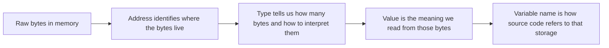
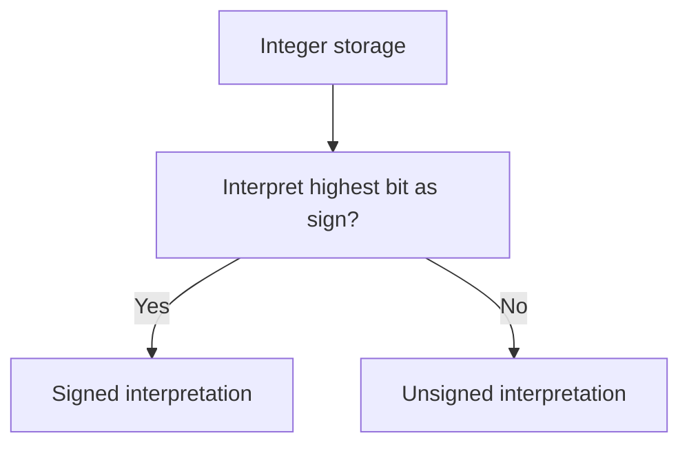
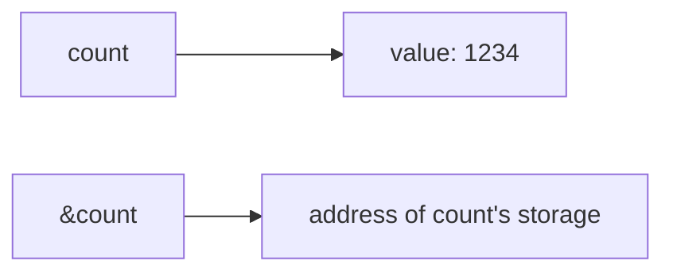
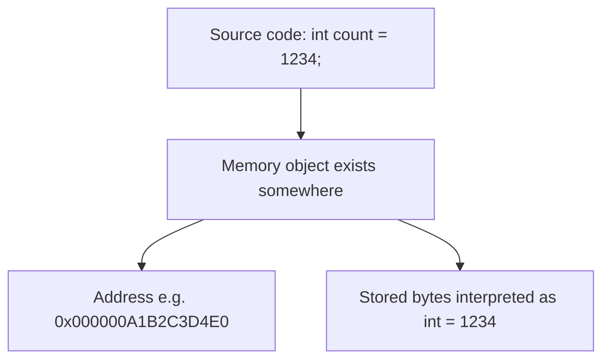
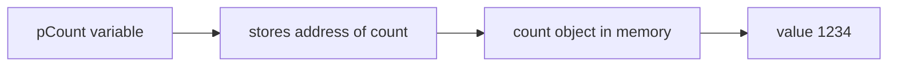
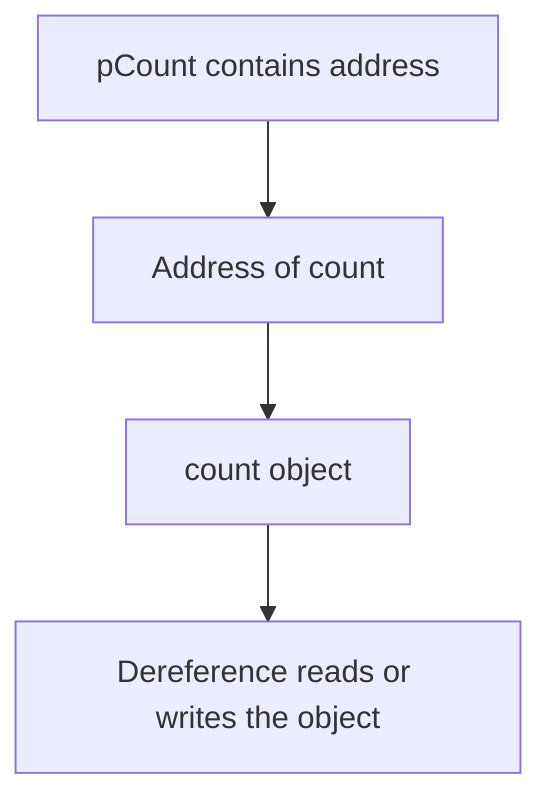
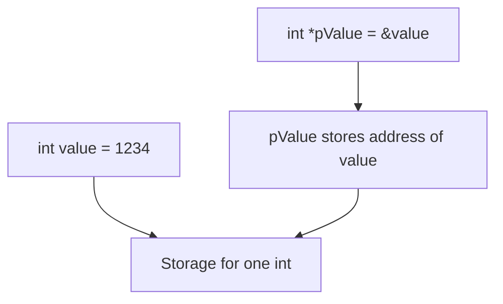
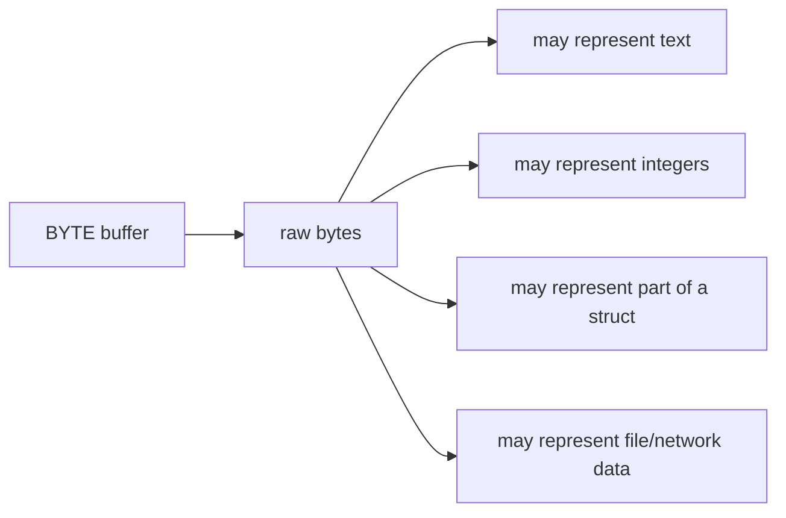

# Lesson 1.4 — Core C Types, Pointers, Arrays, and Addresses

## Where This Fits

**Module:** 1A — Native Foundations and First Contact with the Windows API  
**Lesson:** 1.4  
**Title:** Core C Types, Pointers, Arrays, and Addresses

---

## Why This Lesson Matters

This lesson is where C stops looking like “just syntax” and starts looking like **memory**.

If you do not understand the relationship between:

- a value
- a type
- an address
- a pointer
- a buffer
- a contiguous region of bytes

then later topics will feel mysterious.

You will see function parameters and not know whether they are values or locations. You will see a buffer and not know whether you are looking at text, integers, structures, or raw bytes. You will see an address in a debugger and not know what it means.

That confusion becomes expensive very quickly.

This course is not trying to turn you into a pure computer-science theorist. It is trying to make you **fluent in how programs really inhabit memory on Windows**.

That starts here.

This lesson gives you the minimum raw-memory literacy needed to reason about:

- local variables
- pointers and indirection
- arrays and contiguous storage
- buffers and byte-oriented thinking
- how arguments get passed to APIs
- why addresses matter in debuggers and native tooling
- why a wrong type can produce the right-looking code but the wrong runtime behavior

---

## Learning Objectives

By the end of this lesson, you should be able to:

- explain the difference between a **value**, a **type**, and an **address**
- describe how common C scalar types are represented conceptually in memory
- explain why sizes are platform/compiler dependent, and what is typical on **64-bit Windows**
- read and write basic pointer declarations and dereference operations
- explain what a pointer actually stores
- describe why pointer arithmetic is scaled by the pointed-to type
- explain the relationship between arrays and pointers without incorrectly saying “arrays are pointers”
- reason about contiguous memory and how buffers are laid out
- understand why arrays decay to pointers in many function-call contexts
- connect these concepts to later Windows-native topics such as buffers, WinAPI calls, structures, and binary parsing

---

## Prerequisites

Before starting this lesson, you should already have:

- the VS Code-based Windows lab from Lesson 1.2
- a working C compiler toolchain on Windows
- enough familiarity with Lesson 1.3 to compile and run a simple C program

---

## The Central Mental Model

The most important idea in this lesson is this:

> A program works by reading and writing bytes at addresses, while using types as rules for how those bytes should be interpreted.

That sentence is worth rereading.

C gives you a relatively direct view of this reality.

Higher-level languages often hide the details. C does not. That is exactly why it is useful here.

---

## First Principles: What Actually Exists?

At runtime, the things you reason about most often are:

- **bytes** — the smallest standard unit of addressable memory
- **addresses** — locations in memory
- **types** — rules for interpreting bytes
- **values** — the meaning you get when bytes are interpreted as a given type
- **variables** — named storage locations in source code
- **pointers** — variables whose values are addresses

### Visual Model



A variable name is for *you* and for the compiler.

Memory itself does not contain your source-level variable names.

At runtime, what actually exists is storage at addresses.

---

# Part I — Values, Types, and Bytes

## A Type Is an Interpretation Rule

Consider this declaration:

```c
int count = 1234;
```

Conceptually, this means:

- reserve enough memory for an `int`
- place the bit-pattern representing `1234` into that storage
- allow future reads and writes through the name `count`

The type matters because it determines things such as:

- how large the object is
- whether it is signed or unsigned
- how the compiler generates code to load/store it
- how arithmetic should behave
- how pointer arithmetic scales if you later take its address

## The Same Bytes Can Mean Different Things

This is a foundational low-level idea.

The bytes in memory do not come with labels that say “this is an integer” or “this is text.” The program decides how to interpret them.

A region of four bytes could be interpreted as:

- a 32-bit signed integer
- a 32-bit unsigned integer
- four ASCII characters
- part of a structure
- an address fragment inside some larger layout

This is why **type discipline matters**.

---

## Typical Scalar Types You Will See Constantly

In C, some of the most common scalar types are:

- `char`
- `short`
- `int`
- `long`
- `long long`
- signed and unsigned variants of the above
- floating-point types such as `float` and `double`

For this course, the most important families at first are:

- **byte-like values** → `char`, `unsigned char`, `BYTE`
- **32-bit integers** → `int`, `unsigned int`, `DWORD`
- **size/address-related values** → `size_t`, `SIZE_T`, `uintptr_t`, `ULONG_PTR`
- **pointer values** → `T*` for some type `T`

### Important Warning About Size Assumptions

C does **not** promise the exact byte size of every integer type across all platforms and compilers.

That said, on **64-bit Windows using the common LLP64 model**, a very common mental model is:

- `char` → 1 byte
- `short` → 2 bytes
- `int` → 4 bytes
- `long` → 4 bytes
- `long long` → 8 bytes
- pointer → 8 bytes

That is the model you will most often feel in this course.

But do not memorize this as a universal law of all C everywhere. Memorize it as a **typical Windows x64 reality**.

---

## Signed vs Unsigned

A signed integer type represents both negative and positive values.

An unsigned integer type represents only nonnegative values and uses all available bits for magnitude.

Examples:

```c
int a = -10;
unsigned int b = 10;
```

Why this matters:

- comparisons can behave unexpectedly when you mix signed and unsigned values
- wraparound behavior matters when working with lengths, indexes, and bitmasks
- Windows APIs often use unsigned integral types for sizes, counts, flags, and masks

### Conceptual View



The same storage width can produce very different meanings depending on the type.

---

## `sizeof` Is One of Your Most Important Tools

`sizeof` tells you how many bytes a type or object occupies.

Example:

```c
printf("sizeof(int) = %zu\n", sizeof(int));
printf("sizeof(void*) = %zu\n", sizeof(void*));
```

This is one of the easiest ways to anchor your mental model to your actual environment instead of guessing.

### Mini Rule

Whenever you are unsure how large something is:

- do not assume
- measure it with `sizeof`

---

# Part II — Addresses

## Every Object Lives Somewhere

If an object exists in memory, it has an address.

You can obtain that address with the address-of operator `&`.

```c
int count = 1234;
printf("count = %d\n", count);
printf("&count = %p\n", (void*)&count);
```

Here:

- `count` means “the integer value stored in the variable”
- `&count` means “the address where that integer lives”

This distinction is absolutely critical.

### Visual Example



### A Better Mental Picture



The actual numeric address will vary every run, every machine, and every process layout.

Do not fixate on a specific address value. Fixate on the relationship.

---

## Printing Addresses

Addresses are commonly printed with `%p`.

```c
printf("%p\n", (void*)&count);
```

The cast to `(void*)` is a common, portable habit when printing pointers with `%p`.

---

# Part III — Pointers

## What a Pointer Is

A pointer is a variable whose value is an address.

Example:

```c
int count = 1234;
int *pCount = &count;
```

Read that carefully.

- `count` is an `int`
- `&count` is “address of `count`”
- `pCount` is a pointer to `int`
- the value stored inside `pCount` is the address of `count`

### Visual Diagram



This is called **indirection**.

You are not holding the object directly. You are holding the location of the object.

---

## Declaring Pointers

Basic pattern:

```c
T *name;
```

Examples:

```c
int *pInt;
char *pChar;
unsigned char *pByte;
void *pAny;
```

Meaning:

- `int *pInt;` → `pInt` points to an `int`
- `char *pChar;` → `pChar` points to a `char`
- `void *pAny;` → generic pointer to some address, without type-specific dereference rules until cast

---

## The `*` Symbol Has Two Related Meanings

This confuses beginners, so separate them early.

### In a Declaration

```c
int *p;
```

Here `*` means:

- “`p` is a pointer to `int`”

### In an Expression

```c
*p = 999;
```

Here `*` means:

- “follow the pointer and access the pointed-to object”

Same symbol. Different role.

Context decides which meaning applies.

---

## Dereferencing

Dereferencing means accessing the object at the address stored in a pointer.

```c
int count = 1234;
int *pCount = &count;

printf("%d\n", *pCount);
```

`*pCount` means:

- go to the address stored in `pCount`
- interpret the bytes there as an `int`
- read that integer value

### Write Through a Pointer

```c
*pCount = 777;
```

Now the pointed-to integer changes.

Because `pCount` points to `count`, this updates `count`.

```c
printf("count = %d\n", count);
```

Result: `count` is now `777`.

### Visual Model of Dereference



---

## Pointer Type Matters

A pointer is not “just an address” in the full semantic sense.

It is also a statement about how the compiler should treat the bytes at that address.

For example:

```c
int *pInt;
char *pChar;
```

Even if both contain numeric addresses, they imply different things:

- dereferencing `pInt` reads an `int`
- dereferencing `pChar` reads a `char`
- pointer arithmetic scales differently for each

This is one reason why incorrect casts and incorrect pointer types can quietly break a program.

---

## Null Pointers

A null pointer points to no valid object.

```c
int *p = NULL;
```

This is useful when:

- a pointer has not been assigned yet
- an API uses null to mean “not provided” or “no object”
- you want to make invalid/uninitialized state explicit

### Critical Rule

Do **not** dereference a null pointer.

```c
*p = 123; // invalid if p is NULL
```

That is undefined behavior and commonly crashes.

---

## Uninitialized Pointers Are Dangerous

This is wrong:

```c
int *p;
*p = 5;
```

Why?

Because `p` has not been initialized to a valid address. It contains an indeterminate value.

This is how you accidentally write to garbage addresses.

### Good Habit

Initialize pointers deliberately:

```c
int *p = NULL;
```

or

```c
int value = 0;
int *p = &value;
```

---

# Part IV — Arrays

## What an Array Is

An array is a fixed-size sequence of elements of the same type stored contiguously.

Example:

```c
int numbers[4] = {10, 20, 30, 40};
```

This means:

- reserve space for 4 integers
- store them one after another in memory

### Contiguous Means Adjacent by Element Size

The elements are laid out in order with no gap *between elements of the array itself*.

If `sizeof(int)` is 4, then conceptually:

- `numbers[0]` starts at base address
- `numbers[1]` is 4 bytes later
- `numbers[2]` is another 4 bytes later
- `numbers[3]` is another 4 bytes later

### Visual Diagram

```mermaid
flowchart LR
    A[numbers base address] --> B[numbers[0]]
    B --> C[numbers[1]]
    C --> D[numbers[2]]
    D --> E[numbers[3]]
```

### More Concrete Picture

```text
Base address: 0x1000

0x1000 -> numbers[0]
0x1004 -> numbers[1]
0x1008 -> numbers[2]
0x100C -> numbers[3]
```

That example assumes 4-byte integers.

---

## Arrays Are Not Pointers

This statement matters so much that it deserves its own section.

> Arrays are closely related to pointers, but arrays are not the same thing as pointers.

An array is an actual object with storage for all of its elements.

A pointer is a variable whose value is an address.

These are different things.

### Example

```c
int numbers[4] = {10, 20, 30, 40};
int *p = numbers;
```

Here:

- `numbers` is an array object
- `p` is a pointer variable
- in this expression context, `numbers` decays to a pointer to its first element

That decay is why people casually say “arrays are pointers,” but that statement is sloppy and causes confusion later.

---

## Array Name vs `&array[0]`

In many expression contexts, the array name behaves like a pointer to the first element.

```c
numbers
```

often behaves like:

```c
&numbers[0]
```

That is why this works:

```c
int *p = numbers;
```

But remember: the array itself is still a real array object.

---

## Indexing

Array indexing is based on element offsets.

```c
numbers[2]
```

means “the third integer in the array.”

Conceptually, this is closely related to pointer arithmetic.

```c
numbers[2]
```

is conceptually equivalent to:

```c
*(numbers + 2)
```

This is an important low-level identity.

### Visual Diagram

```mermaid
flowchart TB
    A[numbers] --> B[base address]
    B --> C[+ 0 elements -> numbers[0]]
    B --> D[+ 1 element -> numbers[1]]
    B --> E[+ 2 elements -> numbers[2]]
    B --> F[+ 3 elements -> numbers[3]]
```

---

# Part V — Pointer Arithmetic

## Why Pointer Arithmetic Is Scaled

Suppose:

```c
int *p = numbers;
```

If you compute:

```c
p + 1
```

that does **not** mean “add 1 byte.”

It means:

- move forward by **one `int` element**
- in other words, advance by `sizeof(int)` bytes

If `sizeof(int)` is 4, then `p + 1` advances 4 bytes.

If you had a `char *`, then `p + 1` would advance 1 byte.

### Visual Diagram

```mermaid
flowchart LR
    A[int* p] --> B[p + 1 moves by sizeof(int)]
    C[char* q] --> D[q + 1 moves by sizeof(char)]
    E[struct MYTYPE* r] --> F[r + 1 moves by sizeof(struct MYTYPE)]
```

This scaling behavior is one of the most important low-level properties of typed pointers.

---

## Example

```c
int numbers[4] = {10, 20, 30, 40};
int *p = numbers;

printf("%d\n", *p);       // 10
printf("%d\n", *(p + 1)); // 20
printf("%d\n", *(p + 2)); // 30
```

### Mental Translation

- `p` points to the first element
- `p + 1` points to the second element
- `p + 2` points to the third element

---

## Why This Matters Later

When you work with:

- raw buffers
- Windows structures
- PE headers
- arrays of structures
- binary parsers
- memory regions returned by APIs

pointer arithmetic becomes part of how you navigate the layout.

That is powerful.

It is also exactly where off-by-one mistakes, wrong-type mistakes, and buffer interpretation mistakes become dangerous.

---

# Part VI — Arrays in Function Calls

## Array-to-Pointer Decay

When you pass an array to a function, the function usually receives a pointer to the first element, not a full independent copy of the array object.

Example:

```c
void print_first(int *p)
{
    printf("first = %d\n", p[0]);
}

int numbers[4] = {10, 20, 30, 40};
print_first(numbers);
```

Here `numbers` decays to `int *`.

### What Gets Lost?

The pointer itself does **not** carry the array length.

That means if a function needs the count, you usually pass it separately.

```c
void print_all(const int *p, size_t count)
{
    for (size_t i = 0; i < count; i++)
    {
        printf("%zu: %d\n", i, p[i]);
    }
}
```

This pattern is everywhere in native code.

### Visual Diagram

```mermaid
flowchart LR
    A[Caller has int numbers[4]] --> B[Function call]
    B --> C[Function receives int* to first element]
    B --> D[Length must be passed separately if needed]
```

This exact idea appears constantly in the Windows API:

- pointer to buffer
- length of buffer
- sometimes output length written back separately

That pattern will become very familiar.

---

# Part VII — Raw Bytes and Buffers

## What a Buffer Really Is

A buffer is just a region of memory used to hold data.

Depending on context, that data might be:

- characters
- wide characters
- integers
- binary blobs
- serialized structures
- headers
- network data
- file contents

At the memory level, a buffer is just bytes.

### Common Byte-Oriented Types

You will often see:

```c
unsigned char *
char *
BYTE *
void *
```

These all represent “some address in memory,” but with slightly different intent.

- `char *` often suggests text or raw bytes
- `unsigned char *` often suggests byte-accurate raw data
- `BYTE *` is the Windows-flavored byte pointer style
- `void *` is an untyped generic pointer

---

## Byte-Wise Thinking

Suppose you have:

```c
unsigned char buffer[8] = {0x41, 0x42, 0x43, 0x44, 0x10, 0x20, 0x30, 0x40};
```

You might interpret that as:

- raw bytes
- the ASCII text `ABCD` followed by four non-text bytes
- part of a structure if you impose a layout
- a small record read from a file or network stream

This is why low-level programming often involves constantly asking:

- what bytes are here?
- what type am I assuming?
- is that assumption actually valid?

---

# Part VIII — Windows-Oriented Type Thinking

## Why Windows Uses Its Own Type Names

Windows APIs commonly use names like:

- `BYTE`
- `WORD`
- `DWORD`
- `BOOL`
- `HANDLE`
- `LPVOID`
- `LPCSTR`
- `SIZE_T`
- `ULONG_PTR`

These are mostly typedefs layered over underlying C-compatible types.

Why do this?

Because Windows APIs care about:

- portability across 32-bit and 64-bit builds
- semantic meaning
- historical API consistency
- clearer intent in function signatures

### Examples of Intent

- `BYTE` suggests “raw 8-bit byte data”
- `DWORD` suggests a 32-bit unsigned quantity commonly used for flags, counts, or status values
- `SIZE_T` suggests a size or byte-count concept tied to the platform’s pointer width
- `ULONG_PTR` suggests an integer type large enough to hold a pointer-sized value

The point is not just syntax. The point is meaning.

---

## Why Pointer-Sized Types Matter on Windows x64

On 64-bit Windows, pointers are 64-bit values.

That means code that carelessly stores pointers into 32-bit integer types can truncate addresses and break.

### Bad Idea

```c
DWORD x = (DWORD)p;
```

That may lose the upper bits of a 64-bit pointer.

### Better Thinking

Use pointer-aware types when your logic is really about addresses or pointer-sized quantities.

Examples include:

- `uintptr_t`
- `INT_PTR`
- `UINT_PTR`
- `LONG_PTR`
- `ULONG_PTR`
- `SIZE_T`

This matters later when you reason about:

- module bases
- memory regions
- address arithmetic
- PE structures and offsets
- WinAPI calls that return or consume sizes and addresses

---

# Part IX — Reading Simple Declarations Correctly

Many beginner problems come from not reading declarations carefully enough.

## Examples

```c
int value;
int *pValue;
char buffer[16];
unsigned char *pBytes;
void *pAny;
```

### Read Them in Plain English

- `int value;` → `value` is an integer object
- `int *pValue;` → `pValue` is a pointer to integer
- `char buffer[16];` → `buffer` is an array of 16 `char` elements
- `unsigned char *pBytes;` → `pBytes` is a pointer to unsigned byte-like elements
- `void *pAny;` → `pAny` is a generic pointer

### A Helpful Habit

When a declaration feels confusing, translate it into plain English before trying to use it.

---

# Part X — Common Beginner Mistakes

## Mistake 1 — Confusing Value with Address

Wrong mental model:

> “The variable *is* the address.”

Correct mental model:

- the variable refers to an object
- the object lives at an address
- `&variable` gives you that address

---

## Mistake 2 — Treating Arrays as Fully Interchangeable with Pointers

Arrays and pointers are related, but not identical.

An array has its own storage for multiple elements.

A pointer is one value: an address.

---

## Mistake 3 — Forgetting That Pointer Arithmetic Uses Element Size

Wrong intuition:

> `p + 1` means “next byte.”

Correct rule:

> `p + 1` means “next element of the pointed-to type.”

---

## Mistake 4 — Dereferencing Invalid Pointers

Examples:

- null pointers
- uninitialized pointers
- pointers to objects that no longer exist
- pointers produced by bad casts or invalid arithmetic

---

## Mistake 5 — Losing Length Information

When arrays decay to pointers, length information is not automatically carried along.

That is why APIs so often take:

- pointer to buffer
- buffer length

This is not redundancy. It is necessary.

---

## Mistake 6 — Assuming a Type Name Tells You Everything Universally

Do not assume type sizes from vague folklore.

Use:

- `sizeof`
- platform awareness
- Windows type definitions and intent

---

# Part XI — Guided Example Program

Below is a compact program that demonstrates:

- scalar variables
- addresses
- pointers
- array layout
- pointer arithmetic
- byte-wise buffer access

```c
#include <stdio.h>
#include <stdint.h>
#include <windows.h>

int main(void)
{
    int value = 1234;
    int *pValue = &value;

    int numbers[4] = {10, 20, 30, 40};
    unsigned char bytes[4] = {0x41, 0x42, 0x43, 0x44};

    printf("=== Sizes ===\n");
    printf("sizeof(int)      = %zu\n", sizeof(int));
    printf("sizeof(int*)     = %zu\n", sizeof(int*));
    printf("sizeof(numbers)  = %zu\n", sizeof(numbers));
    printf("sizeof(BYTE)     = %zu\n", sizeof(BYTE));
    printf("sizeof(SIZE_T)   = %zu\n", sizeof(SIZE_T));

    printf("\n=== Value and Address ===\n");
    printf("value            = %d\n", value);
    printf("&value           = %p\n", (void*)&value);
    printf("pValue           = %p\n", (void*)pValue);
    printf("*pValue          = %d\n", *pValue);

    *pValue = 777;
    printf("value after *pValue = 777 -> %d\n", value);

    printf("\n=== Array Elements ===\n");
    for (size_t i = 0; i < 4; i++)
    {
        printf("numbers[%zu] = %d at %p\n", i, numbers[i], (void*)&numbers[i]);
    }

    printf("\n=== Pointer Arithmetic ===\n");
    printf("numbers        = %p\n", (void*)numbers);
    printf("numbers + 1    = %p\n", (void*)(numbers + 1));
    printf("*(numbers + 2) = %d\n", *(numbers + 2));

    printf("\n=== Raw Bytes ===\n");
    for (size_t i = 0; i < 4; i++)
    {
        printf("bytes[%zu] = 0x%02X at %p\n", i, bytes[i], (void*)&bytes[i]);
    }

    return 0;
}
```

---

## What You Should Notice in the Output

When you run it, pay attention to these relationships:

1. `pValue` should print the same address as `&value`.
2. `*pValue` should read the current value of `value`.
3. After writing through `*pValue`, the original variable changes.
4. Adjacent array elements should appear at increasing addresses.
5. The distance between adjacent `int` elements should usually match `sizeof(int)`.
6. The distance between adjacent `unsigned char` elements should be 1 byte.

Do not focus on the exact numeric addresses. Those are not the lesson.

Focus on the pattern.

---

# Part XII — Visual Memory Walkthrough

## Scalar + Pointer Example



## Array Example

```mermaid
flowchart TB
    ARR[int numbers[4]] --> N0[numbers[0]]
    ARR --> N1[numbers[1]]
    ARR --> N2[numbers[2]]
    ARR --> N3[numbers[3]]
    N0 --> A0[contiguous memory]
    N1 --> A1[next element-sized slot]
    N2 --> A2[next element-sized slot]
    N3 --> A3[next element-sized slot]
```

## Buffer-Oriented Example



---

# Part XIII — Why This Matters for Windows APIs

Soon you will see WinAPI functions that take parameters like:

- pointers to input buffers
- pointers to output buffers
- lengths in bytes or element counts
- pointers to structures
- pointers to pointers
- handles that conceptually reference kernel or user-mode objects

Without the mental model from this lesson, those signatures look intimidating.

With the mental model from this lesson, they become readable.

For example, once you see something like:

```c
BOOL SomeApi(
    BYTE *Buffer,
    DWORD BufferLength,
    DWORD *BytesWritten
);
```

you can already reason about it:

- `BYTE *Buffer` → pointer to a byte buffer
- `DWORD BufferLength` → how large that buffer is
- `DWORD *BytesWritten` → pointer to a location where the API can store an output count

That is exactly the kind of literacy this lesson is building.

---

# Part XIV — Lab: Build Intuition Through Inspection

## Lab Goal

Compile and run the guided example program, then inspect the relationships between values, addresses, arrays, and pointers.

## Step 1 — Create the Source File

Create a file named:

```text
lesson_1_4_memory_basics.c
```

Paste in the example program from this lesson.

## Step 2 — Build It

Use your normal VS Code workflow, or compile from a developer terminal.

Example with MSVC:

```powershell
cl /W4 /EHsc /nologo lesson_1_4_memory_basics.c
```

If your environment complains about C++-specific flags, remove `/EHsc` and compile as plain C:

```powershell
cl /W4 /nologo lesson_1_4_memory_basics.c
```

Example with GCC in an MSYS2 shell:

```bash
gcc -Wall -Wextra -o lesson_1_4_memory_basics.exe lesson_1_4_memory_basics.c
```

## Step 3 — Run It

Run the program and study:

- the printed addresses
- the spacing between array elements
- the equality of `&value` and `pValue`
- the effect of writing through the pointer

## Step 4 — Modify It

Try the following changes one at a time:

- change `int value` to `short value`
- change `numbers` from `int[4]` to `char[4]`
- add another pointer `int *pSecond = &numbers[1];`
- print `numbers + 3`
- print `sizeof(numbers) / sizeof(numbers[0])`

## Step 5 — Explain What Happened

After each modification, write down:

- what changed in memory layout
- what changed in addresses
- what changed in printed values
- what changed because of type size

That reflection is part of the lab.

---

# Part XV — A Small but Important Precision Note

## Objects vs Bytes vs Representation

At this stage, keep the following practical mental model:

- every object occupies storage
- storage is made of bytes
- addresses identify locations in that storage
- types tell the compiler how the object should be treated

That model is accurate enough for almost everything you need right now.

Later, you will learn finer-grained details such as:

- alignment
- padding
- structure layout
- object representation
- endianness
- calling-convention effects on stack/register usage

Do not overload yourself with all of that yet.

This lesson is about getting the *core geometric intuition* correct.

---

# Part XVI — Frequently Asked Questions

## “Is a pointer just a number?”

At the machine level, it is an address value.

In C, it is also a typed construct with rules about dereference behavior, arithmetic, and conversions.

So the best answer is:

> It is an address value, but not one you should treat like an ordinary integer casually.

---

## “Are arrays pointers?”

No.

But in many expression contexts, an array name decays to a pointer to its first element.

That is why they feel similar so often.

---

## “Why do APIs need both a pointer and a length?”

Because a pointer tells you **where** the data starts, but not **how much** data is valid.

---

## “Why should I care about pointer size so early?”

Because on 64-bit Windows, addresses are 64-bit values, and many later concepts depend on pointer-width correctness.

---

# Key Terms

- **Address** — a location in memory
- **Value** — the meaning obtained when bytes are interpreted according to a type
- **Type** — rules for how bytes are interpreted and manipulated
- **Pointer** — a variable whose value is an address
- **Dereference** — access the object pointed to by a pointer
- **Array** — fixed-size contiguous sequence of same-typed elements
- **Buffer** — a region of memory used to hold data
- **Contiguous** — laid out directly next to each other in memory order
- **Pointer arithmetic** — movement across memory in units of the pointed-to type
- **Decay** — the common conversion of an array expression to a pointer to its first element

---

# Lesson Summary

In this lesson, you built the core memory literacy that native Windows work depends on.

You learned that:

- types are interpretation rules layered over bytes in memory
- variables live at addresses
- pointers store addresses
- dereferencing follows a pointer to access the pointed-to object
- arrays are contiguous storage for same-typed elements
- arrays and pointers are closely related but not identical
- pointer arithmetic scales by element size, not raw intuition
- native APIs constantly rely on pointer + length patterns
- Windows-specific typedefs often communicate both size intent and semantic intent

This is one of the most important lessons in the entire early part of the course.

If this lesson feels intuitive, future material becomes much easier.

If this lesson still feels fuzzy, spend extra time here before moving on.

That is a good investment.

---

# Knowledge Check

Try answering these without looking back first.

1. What is the difference between `value` and `&value`?
2. What does an `int *` actually store?
3. Why is dereferencing an uninitialized pointer dangerous?
4. Why is `numbers[2]` closely related to `*(numbers + 2)`?
5. Why does `p + 1` not always mean “one byte later”?
6. Why do APIs so often require both a buffer pointer and a length?
7. Why is storing a 64-bit pointer in a 32-bit integer type dangerous on Windows x64?
8. What is the practical difference between an array object and a pointer variable?

---

# Looking Ahead

In the next lesson, we will build directly on this foundation by covering:

- strings
- buffers as text vs bytes
- null terminators
- `char *` vs wide-character strings
- why Unicode conventions matter on Windows

That lesson will feel much easier because you now understand the memory model underneath it.
