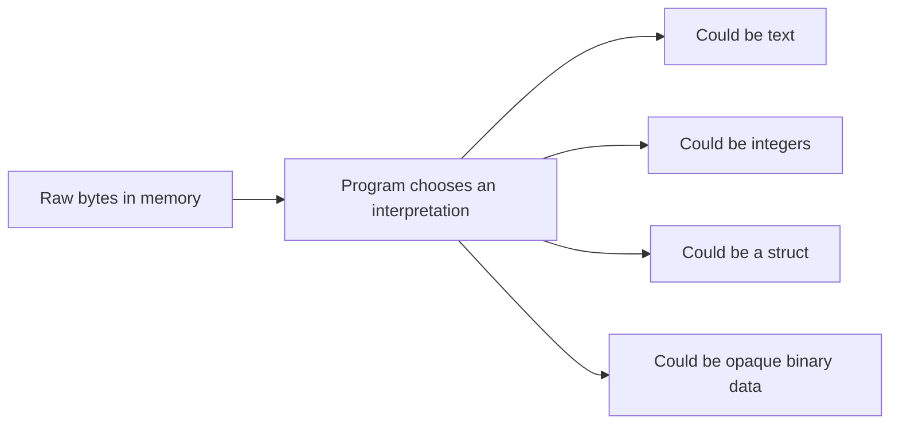
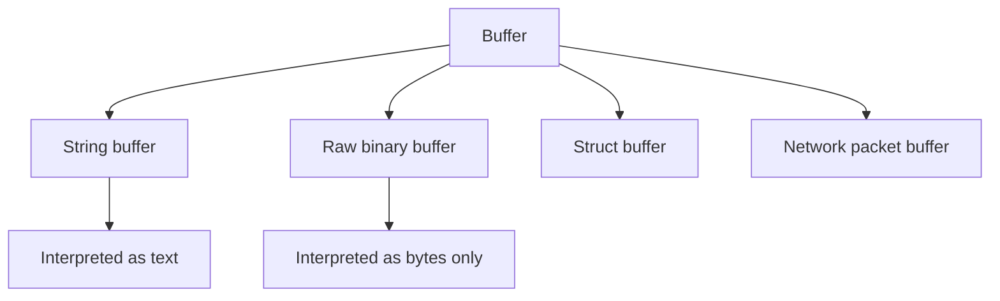
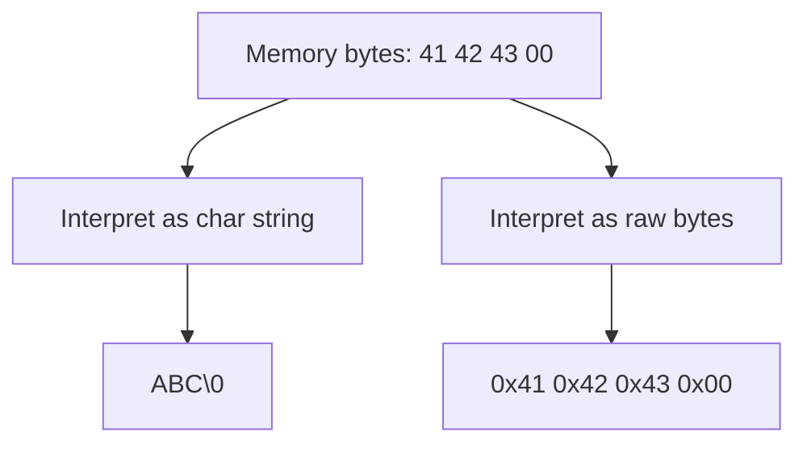
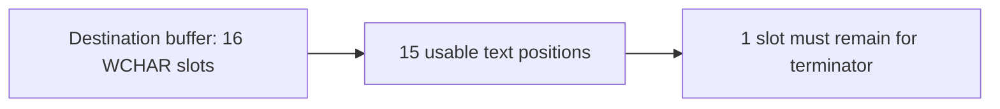
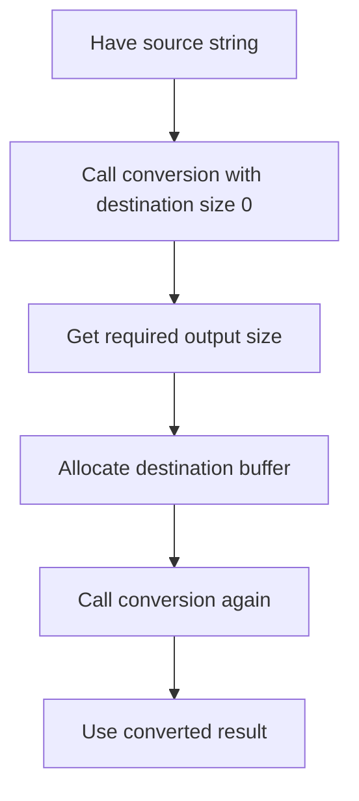
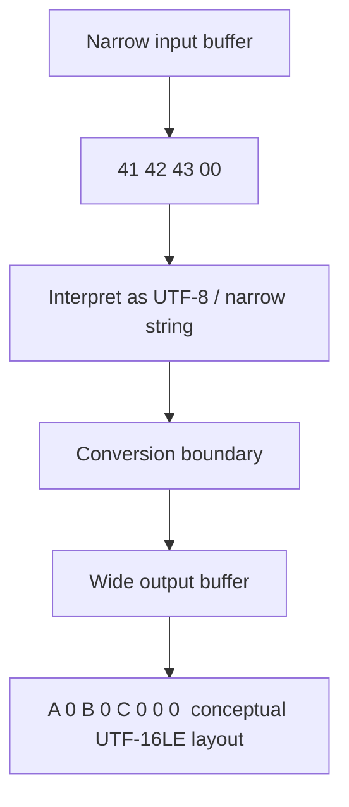

# Lesson 1.5 — Strings, Buffers, and Unicode on Windows

## Where This Fits

**Module:** 1A — Native Foundations and First Contact with the Windows API  
**Lesson:** 1.5  
**Title:** Strings, Buffers, and Unicode on Windows

---

## Why This Lesson Matters

A huge amount of beginner confusion in Windows-native development comes from one simple fact:

> A **string** is not magic. It is just a buffer interpreted according to text rules.

If you do not have a clean mental model for strings and buffers, then later lessons become painful very quickly.

You will see things like:

- `char *`
- `wchar_t *`
- `LPSTR`
- `LPCWSTR`
- `BYTE *`
- `void *`
- `WCHAR name[260]`
- `MultiByteToWideChar`
- `WideCharToMultiByte`

…and it will all blur together unless you understand what each one really means in memory.

This lesson gives you that model.

It also explains one of the most important Windows-specific realities in this course:

> Modern Windows-native development is fundamentally a **Unicode** story, and in the WinAPI that usually means **UTF-16 wide strings**.

You need to understand that before you move deeper into WinAPI usage, structures, process APIs, file paths, registry functions, and loader-related topics.

---

## Learning Objectives

By the end of this lesson, you should be able to:

- explain the difference between a **character**, a **string**, and a **buffer**
- explain why a buffer is not automatically text
- distinguish between **narrow strings** (`char *`) and **wide strings** (`wchar_t *`, `WCHAR *`)
- explain why Windows-native APIs often expect UTF-16 wide strings
- identify common Windows string-related types such as `LPSTR`, `LPCSTR`, `LPWSTR`, and `LPCWSTR`
- reason correctly about **null termination**
- distinguish between **length in bytes** and **length in characters**
- understand why string conversion is a boundary problem, not something to do casually everywhere
- use core conversion APIs conceptually: `MultiByteToWideChar` and `WideCharToMultiByte`
- avoid common errors involving buffer sizes, truncation, and encoding mismatches

---

## Prerequisites

Before starting this lesson, you should already be comfortable with:

- Lesson 1.3 — your first Windows C program
- Lesson 1.4 — values, bytes, addresses, pointers, arrays, and contiguous memory

This lesson assumes you already understand that arrays occupy contiguous memory and that pointers hold addresses.

---

## The Core Mental Model

At the machine level, memory is just bytes.

A **buffer** is simply a region of memory.

A **string** is a buffer that your program chooses to interpret as text using a specific encoding and layout convention.

That means the same raw bytes can be interpreted in more than one way depending on the rules you apply.

### Visual Model



This is the first major idea:

> **Text is an interpretation layered on top of bytes.**

---

# Part I — What Is a String, Really?

## A String Is Usually a Sequence Plus a Convention

When programmers say “string,” they often mean:

- a sequence of character units in memory
- with some rule for finding where the sequence ends
- using some encoding to map stored values to text

In C and in most Win32 APIs, that convention is usually:

- a contiguous sequence of character units
- terminated by a **null terminator**

So a C-style string is not “a text object.”  
It is typically:

- bytes or wide-character units in memory
- followed by a zero-valued terminator

---

## A Buffer Is Broader Than a String

A buffer might hold:

- text
- file data
- encrypted bytes
- machine code
- network data
- a serialized structure
- image bytes
- part of a PE file

So remember:

> **Every string is stored in a buffer, but not every buffer is a string.**

That distinction matters constantly in native code.

### Visual Contrast



---

## Null Termination

A null-terminated string ends with a zero-valued unit.

For narrow strings:

- terminator is `'\0'`

For wide strings:

- terminator is `L'\0'`

Example:

```c
char name[] = "cat";
```

Conceptually in memory:

```text
'c' 'a' 't' '\0'
```

Example:

```c
wchar_t name[] = L"cat";
```

Conceptually in memory:

```text
L'c' L'a' L't' L'\0'
```

The terminator is not “extra decoration.”  
It is how many APIs know where the string ends.

---

## Strings Do Not Carry Their Length Automatically

A classic C string does **not** automatically store its own length alongside its data.

That means many APIs must either:

- walk through memory until they find the null terminator, or
- receive a length separately

This distinction matters a lot when you see function parameters such as:

- pointer only
- pointer plus length
- pointer plus destination buffer size

Those are not interchangeable.

---

# Part II — Characters, Bytes, Code Units, and Why People Get Confused

## The Simplified Model You Need Right Now

To stay practical, keep this layered model in mind:

- **byte** → raw 8-bit storage unit
- **character encoding** → rule for representing text in memory
- **code unit** → the storage unit used by an encoding
- **string** → a sequence of encoded units interpreted as text

For this course, the key working model is:

- narrow C strings use **8-bit `char` units**
- Windows Unicode APIs use **16-bit wide-character units** via `wchar_t` / `WCHAR`
- Windows represents Unicode text in the API layer using **UTF-16**

You do not need full Unicode-theory mastery yet.  
You do need to stop assuming:

- 1 character = 1 byte
- 1 visible symbol = 1 code unit
- “string length” always means the same thing

Those assumptions create bugs.

---

## Why “Length” Is Dangerous Without Context

When someone says “length,” you must ask:

- length in **bytes**?
- length in **characters**?
- length including the null terminator?
- length excluding the null terminator?

That question becomes critical in native APIs.

### Example

A UTF-16 string might contain 5 visible text characters, but the amount of memory used is not automatically “5 bytes.”

Similarly, a UTF-8 string can use varying numbers of bytes for different characters.

That is why Windows documentation is extremely careful about whether a parameter is measured in **bytes** or **characters**.

---

# Part III — Narrow Strings on Windows

## `char *` and 8-Bit Strings

A narrow string in C typically uses `char` elements:

```c
char greeting[] = "hello";
char *p = greeting;
```

This gives you:

- 8-bit storage units
- C-style null termination
- compatibility with standard C string functions
- compatibility with WinAPI **A** functions

### Important Clarification

A `char *` string does **not** by itself tell you the encoding.

It might be:

- ASCII
- UTF-8
- current ANSI code page text
- OEM code page text
- arbitrary bytes that only *happen* to look text-like

That ambiguity is one reason Windows-native work prefers Unicode-centric handling.

---

## When Narrow Strings Are Still Useful

Narrow strings are still common and useful for:

- protocol data that is explicitly UTF-8
- plain ASCII control strings
- file or network formats that define an 8-bit encoding
- interop with libraries that use `char *`
- raw buffers where text is only one possible interpretation

So the lesson is **not** “never use `char *`.”

The lesson is:

> Use `char *` deliberately, and do not pretend it automatically means Unicode-safe Windows text.

---

# Part IV — Wide Strings on Windows

## `wchar_t`, `WCHAR`, and Wide Strings

Windows documentation and APIs commonly use wide-character string types.

Examples:

- `wchar_t *`
- `WCHAR *`
- `LPWSTR`
- `LPCWSTR`

The important working fact is:

> For modern Win32 Unicode APIs, wide strings are the normal and expected text representation.

Declare them like this:

```c
wchar_t title[] = L"Native Foundations";
WCHAR message[] = L"Unicode on Windows";
```

The `L` prefix creates a wide string literal.

---

## Why Windows Uses Wide Strings

Windows supports Unicode text for UI, file names, command lines, and many core APIs.

The practical consequence is that Windows offers two families of many text APIs:

- **A** version → narrow / code-page-based
- **W** version → wide / Unicode

Example:

- `MessageBoxA`
- `MessageBoxW`

The `W` version expects wide-character input.

### Visual Model

```mermaid
flowchart LR
    A[Your source code] --> B[Narrow string literal: "hello"]
    A --> C[Wide string literal: L"hello"]

    B --> D[char* / LPSTR / LPCSTR]
    C --> E[wchar_t* / LPWSTR / LPCWSTR]

    D --> F[A-family WinAPI]
    E --> G[W-family WinAPI]
```

---

## Common Windows String Types

You will see these constantly:

### Narrow / 8-bit family

- `CHAR`
- `LPSTR` → pointer to mutable narrow string
- `LPCSTR` → pointer to constant narrow string

### Wide / Unicode family

- `WCHAR`
- `LPWSTR` → pointer to mutable wide string
- `LPCWSTR` → pointer to constant wide string

### Generic / compile-dependent family

- `TCHAR`
- `LPTSTR`
- `LPCTSTR`

These generic types compile to narrow or wide forms depending on whether `UNICODE` is defined.

---

## Course Guidance: What We Will Prefer

Official Windows guidance supports generic types and generic function names when compiling with `UNICODE`.

For this course, however, the most readable mental model for self-learners is usually:

- use **explicit wide strings**
- use **explicit `W` APIs**
- make the encoding visible in the code

Why?

Because it removes ambiguity.

Instead of hiding the actual type behind `TCHAR` and macro expansion, it shows you exactly what the function expects and exactly what your string is.

So in this course, many examples will prefer:

- `L"..."` literals
- `WCHAR`
- `LPCWSTR`
- `MessageBoxW`

rather than generic forms.

That is a teaching decision for clarity.

---

# Part V — A/W APIs and the Unicode Boundary

## Why A and W Both Exist

Windows had to support older code-page-based programs while also moving the platform toward Unicode.

That is why many APIs exist in parallel forms:

- `CreateFileA` / `CreateFileW`
- `MessageBoxA` / `MessageBoxW`
- `SetWindowTextA` / `SetWindowTextW`

In many headers, the undecorated name is actually a macro alias:

- `CreateFile`
- `MessageBox`
- `lstrlen`

Those generic names resolve to the `A` or `W` version based on whether `UNICODE` is defined.

---

## Why Mixing Styles Causes Confusion

A very common beginner problem is mixing:

- generic function names
- explicit narrow strings
- explicit wide strings
- generic typedefs
- non-generic CRT functions

That can create:

- compilation errors
- accidental narrowing
- unexpected macro resolution
- wrong function variants
- runtime bugs

### Better Beginner Rule

Until you are very comfortable, do one of these consistently:

**Option A — explicit Unicode path**
- `WCHAR`
- `L"..."` literals
- explicit `W` APIs

**Option B — generic path**
- `TCHAR`
- `TEXT("...")`
- generic API names with `UNICODE` defined

For a course like this, **Option A is usually easier to reason about**.

---

# Part VI — Strings vs Raw Byte Buffers

## A Text Buffer and a Byte Buffer Are Not the Same Kind of Thing

Consider these declarations:

```c
char text[] = "ABC";
BYTE raw[] = {0x41, 0x42, 0x43, 0x00};
```

These may contain related values, but they are not the same *conceptual object*.

One is declared as text.

The other is declared as raw bytes.

That distinction matters because:

- APIs expect specific types
- lengths may be interpreted differently
- printing/debugging assumptions differ
- text conversions may be required

---

## The Same Memory Can Look Different Depending on Interpretation



This is exactly why low-level developers must constantly ask:

> What is this buffer supposed to represent?

Not:

> What do I hope it represents?

---

## Strings Are Often Passed as Pointers, but Buffers Need Size Context

This difference matters:

```c
void takes_text(const char *s);
void takes_buffer(const BYTE *buf, size_t len);
```

The first assumes null termination.

The second assumes explicit length.

These are different models.

If you pass arbitrary binary data to a null-terminated string API, the API may:

- stop early at the first zero byte
- run too far if no terminator exists
- misinterpret non-text bytes as text

---

# Part VII — Buffer Size, Capacity, and the Off-By-One Problem

## Capacity Is Not the Same as Current Length

Suppose you declare:

```c
WCHAR title[32];
```

That means:

- buffer capacity = 32 `WCHAR` elements
- not 32 visible characters already stored
- and not necessarily 32 bytes

If `WCHAR` elements are 2 bytes each in the API model, then this buffer occupies 64 bytes of storage.

But when many Windows-safe string APIs ask for a size, they want it in **characters**, not bytes.

That is a crucial distinction.

---

## The Off-By-One Rule

When storing a null-terminated string, you must reserve space for:

- all text units
- plus the terminating null

So if your destination capacity is 16 characters, the longest null-terminated string you can store fully is **15 characters plus terminator**.

### Visual Model



This is one of the most common reasons string copies truncate or fail.

---

## Character Count vs Byte Count

This lesson cannot repeat this too often:

> Some APIs take **characters**. Some APIs take **bytes**. You must know which one you are calling.

That is not trivia. It is a correctness issue.

---

# Part VIII — Safer Copy Patterns

## Why Raw Copying Is Dangerous

Historically, unsafe string copying caused endless bugs.

The core issue is simple:

- source length may exceed destination capacity
- the destination may not get terminated correctly
- developers may measure size in the wrong unit

Windows provides safer helper functions such as the **StrSafe** family.

---

## Example: `StringCchCopyW`

A useful beginner-friendly example is:

```c
StringCchCopyW(dest, cchDest, src);
```

The key idea is that the destination size is expressed in **characters**.

That makes it much easier to reason about a `WCHAR` destination.

### Example

```c
#include <windows.h>
#include <strsafe.h>

WCHAR title[32];
HRESULT hr = StringCchCopyW(title, 32, L"Lesson 1.5");
```

This is conceptually safer than a copy that knows nothing about the destination capacity.

---

## Why This Matters Operationally

You are building habits now that later affect:

- path handling
- registry strings
- command lines
- structure fields
- process creation parameters
- decoding buffers in debuggers
- converting network or file data into WinAPI-compatible strings

Good string discipline is not “just about UI text.”

It is part of not lying to yourself about memory.

---

# Part IX — Conversion Between UTF-8 and UTF-16

## The Boundary Mindset

A clean native program usually does **not** constantly convert strings back and forth everywhere.

Instead, it picks a working representation for most of the program and converts at boundaries.

For Windows-native code, a very reasonable default is:

- keep WinAPI-facing text as UTF-16 wide strings
- convert from UTF-8 when input arrives from a narrow external source
- convert back to UTF-8 only when needed for output, protocols, or storage formats

This is a much healthier pattern than random ad hoc conversions.

---

## `MultiByteToWideChar`

This function converts narrow input into UTF-16 wide output.

Typical use:

- source data is UTF-8 or another 8-bit encoding
- destination is wide text for WinAPI use

### Important Concept

Its input size is measured in **bytes**.

Its output size is measured in **wide characters**.

That difference is exactly why incorrect use can overrun buffers.

---

## `WideCharToMultiByte`

This converts UTF-16 wide input into a narrow output encoding.

Typical use:

- internal or WinAPI text is wide
- output must become UTF-8 or some other specified encoding

### Important Concept

Its input size is measured in **characters**.

Its output size is measured in **bytes**.

Again: you must know the unit on each side.

---

## The Two-Pass Pattern

A very common safe pattern is:

1. call the conversion API with destination size `0`
2. get the required output size
3. allocate or size the destination buffer correctly
4. call again to perform the actual conversion

### Visual Flow



This is one of the most important practical habits in this lesson.

---

# Part X — Worked Example Program

Below is a self-contained example designed for learning.

It shows:

- a UTF-8 narrow string
- conversion to UTF-16
- safe copy into a fixed wide buffer
- a `MessageBoxW` call
- a raw-byte dump so you can connect text to memory

> The goal is not to build the prettiest production program.  
> The goal is to make the representations visible.

```c
#define UNICODE
#define _UNICODE

#include <windows.h>
#include <strsafe.h>
#include <stdio.h>

static void print_bytes(const BYTE *buf, size_t len)
{
    size_t i;

    for (i = 0; i < len; i++)
    {
        printf("%02X ", buf[i]);
    }

    printf("\n");
}

int main(void)
{
    const char *utf8_input = u8"Hello from UTF-8";
    int needed_wchars = 0;
    WCHAR wide_text[64];
    WCHAR title[32];
    HRESULT hr;

    ZeroMemory(wide_text, sizeof(wide_text));
    ZeroMemory(title, sizeof(title));

    /*
        First pass:
        Ask how many wide characters are required, including the null terminator.
    */
    needed_wchars = MultiByteToWideChar(
        CP_UTF8,
        MB_ERR_INVALID_CHARS,
        utf8_input,
        -1,
        NULL,
        0
    );

    if (needed_wchars == 0)
    {
        printf("MultiByteToWideChar sizing failed. GetLastError=%lu\n", GetLastError());
        return 1;
    }

    if ((size_t)needed_wchars > (sizeof(wide_text) / sizeof(wide_text[0])))
    {
        printf("Destination wide_text buffer is too small.\n");
        return 1;
    }

    /*
        Second pass:
        Perform the actual conversion.
    */
    if (MultiByteToWideChar(
            CP_UTF8,
            MB_ERR_INVALID_CHARS,
            utf8_input,
            -1,
            wide_text,
            (int)(sizeof(wide_text) / sizeof(wide_text[0])))
        == 0)
    {
        printf("MultiByteToWideChar conversion failed. GetLastError=%lu\n", GetLastError());
        return 1;
    }

    hr = StringCchCopyW(
        title,
        sizeof(title) / sizeof(title[0]),
        L"Lesson 1.5 Demo"
    );

    if (FAILED(hr))
    {
        printf("StringCchCopyW failed: 0x%08lX\n", (unsigned long)hr);
        return 1;
    }

    printf("UTF-8 input bytes:\n");
    print_bytes((const BYTE *)utf8_input, lstrlenA(utf8_input) + 1);

    printf("Wide text bytes in memory:\n");
    print_bytes((const BYTE *)wide_text, (lstrlenW(wide_text) + 1) * sizeof(WCHAR));

    MessageBoxW(NULL, wide_text, title, MB_OK | MB_ICONINFORMATION);

    return 0;
}
```

---

## What This Program Is Teaching You

### 1. The source and destination are different representations

- `utf8_input` is narrow UTF-8 text
- `wide_text` is UTF-16 wide text for WinAPI usage

### 2. The conversion is explicit

That is good.

It makes the boundary visible instead of hiding it behind assumptions.

### 3. Buffer sizing is handled deliberately

We first ask for the required size, then verify our destination capacity.

### 4. `MessageBoxW` consumes wide text

That reinforces the Windows-native Unicode model.

### 5. Printing raw bytes builds your memory intuition

That matters later when you inspect strings in a debugger or memory view.

---

# Part XI — How to Build This in the Lab

## Minimal MSVC Command

From a developer shell or an appropriately configured VS Code terminal:

```powershell
cl /nologo /W4 /Zi /TC lesson_1_5.c user32.lib
```

Run it:

```powershell
.\lesson_1_5.exe
```

You should see:

- console byte output
- a message box showing the converted wide string

---

## What to Observe Carefully

When you run it, pay attention to:

- the narrow source bytes
- the wide destination bytes
- the extra null terminator
- how `lstrlenA` and `lstrlenW` report lengths in character units, not raw byte totals
- how the byte count for the wide string is computed with `sizeof(WCHAR)`

That last bullet is the kind of detail that later prevents real bugs.

---

# Part XII — A Conceptual Memory Walkthrough

Suppose the source is:

```c
const char *utf8_input = "ABC";
```

Then the narrow bytes look roughly like:

```text
41 42 43 00
```

If converted to UTF-16 wide characters, the resulting representation becomes a sequence of wide units ending in a wide null terminator.

### Diagram



Do not over-focus on the exact byte-endianness details yet.

What matters right now is that:

- the output representation uses wider units
- null termination still exists
- text representation and byte layout are related but not identical

---

# Part XIII — Console Output and the Unicode Trap

## Why Console Text Can Be Confusing on Windows

Console behavior is one place where beginners often get mixed messages.

A few practical points:

- old Windows console habits often revolve around code pages
- newer guidance prefers Unicode
- UTF-8 can work through narrow console APIs when the console code page is configured appropriately
- the `W` family of APIs deals directly with UTF-16 text

For this course, the key operational lesson is:

> Do not assume that because text “prints fine once,” your encoding model is correct.

Console output is one of the easiest places to accidentally build false confidence.

---

# Part XIV — Common Mistakes You Must Learn to See Early

## Mistake 1 — Treating Arbitrary Bytes as a String

This is wrong unless you know:

- the data is actually text
- the encoding is known
- there is valid termination or an explicit length

---

## Mistake 2 — Forgetting the Terminator

If the API expects a null-terminated string and you do not provide one, the API may walk off into unrelated memory.

That can cause:

- garbage output
- incorrect comparisons
- crashes
- data leakage
- very confusing debugger sessions

---

## Mistake 3 — Confusing Characters and Bytes

This is one of the most important mistakes in all of Windows string handling.

Examples of the wrong mindset:

- “This buffer has 32 characters so it must be 32 bytes.”
- “The input length is 16, so the output buffer size can also be 16.”
- “I used `sizeof` once, so I’m definitely safe.”

Those statements may or may not be true depending on the types and the API.

---

## Mistake 4 — Using the Wrong API Variant

Passing a narrow string to a wide API, or vice versa, is a classic failure mode.

Example problem pattern:

- code uses `L"wide literal"`
- function resolves to `MessageBoxA`

Or:

- code uses `"narrow literal"`
- function resolves to `CreateFileW`

This is exactly why consistent style matters.

---

## Mistake 5 — Casual Conversion Using the Wrong Code Page

If you convert narrow text without being explicit about its encoding, you are making an assumption.

That assumption may fail:

- on another machine
- under another locale
- in another console
- on data containing non-ASCII characters

That is why explicit UTF-8 or explicit Unicode handling is healthier than “whatever ANSI means today.”

---

## Mistake 6 — Thinking `sizeof(pointer)` Tells You String Length

This is false.

```c
char *p = "hello";
sizeof(p)
```

This gives you the size of the pointer itself, not the length of the text.

That mistake appears endlessly in beginner native code.

---

# Part XV — Practical Rules of Thumb for This Course

Use these rules until they become instinctive.

## Rule 1

When you see a buffer, ask:

- what is its element type?
- what is its capacity?
- what unit is this API expecting?
- is this text or raw data?

## Rule 2

Prefer explicit `W` WinAPI calls in learning examples when the goal is clarity.

## Rule 3

Treat UTF-8 ↔ UTF-16 conversion as a deliberate boundary crossing.

## Rule 4

Never assume “string length” means bytes.

## Rule 5

Reserve space for the null terminator.

## Rule 6

A pointer to text is not the same thing as an owned buffer with capacity.

That difference matters for writes.

---

# Part XVI — Mini Comparison Table

| Concept | Narrow String | Wide String |
| --- | --- | --- |
| Common C type | `char *` | `wchar_t *` / `WCHAR *` |
| Common Windows const pointer | `LPCSTR` | `LPCWSTR` |
| Common literal form | `"hello"` | `L"hello"` |
| Typical WinAPI family | `A` functions | `W` functions |
| Typical use in modern Windows-native code | boundary data / UTF-8 / legacy interop | primary WinAPI text path |
| Unit commonly counted by many APIs | bytes or chars depending on API | wide characters for many APIs |

---

# Part XVII — Lab Exercises

## Lab 1 — Inspect Literal Layouts

Create a small program that declares:

```c
char a[] = "test";
WCHAR b[] = L"test";
```

Then print:

- `sizeof(a)`
- `sizeof(b)`
- `lstrlenA(a)`
- `lstrlenW(b)`

Write down why those values differ.

---

## Lab 2 — Break a Copy on Purpose

Create a destination buffer that is intentionally too small and see how `StringCchCopyW` behaves.

Questions to answer:

- does it overflow?
- what return value do you get?
- what does the destination contain afterward?

---

## Lab 3 — Add a UTF-8 Conversion Boundary

Take a UTF-8 input string and convert it with `MultiByteToWideChar`.

Then:

- display it with `MessageBoxW`
- print the raw bytes before and after conversion
- explain which length values are in bytes and which are in characters

---

## Lab 4 — Compare Text Buffer vs Raw Byte Buffer

Create:

```c
char text[] = "ABC";
BYTE raw[] = {0x41, 0x42, 0x43, 0x00};
```

Inspect both in a debugger or via byte-printing.

Explain:

- how they are similar
- how they are different
- why the declared type still matters even when the bytes look familiar

---

# Part XVIII — Knowledge Check

Make sure you can answer these without guessing.

1. Why is a buffer not automatically a string?
2. What is the difference between `L"hello"` and `"hello"`?
3. Why is `LPCWSTR` a more informative type than “some string pointer”?
4. Why can copying text safely require you to think in characters instead of bytes?
5. Why is UTF-8 ↔ UTF-16 conversion best treated as a boundary operation?
6. Why can `sizeof(p)` be useless when `p` is a string pointer?
7. What is the practical danger of assuming the current ANSI code page?
8. Why is the null terminator part of the storage requirement?

---

# Part XIX — Summary

This lesson gives you one of the most reusable mental models in the entire course:

> **Strings are memory plus convention.**

You should now understand that:

- text lives in buffers
- not all buffers are text
- narrow strings and wide strings are different representations
- Windows-native APIs strongly revolve around Unicode handling
- null termination matters
- length units matter
- conversion boundaries matter
- buffer discipline matters

That is the real foundation.

You are not just learning how to print text.

You are learning how native code represents, moves, converts, and mis-handles one of the most common data forms in the entire platform.

That understanding will pay off immediately in later lessons involving:

- structures with string fields
- file paths
- process creation
- registry APIs
- imports and exports
- debugger memory inspection
- loader- and PE-related reasoning

---

# Key Terms

- **buffer** — a region of memory used to hold data
- **string** — text data stored according to an encoding and layout convention
- **null terminator** — zero-valued element marking the end of a C-style string
- **narrow string** — string based on 8-bit `char` units
- **wide string** — string based on wide-character units such as `wchar_t` / `WCHAR`
- **Unicode** — a universal text standard used broadly across modern systems
- **UTF-16** — the Unicode encoding commonly used by Windows API wide-string interfaces
- **UTF-8** — a common Unicode encoding used widely in files, protocols, tools, and cross-platform systems
- **conversion boundary** — the point where text changes from one representation or encoding to another
- **capacity** — total space available in a destination buffer
- **length** — amount of currently meaningful data, which must always be interpreted in the correct unit

---

# Suggested Next Step

The next lesson will build on this by shifting from “text in memory” to **structured data in memory**.

That means you are about to move from:

- sequences of character units

to:

- **fields laid out together with rules about size, alignment, and layout**

That is the bridge into **structs, packing, alignment, and data layout**.

---

# Reference Notes

The technical framing in this lesson aligns with current Microsoft documentation for:

- Windows Unicode support and the preference for Unicode text in Win32 APIs
- Windows string data types (`LPSTR`, `LPWSTR`, `TCHAR`, and related forms)
- UTF-8 / UTF-16 conversion through `MultiByteToWideChar` and `WideCharToMultiByte`
- `StringCchCopyW` and size-aware destination handling
- `MessageBoxW` as a Unicode WinAPI example
