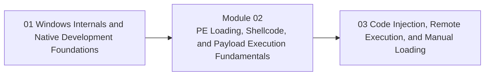

<div align="center">

# Module 02 - PE Loading, Shellcode, and Payload Execution Fundamentals

*Teach how executable logic is represented, stored, transformed, prepared, and executed in a controlled local lab.*

</div>

---

> **Start Here**
>
> Work through the lessons in order, complete the lab, then submit the module checkpoint evidence. Keep this module local-only, snapshot-backed, and evidence-driven.

## At a Glance

| Area | Details |
|---|---|
| Course | Malware Development and Implant Engineering |
| Module | 02 - PE Loading, Shellcode, and Payload Execution Fundamentals |
| Role | Teach how executable logic is represented, stored, transformed, prepared, and executed in a controlled local lab. |
| Why here | Learners now understand PE files, memory, and debugging. They are ready to reason about payload forms and local execution. |
| Prepares next | Module 03 remote process interaction and injection families. |

| Builds On | Core Artifact | Safety Boundary |
|---|---|---|
| Prior module checkpoint evidence and lab discipline | payload lifecycle diagram and evidence notes explaining storage, transformation, memory preparation, control transfer, observations, and cleanup | Local-only or isolated lab artifacts |

---

## Module Position



---

## Lesson Path

| Lesson | Role in the Journey | Required practice |
|---|---|---|
| [2.1 - What Is a Payload? Roles, Forms, and Execution Goals](lessons/module-02-lesson-2-1-what-is-a-payload-roles-forms-and-execution-goals.md) | Define payloads as executable logic with a mission | classify payload examples |
| [2.2 - EXE vs DLL vs Shellcode](lessons/module-02-lesson-2-2-exe-vs-dll-vs-shellcode.md) | Compare startup assumptions and constraints | startup model comparison |
| [2.3 - Position-Independent Code and Runtime API Resolution](lessons/module-02-lesson-2-3-position-independent-code-and-runtime-api-resolution.md) | Explain why shellcode cannot assume normal PE loader support | PIC and API-resolution map |
| [2.4 - From Bytes to Executable Memory](lessons/module-02-lesson-2-4-from-bytes-to-executable-memory.md) | Establish allocation, writing, protection, and control-transfer sequence | prepare-transfer-observe flow |
| [2.5 - Direct Invocation, Thread-Based Execution, and Cleanup](lessons/module-02-lesson-2-5-direct-invocation-thread-based-execution-and-cleanup.md) | Compare direct calls with thread start-routine semantics | controlled benign execution lab |
| [2.6 - Standard DLL Loading as the Baseline](lessons/module-02-lesson-2-6-standard-dll-loading-as-the-baseline.md) | Use normal loader-mediated DLL loading as the reference model | DLL loading inspection |
| [2.7 - Where Payload Bytes Live Before Execution](lessons/module-02-lesson-2-7-where-payload-bytes-live-before-execution.md) | Separate storage surface from execution | storage-surface map |
| [2.8 - Stagers, Stages, Delivery, and the Fileless Misconception](lessons/module-02-lesson-2-8-stagers-stages-delivery-and-the-fileless-misconception.md) | Define loader, stager, stage, memory-only, and fileless precisely | taxonomy worksheet |
| [2.9 - Encoding, Encryption, Obfuscation, and Packing](lessons/module-02-lesson-2-9-encoding-encryption-obfuscation-and-packing.md) | Build a precise transformation taxonomy | classify transformations |
| [2.10 - Payload Configuration and Key Material](lessons/module-02-lesson-2-10-payload-configuration-and-key-material.md) | Separate config storage from payload bytes | config schema sketch |
| [2.11 - Observing Local Execution: Memory, Crashes, and Artifacts](lessons/module-02-lesson-2-11-observing-local-execution-memory-crashes-and-artifacts.md) | Teach debugging and observation habits for payload experiments | crash triage and evidence notes |
| [2.12 - Payload Safety, Sandboxing, and Module Synthesis](lessons/module-02-lesson-2-12-payload-safety-sandboxing-and-module-synthesis.md) | Close with safe workflow, snapshots, and the full local lifecycle | module checkpoint lab |

---

## Hands-On Requirement

This module should not be read passively. Each lesson should produce a lab artifact: code, build output, debugger/process/PE observations, a telemetry note, an architecture diagram, or a checkpoint worksheet.

Use this loop throughout the module:

```text
build or prepare -> run or simulate -> inspect -> interpret -> clean up
```

---

## Learning Arcs

### Arc 02A - Payload Forms and Constraints

| Lesson | Title | Purpose | Practice |
|---|---|---|---|
| 2.1 | What Is a Payload? Roles, Forms, and Execution Goals | Define payloads as executable logic with a mission | classify payload examples |
| 2.2 | EXE vs DLL vs Shellcode | Compare startup assumptions and constraints | startup model comparison |
| 2.3 | Position-Independent Code and Runtime API Resolution | Explain why shellcode cannot assume normal PE loader support | PIC and API-resolution map |

### Arc 02B - Local Execution Lifecycle

| Lesson | Title | Purpose | Practice |
|---|---|---|---|
| 2.4 | From Bytes to Executable Memory | Establish allocation, writing, protection, and control-transfer sequence | prepare-transfer-observe flow |
| 2.5 | Direct Invocation, Thread-Based Execution, and Cleanup | Compare direct calls with thread start-routine semantics | controlled benign execution lab |
| 2.6 | Standard DLL Loading as the Baseline | Use normal loader-mediated DLL loading as the reference model | DLL loading inspection |

### Arc 02C - Staging, Storage, and Transformation

| Lesson | Title | Purpose | Practice |
|---|---|---|---|
| 2.7 | Where Payload Bytes Live Before Execution | Separate storage surface from execution | storage-surface map |
| 2.8 | Stagers, Stages, Delivery, and the Fileless Misconception | Define loader, stager, stage, memory-only, and fileless precisely | taxonomy worksheet |
| 2.9 | Encoding, Encryption, Obfuscation, and Packing | Build a precise transformation taxonomy | classify transformations |
| 2.10 | Payload Configuration and Key Material | Separate config storage from payload bytes | config schema sketch |

### Arc 02D - Observation and Safety

| Lesson | Title | Purpose | Practice |
|---|---|---|---|
| 2.11 | Observing Local Execution: Memory, Crashes, and Artifacts | Teach debugging and observation habits for payload experiments | crash triage and evidence notes |
| 2.12 | Payload Safety, Sandboxing, and Module Synthesis | Close with safe workflow, snapshots, and the full local lifecycle | module checkpoint lab |

---

## Required Artifacts

| Artifact | Path |
|---|---|
| Module lab | [labs/module-02-lab-01-payload-execution-synthesis.md](labs/module-02-lab-01-payload-execution-synthesis.md) |
| Module checkpoint | [checkpoints/module-02-checkpoint.md](checkpoints/module-02-checkpoint.md) |
| Reference cheat sheet | [references/module-02-reference-cheat-sheet.md](references/module-02-reference-cheat-sheet.md) |
| Gap analysis | [references/module-02-gap-analysis.md](references/module-02-gap-analysis.md) |

## Optional Deep Dives

- XOR decode stubs
- Base64 and BaseN representation
- conceptual stream-cipher protection
- resource-backed payload storage
- reflective DLL concepts preview

Deep dives are optional. They should not block the core path.

---

## Module Navigation

| Previous | Next |
|---|---|
| [01 - Windows Internals and Native Development Foundations](../01-windows-foundations/README.md) | [03 - Code Injection, Remote Execution, and Manual Loading](../03-injection-loading/README.md) |
