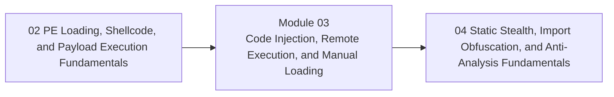

<div align="center">

# Module 03 - Code Injection, Remote Execution, and Manual Loading

*Teach remote-process interaction and injection/loading families as controlled mechanics with prerequisites, tradeoffs, and observable side effects.*

</div>

---

> **Start Here**
>
> Work through the lessons in order, complete the lab, then submit the module checkpoint evidence. Keep this module local-only, snapshot-backed, and evidence-driven.

## At a Glance

| Area | Details |
|---|---|
| Course | Malware Development and Implant Engineering |
| Module | 03 - Code Injection, Remote Execution, and Manual Loading |
| Role | Teach remote-process interaction and injection/loading families as controlled mechanics with prerequisites, tradeoffs, and observable side effects. |
| Why here | Learners now understand local payload execution and Windows process/memory foundations. |
| Prepares next | Module 04 static stealth and Module 05 telemetry mapping. |

| Builds On | Core Artifact | Safety Boundary |
|---|---|---|
| Prior module checkpoint evidence and lab discipline | compare remote execution families by prerequisites, execution trigger, memory model, stability, artifacts, and validation method | Local-only or isolated lab artifacts |

---

## Module Position



---

## Lesson Path

| Lesson | Role in the Journey | Required practice |
|---|---|---|
| [3.1 - Remote Execution on Windows: Targets, Boundaries, and Access](lessons/module-03-lesson-3-1-remote-execution-on-windows-targets-boundaries-and-access.md) | Define cross-process interaction boundaries | boundary and rights map |
| [3.2 - Process and Thread Enumeration Fundamentals](lessons/module-03-lesson-3-2-process-and-thread-enumeration-fundamentals.md) | Treat target discovery as data collection | process and thread inventory |
| [3.3 - Choosing a Stable Target and Requesting the Right Access](lessons/module-03-lesson-3-3-choosing-a-stable-target-and-requesting-the-right-access.md) | Teach target selection, architecture, session, integrity, and handle rights | target selection worksheet |
| [3.4 - Reading Remote State Before Changing Anything](lessons/module-03-lesson-3-4-reading-remote-state-before-changing-anything.md) | Validate assumptions about modules, memory, and context | remote-state checklist |
| [3.5 - Remote Memory as a Lifecycle](lessons/module-03-lesson-3-5-remote-memory-as-a-lifecycle.md) | Establish reserve, write, protect, verify, cleanup | lifecycle diagram |
| [3.6 - Allocation, Writing, Protection, and Verification](lessons/module-03-lesson-3-6-allocation-writing-protection-and-verification.md) | Teach remote memory operations as one pipeline | protection transition table |
| [3.7 - Section Objects and Shared Mapping Concepts](lessons/module-03-lesson-3-7-section-objects-and-shared-mapping-concepts.md) | Introduce section-backed memory as a distinct model | private vs section-backed map |
| [3.8 - Injection Families: A Comparative Mental Model](lessons/module-03-lesson-3-8-injection-families-a-comparative-mental-model.md) | Organize families by memory model and execution trigger | family taxonomy |
| [3.9 - Remote Thread and DLL Path Injection Baselines](lessons/module-03-lesson-3-9-remote-thread-and-dll-path-injection-baselines.md) | Teach clean baseline chains before variants | baseline chain diagram |
| [3.10 - APC, Thread Hijacking, and Context Redirection](lessons/module-03-lesson-3-10-apc-thread-hijacking-and-context-redirection.md) | Explain context-dependent execution mechanisms | execution context comparison |
| [3.11 - Section-Based, Manual Mapping, Reflective Loading, and sRDI Concepts](lessons/module-03-lesson-3-11-section-based-manual-mapping-reflective-loading-and-srdi-concepts.md) | Connect module loading variants to loader responsibilities | responsibility map |
| [3.12 - Hollowing, Startup Timing, and Image Replacement Families](lessons/module-03-lesson-3-12-hollowing-startup-timing-and-image-replacement-families.md) | Group suspended-process and image-replacement concepts | variant comparison |
| [3.13 - Masquerading, Lineage, Module Stomping, and Artifact Reduction](lessons/module-03-lesson-3-13-masquerading-lineage-module-stomping-and-artifact-reduction.md) | Explain identity and representation manipulation without conflating it with execution | identity surface table |
| [3.14 - Synthesis: Selecting the Right Remote Execution Strategy](lessons/module-03-lesson-3-14-synthesis-selecting-the-right-remote-execution-strategy.md) | Build decision framework across prerequisites, stability, and observability | strategy checkpoint |

---

## Hands-On Requirement

This module should not be read passively. Each lesson should produce a lab artifact: code, build output, debugger/process/PE observations, a telemetry note, an architecture diagram, or a checkpoint worksheet.

Use this loop throughout the module:

```text
build or prepare -> run or simulate -> inspect -> interpret -> clean up
```

---

## Learning Arcs

### Arc 03A - Remote Process Readiness

| Lesson | Title | Purpose | Practice |
|---|---|---|---|
| 3.1 | Remote Execution on Windows: Targets, Boundaries, and Access | Define cross-process interaction boundaries | boundary and rights map |
| 3.2 | Process and Thread Enumeration Fundamentals | Treat target discovery as data collection | process and thread inventory |
| 3.3 | Choosing a Stable Target and Requesting the Right Access | Teach target selection, architecture, session, integrity, and handle rights | target selection worksheet |
| 3.4 | Reading Remote State Before Changing Anything | Validate assumptions about modules, memory, and context | remote-state checklist |

### Arc 03B - Remote Memory Lifecycle

| Lesson | Title | Purpose | Practice |
|---|---|---|---|
| 3.5 | Remote Memory as a Lifecycle | Establish reserve, write, protect, verify, cleanup | lifecycle diagram |
| 3.6 | Allocation, Writing, Protection, and Verification | Teach remote memory operations as one pipeline | protection transition table |
| 3.7 | Section Objects and Shared Mapping Concepts | Introduce section-backed memory as a distinct model | private vs section-backed map |

### Arc 03C - Injection and Loading Families

| Lesson | Title | Purpose | Practice |
|---|---|---|---|
| 3.8 | Injection Families: A Comparative Mental Model | Organize families by memory model and execution trigger | family taxonomy |
| 3.9 | Remote Thread and DLL Path Injection Baselines | Teach clean baseline chains before variants | baseline chain diagram |
| 3.10 | APC, Thread Hijacking, and Context Redirection | Explain context-dependent execution mechanisms | execution context comparison |
| 3.11 | Section-Based, Manual Mapping, Reflective Loading, and sRDI Concepts | Connect module loading variants to loader responsibilities | responsibility map |

### Arc 03D - Startup Manipulation and Strategy

| Lesson | Title | Purpose | Practice |
|---|---|---|---|
| 3.12 | Hollowing, Startup Timing, and Image Replacement Families | Group suspended-process and image-replacement concepts | variant comparison |
| 3.13 | Masquerading, Lineage, Module Stomping, and Artifact Reduction | Explain identity and representation manipulation without conflating it with execution | identity surface table |
| 3.14 | Synthesis: Selecting the Right Remote Execution Strategy | Build decision framework across prerequisites, stability, and observability | strategy checkpoint |

---

## Required Artifacts

| Artifact | Path |
|---|---|
| Module lab | [labs/module-03-lab-01-injection-loading-synthesis.md](labs/module-03-lab-01-injection-loading-synthesis.md) |
| Module checkpoint | [checkpoints/module-03-checkpoint.md](checkpoints/module-03-checkpoint.md) |
| Reference cheat sheet | [references/module-03-reference-cheat-sheet.md](references/module-03-reference-cheat-sheet.md) |
| Gap analysis | [references/module-03-gap-analysis.md](references/module-03-gap-analysis.md) |

## Optional Deep Dives

- Early Bird variants
- process doppelganging, herpaderping, and ghosting concepts
- header stomping
- deeper thread-context restoration
- remote PEB walking

Deep dives are optional. They should not block the core path.

---

## Module Navigation

| Previous | Next |
|---|---|
| [02 - PE Loading, Shellcode, and Payload Execution Fundamentals](../02-payload-execution/README.md) | [04 - Static Stealth, Import Obfuscation, and Anti-Analysis Fundamentals](../04-static-stealth-anti-analysis/README.md) |
