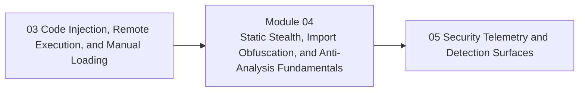

<div align="center">

# Module 04 - Static Stealth, Import Obfuscation, and Anti-Analysis Fundamentals

*Teach how binaries change their static shape, how analysts triage them, and why static stealth is limited.*

</div>

---

> **Start Here**
>
> Work through the lessons in order, complete the lab, then submit the module checkpoint evidence. Keep this module local-only, snapshot-backed, and evidence-driven.

## At a Glance

| Area | Details |
|---|---|
| Course | Malware Development and Implant Engineering |
| Module | 04 - Static Stealth, Import Obfuscation, and Anti-Analysis Fundamentals |
| Role | Teach how binaries change their static shape, how analysts triage them, and why static stealth is limited. |
| Why here | Learners understand payloads and loading. They can now reason about what binaries reveal before and during early execution. |
| Prepares next | Module 05 telemetry and detection surfaces. |

| Builds On | Core Artifact | Safety Boundary |
|---|---|---|
| Prior module checkpoint evidence and lab discipline | before/after static triage report explaining what changed, what did not change, what an analyst can still infer, and what requires runtime validation | Local-only or isolated lab artifacts |

---

## Module Position



---

## Lesson Path

| Lesson | Role in the Journey | Required practice |
|---|---|---|
| [4.1 - What a Binary Reveals Before It Runs](lessons/module-04-lesson-4-1-what-a-binary-reveals-before-it-runs.md) | Establish strings, imports, sections, entropy, metadata, resources, and signatures as triage signals | static triage worksheet |
| [4.2 - Static vs Dynamic Detection Boundaries](lessons/module-04-lesson-4-2-static-vs-dynamic-detection-boundaries.md) | Explain what static inspection can and cannot prove | observation vs inference table |
| [4.3 - String Obfuscation as Representation Change](lessons/module-04-lesson-4-3-string-obfuscation-as-representation-change.md) | Teach string hiding as transformation with runtime recovery | before/after string inspection |
| [4.4 - Import Evasion, Delayed Resolution, and API Hashing](lessons/module-04-lesson-4-4-import-evasion-delayed-resolution-and-api-hashing.md) | Explain import minimization and hashed lookup patterns without mysticism | import visibility comparison |
| [4.5 - Custom Import Resolution and API Set Awareness](lessons/module-04-lesson-4-5-custom-import-resolution-and-api-set-awareness.md) | Connect runtime resolution to PEB, modules, exports, and API set redirection | resolution responsibility map |
| [4.6 - Metadata, Resources, Entropy, and Packing Concepts](lessons/module-04-lesson-4-6-metadata-resources-entropy-and-packing-concepts.md) | Explain binary identity and packed-shape tradeoffs | entropy and metadata comparison |
| [4.7 - Anti-Debugging, Anti-VM, and Anti-Sandbox Signals](lessons/module-04-lesson-4-7-anti-debugging-anti-vm-and-anti-sandbox-signals.md) | Teach environment checks as assumptions with false-positive risk | environment-signal worksheet |
| [4.8 - Static Stealth Failure Modes](lessons/module-04-lesson-4-8-static-stealth-failure-modes.md) | Explain why changed static shape does not equal invisibility | failure-mode matrix |
| [4.9 - Analyst View: Reconstructing Meaning From a Transformed Binary](lessons/module-04-lesson-4-9-analyst-view-reconstructing-meaning-from-a-transformed-binary.md) | Teach reverse perspective and evidence-driven interpretation | analyst note exercise |
| [4.10 - Synthesis: Static Stealth Tradeoff Review](lessons/module-04-lesson-4-10-synthesis-static-stealth-tradeoff-review.md) | Consolidate signals, transformations, and limits | module checkpoint |

---

## Hands-On Requirement

This module should not be read passively. Each lesson should produce a lab artifact: code, build output, debugger/process/PE observations, a telemetry note, an architecture diagram, or a checkpoint worksheet.

Use this loop throughout the module:

```text
build or prepare -> run or simulate -> inspect -> interpret -> clean up
```

---

## Learning Arcs

### Arc 04A - Static Triage Baseline

| Lesson | Title | Purpose | Practice |
|---|---|---|---|
| 4.1 | What a Binary Reveals Before It Runs | Establish strings, imports, sections, entropy, metadata, resources, and signatures as triage signals | static triage worksheet |
| 4.2 | Static vs Dynamic Detection Boundaries | Explain what static inspection can and cannot prove | observation vs inference table |

### Arc 04B - Representation and Resolution Changes

| Lesson | Title | Purpose | Practice |
|---|---|---|---|
| 4.3 | String Obfuscation as Representation Change | Teach string hiding as transformation with runtime recovery | before/after string inspection |
| 4.4 | Import Evasion, Delayed Resolution, and API Hashing | Explain import minimization and hashed lookup patterns without mysticism | import visibility comparison |
| 4.5 | Custom Import Resolution and API Set Awareness | Connect runtime resolution to PEB, modules, exports, and API set redirection | resolution responsibility map |

### Arc 04C - Anti-Analysis and Analyst Reconstruction

| Lesson | Title | Purpose | Practice |
|---|---|---|---|
| 4.6 | Metadata, Resources, Entropy, and Packing Concepts | Explain binary identity and packed-shape tradeoffs | entropy and metadata comparison |
| 4.7 | Anti-Debugging, Anti-VM, and Anti-Sandbox Signals | Teach environment checks as assumptions with false-positive risk | environment-signal worksheet |
| 4.8 | Static Stealth Failure Modes | Explain why changed static shape does not equal invisibility | failure-mode matrix |
| 4.9 | Analyst View: Reconstructing Meaning From a Transformed Binary | Teach reverse perspective and evidence-driven interpretation | analyst note exercise |
| 4.10 | Synthesis: Static Stealth Tradeoff Review | Consolidate signals, transformations, and limits | module checkpoint |

---

## Required Artifacts

| Artifact | Path |
|---|---|
| Module lab | [labs/module-04-lab-01-static-stealth-anti-analysis-synthesis.md](labs/module-04-lab-01-static-stealth-anti-analysis-synthesis.md) |
| Module checkpoint | [checkpoints/module-04-checkpoint.md](checkpoints/module-04-checkpoint.md) |
| Reference cheat sheet | [references/module-04-reference-cheat-sheet.md](references/module-04-reference-cheat-sheet.md) |
| Gap analysis | [references/module-04-gap-analysis.md](references/module-04-gap-analysis.md) |

## Optional Deep Dives

- compile-time string encryption patterns
- hash collision handling
- API set parser internals
- packer anatomy
- deeper resource and signing triage

Deep dives are optional. They should not block the core path.

---

## Module Navigation

| Previous | Next |
|---|---|
| [03 - Code Injection, Remote Execution, and Manual Loading](../03-injection-loading/README.md) | [05 - Security Telemetry and Detection Surfaces](../05-telemetry-detection-surfaces/README.md) |
