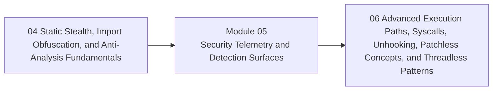

<div align="center">

# Module 05 - Security Telemetry and Detection Surfaces

*Teach what defenders, analysts, and endpoint security products observe so learners understand detection surfaces before advanced evasion claims.*

</div>

---

> **Start Here**
>
> Work through the lessons in order, complete the lab, then submit the module checkpoint evidence. Keep this module local-only, snapshot-backed, and evidence-driven.

## At a Glance

| Area | Details |
|---|---|
| Course | Malware Development and Implant Engineering |
| Module | 05 - Security Telemetry and Detection Surfaces |
| Role | Teach what defenders, analysts, and endpoint security products observe so learners understand detection surfaces before advanced evasion claims. |
| Why here | Learners have seen payloads, injection, and static stealth. They now need a defender visibility model. |
| Prepares next | Module 06 advanced execution-path and patchless concepts. |

| Builds On | Core Artifact | Safety Boundary |
|---|---|---|
| Prior module checkpoint evidence and lab discipline | telemetry matrix for representative behaviors from Modules 02-04, separating direct observations, inferences, and validation steps | Local-only or isolated lab artifacts |

---

## Module Position



---

## Lesson Path

| Lesson | Role in the Journey | Required practice |
|---|---|---|
| [5.1 - What EDR Actually Tries to Observe](lessons/module-05-lesson-5-1-what-edr-actually-tries-to-observe.md) | Build high-level endpoint visibility mental model | visibility map |
| [5.2 - Events, Correlation, and Behavioral Analytics](lessons/module-05-lesson-5-2-events-correlation-and-behavioral-analytics.md) | Explain events vs behavior chains | event-chain worksheet |
| [5.3 - User-Mode Hooks, Kernel Callbacks, and Monitoring Boundaries](lessons/module-05-lesson-5-3-user-mode-hooks-kernel-callbacks-and-monitoring-boundaries.md) | Teach where monitoring happens and why kernel bypasses are out of core scope | hook/callback map |
| [5.4 - ETW in Context](lessons/module-05-lesson-5-4-etw-in-context.md) | Explain ETW as observability infrastructure | provider and signal map |
| [5.5 - AMSI in Context](lessons/module-05-lesson-5-5-amsi-in-context.md) | Explain AMSI role and boundaries | AMSI data-flow diagram |
| [5.6 - Memory Scanning and Runtime Inspection](lessons/module-05-lesson-5-6-memory-scanning-and-runtime-inspection.md) | Teach memory-state visibility | memory-scan concept map |
| [5.7 - Process, Thread, Module, Handle, File, and Registry Signals](lessons/module-05-lesson-5-7-process-thread-module-handle-file-and-registry-signals.md) | Map core OS artifacts to detection surfaces | artifact matrix |
| [5.8 - Network, Beacon, and Timing Signals](lessons/module-05-lesson-5-8-network-beacon-and-timing-signals.md) | Preview communication visibility before C2 architecture | timing profile worksheet |
| [5.9 - Technique-to-Telemetry Mapping](lessons/module-05-lesson-5-9-technique-to-telemetry-mapping.md) | Connect earlier modules to observable signals | technique telemetry matrix |
| [5.10 - Why One Bypass Does Not Equal Invisibility](lessons/module-05-lesson-5-10-why-one-bypass-does-not-equal-invisibility.md) | Correct common evasion mythology | layered visibility exercise |
| [5.11 - Building an Analyst-Quality Evidence Note](lessons/module-05-lesson-5-11-building-an-analyst-quality-evidence-note.md) | Standardize evidence writing and validation | evidence note lab |

---

## Hands-On Requirement

This module should not be read passively. Each lesson should produce a lab artifact: code, build output, debugger/process/PE observations, a telemetry note, an architecture diagram, or a checkpoint worksheet.

Use this loop throughout the module:

```text
build or prepare -> run or simulate -> inspect -> interpret -> clean up
```

---

## Learning Arcs

### Arc 05A - Endpoint Visibility Model

| Lesson | Title | Purpose | Practice |
|---|---|---|---|
| 5.1 | What EDR Actually Tries to Observe | Build high-level endpoint visibility mental model | visibility map |
| 5.2 | Events, Correlation, and Behavioral Analytics | Explain events vs behavior chains | event-chain worksheet |
| 5.3 | User-Mode Hooks, Kernel Callbacks, and Monitoring Boundaries | Teach where monitoring happens and why kernel bypasses are out of core scope | hook/callback map |

### Arc 05B - Major Telemetry Surfaces

| Lesson | Title | Purpose | Practice |
|---|---|---|---|
| 5.4 | ETW in Context | Explain ETW as observability infrastructure | provider and signal map |
| 5.5 | AMSI in Context | Explain AMSI role and boundaries | AMSI data-flow diagram |
| 5.6 | Memory Scanning and Runtime Inspection | Teach memory-state visibility | memory-scan concept map |
| 5.7 | Process, Thread, Module, Handle, File, and Registry Signals | Map core OS artifacts to detection surfaces | artifact matrix |
| 5.8 | Network, Beacon, and Timing Signals | Preview communication visibility before C2 architecture | timing profile worksheet |

### Arc 05C - Evidence and Validation

| Lesson | Title | Purpose | Practice |
|---|---|---|---|
| 5.9 | Technique-to-Telemetry Mapping | Connect earlier modules to observable signals | technique telemetry matrix |
| 5.10 | Why One Bypass Does Not Equal Invisibility | Correct common evasion mythology | layered visibility exercise |
| 5.11 | Building an Analyst-Quality Evidence Note | Standardize evidence writing and validation | evidence note lab |

---

## Required Artifacts

| Artifact | Path |
|---|---|
| Module lab | [labs/module-05-lab-01-telemetry-detection-surfaces-synthesis.md](labs/module-05-lab-01-telemetry-detection-surfaces-synthesis.md) |
| Module checkpoint | [checkpoints/module-05-checkpoint.md](checkpoints/module-05-checkpoint.md) |
| Reference cheat sheet | [references/module-05-reference-cheat-sheet.md](references/module-05-reference-cheat-sheet.md) |
| Gap analysis | [references/module-05-gap-analysis.md](references/module-05-gap-analysis.md) |

## Optional Deep Dives

- Sysmon-oriented lab profile
- event log collection
- memory scanner concepts
- cloud EDR pipeline concepts
- Sigma and YARA rule reading

Deep dives are optional. They should not block the core path.

---

## Module Navigation

| Previous | Next |
|---|---|
| [04 - Static Stealth, Import Obfuscation, and Anti-Analysis Fundamentals](../04-static-stealth-anti-analysis/README.md) | [06 - Advanced Execution Paths, Syscalls, Unhooking, Patchless Concepts, and Threadless Patterns](../06-advanced-execution-evasion/README.md) |
