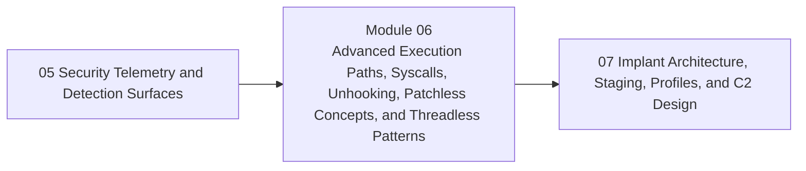

<div align="center">

# Module 06 - Advanced Execution Paths, Syscalls, Unhooking, Patchless Concepts, and Threadless Patterns

*Teach advanced execution-path ideas as engineering tradeoffs, with emphasis on assumptions, fragility, portability, and observable side effects.*

</div>

---

> **Start Here**
>
> Work through the lessons in order, complete the lab, then submit the module checkpoint evidence. Keep this module local-only, snapshot-backed, and evidence-driven.

## At a Glance

| Area | Details |
|---|---|
| Course | Malware Development and Implant Engineering |
| Module | 06 - Advanced Execution Paths, Syscalls, Unhooking, Patchless Concepts, and Threadless Patterns |
| Role | Teach advanced execution-path ideas as engineering tradeoffs, with emphasis on assumptions, fragility, portability, and observable side effects. |
| Why here | Learners first need telemetry foundations before claims about evasion can make sense. |
| Prepares next | Module 07 implant architecture and C2 design. |

| Builds On | Core Artifact | Safety Boundary |
|---|---|---|
| Prior module checkpoint evidence and lab discipline | advanced execution tradeoff review explaining what each path changes, what it does not change, what can still be observed, and why complexity may not be justified | Local-only or isolated lab artifacts |

---

## Module Position



---

## Lesson Path

| Lesson | Role in the Journey | Required practice |
|---|---|---|
| [6.1 - Advanced Execution Paths: What Problem Are We Solving?](lessons/module-06-lesson-6-1-advanced-execution-paths-what-problem-are-we-solving.md) | Frame advanced techniques as tradeoff decisions | problem-definition worksheet |
| [6.2 - WinAPI, NTAPI, Syscalls, and Versioning Risk](lessons/module-06-lesson-6-2-winapi-ntapi-syscalls-and-versioning-risk.md) | Reconnect API layers to portability and stability | API layer map |
| [6.3 - NTDLL Hooking, Unhooking, and API Repair Concepts](lessons/module-06-lesson-6-3-ntdll-hooking-unhooking-and-api-repair-concepts.md) | Explain hook removal goals, assumptions, and observability limits | hook-state diagram |
| [6.4 - Hardware Breakpoints and Debug Registers](lessons/module-06-lesson-6-4-hardware-breakpoints-and-debug-registers.md) | Introduce DR0-DR7 and breakpoint semantics | register concept map |
| [6.5 - Patchless Concepts and HWBP-Assisted Reasoning](lessons/module-06-lesson-6-5-patchless-concepts-and-hwbp-assisted-reasoning.md) | Explain no-patch reasoning and constraints | patchless tradeoff table |
| [6.6 - VEH, Exceptions, Callbacks, Timers, and Threadpool Dispatch](lessons/module-06-lesson-6-6-veh-exceptions-callbacks-timers-and-threadpool-dispatch.md) | Compare alternate dispatch mechanisms | dispatch surface map |
| [6.7 - Threadless Execution and Context Manipulation Claims](lessons/module-06-lesson-6-7-threadless-execution-and-context-manipulation-claims.md) | Explain threadless claims and validation boundaries | claim validation worksheet |
| [6.8 - LOLBins, Trusted Utilities, and Control-Flow Boundary Topics](lessons/module-06-lesson-6-8-lolbins-trusted-utilities-and-control-flow-boundary-topics.md) | Treat trusted-tool use and advanced control flow as detection and trust-boundary problems | trust-boundary worksheet |
| [6.9 - Advanced Execution Failure Modes](lessons/module-06-lesson-6-9-advanced-execution-failure-modes.md) | Explain crashes, instability, portability issues, and maintenance cost | failure-mode matrix |
| [6.10 - Synthesis: Choosing Advanced Paths Responsibly](lessons/module-06-lesson-6-10-synthesis-choosing-advanced-paths-responsibly.md) | Consolidate tradeoffs, defender view, and boundaries | module checkpoint |

---

## Hands-On Requirement

This module should not be read passively. Each lesson should produce a lab artifact: code, build output, debugger/process/PE observations, a telemetry note, an architecture diagram, or a checkpoint worksheet.

Use this loop throughout the module:

```text
build or prepare -> run or simulate -> inspect -> interpret -> clean up
```

---

## Learning Arcs

### Arc 06A - API Layers and Hook-Aware Reasoning

| Lesson | Title | Purpose | Practice |
|---|---|---|---|
| 6.1 | Advanced Execution Paths: What Problem Are We Solving? | Frame advanced techniques as tradeoff decisions | problem-definition worksheet |
| 6.2 | WinAPI, NTAPI, Syscalls, and Versioning Risk | Reconnect API layers to portability and stability | API layer map |
| 6.3 | NTDLL Hooking, Unhooking, and API Repair Concepts | Explain hook removal goals, assumptions, and observability limits | hook-state diagram |

### Arc 06B - Patchless and Alternative Dispatch Concepts

| Lesson | Title | Purpose | Practice |
|---|---|---|---|
| 6.4 | Hardware Breakpoints and Debug Registers | Introduce DR0-DR7 and breakpoint semantics | register concept map |
| 6.5 | Patchless Concepts and HWBP-Assisted Reasoning | Explain no-patch reasoning and constraints | patchless tradeoff table |
| 6.6 | VEH, Exceptions, Callbacks, Timers, and Threadpool Dispatch | Compare alternate dispatch mechanisms | dispatch surface map |
| 6.7 | Threadless Execution and Context Manipulation Claims | Explain threadless claims and validation boundaries | claim validation worksheet |

### Arc 06C - Judgement and Defender View

| Lesson | Title | Purpose | Practice |
|---|---|---|---|
| 6.8 | LOLBins, Trusted Utilities, and Control-Flow Boundary Topics | Treat trusted-tool use and advanced control flow as detection and trust-boundary problems | trust-boundary worksheet |
| 6.9 | Advanced Execution Failure Modes | Explain crashes, instability, portability issues, and maintenance cost | failure-mode matrix |
| 6.10 | Synthesis: Choosing Advanced Paths Responsibly | Consolidate tradeoffs, defender view, and boundaries | module checkpoint |

---

## Required Artifacts

| Artifact | Path |
|---|---|
| Module lab | [labs/module-06-lab-01-advanced-execution-evasion-synthesis.md](labs/module-06-lab-01-advanced-execution-evasion-synthesis.md) |
| Module checkpoint | [checkpoints/module-06-checkpoint.md](checkpoints/module-06-checkpoint.md) |
| Reference cheat sheet | [references/module-06-reference-cheat-sheet.md](references/module-06-reference-cheat-sheet.md) |
| Gap analysis | [references/module-06-gap-analysis.md](references/module-06-gap-analysis.md) |

## Optional Deep Dives

- detailed syscall resolution strategies
- single-step handlers
- deeper VEH dispatch
- return-path manipulation concepts
- BYOVD and driver material as non-core boundary topic

Deep dives are optional. They should not block the core path.

---

## Module Navigation

| Previous | Next |
|---|---|
| [05 - Security Telemetry and Detection Surfaces](../05-telemetry-detection-surfaces/README.md) | [07 - Implant Architecture, Staging, Profiles, and C2 Design](../07-implant-architecture-c2/README.md) |
