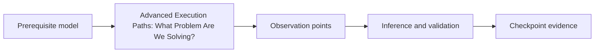

# Lesson 6.1 - Advanced Execution Paths: What Problem Are We Solving?

---

> **Lesson Objective**
>
> Frame advanced techniques as tradeoff decisions. By the end, you should be able to explain the concept, identify the evidence it creates, and describe the safety boundary that keeps the work in a controlled lab.

| Field | Value |
|---|---|
| Course | Malware Development and Implant Engineering |
| Module | 06 - Advanced Execution Paths, Syscalls, Unhooking, Patchless Concepts, and Threadless Patterns |
| Lesson | 6.1 - Advanced Execution Paths: What Problem Are We Solving? |
| Estimated Time | 35-60 minutes |
| Difficulty | Beginner to intermediate |

| Prerequisites | You will practice | Main outcome |
|---|---|---|
| Prior lessons in this module, Module 00 lab discipline, and a clean VM snapshot | problem-definition worksheet | A concrete lab artifact plus a defensible evidence note that separates observation, inference, validation, and cleanup |

> **Important**
>
> Keep this lesson inside a learner-owned, isolated lab. Use benign test programs, toy targets, simulated evidence, or diagrams. Do not aim the workflow at third-party systems or production environments.

> **Hands-On Requirement**
>
> Do not treat this as a reading-only lesson. Complete the build, run, inspect, worksheet, or simulation artifact requested by the practice section before moving on. If the lesson is conceptual, the required hands-on output is the diagram, comparison table, or evidence note that makes the concept concrete.

## Table of Contents

- [Lesson Map](#lesson-map)
- [Why This Lesson Matters](#why-this-lesson-matters)
- [Learning Objectives](#learning-objectives)
- [The Core Mental Model](#the-core-mental-model)
- [What This Helps Us Answer](#what-this-helps-us-answer)
- [Main Concepts](#main-concepts)
- [Walkthrough](#walkthrough)
- [Interpretation](#interpretation)
- [Common Mistakes](#common-mistakes)
- [Defender or Analyst View](#defender-or-analyst-view)
- [Practice](#practice)
- [Knowledge Check](#knowledge-check)
- [Answers](#answers)
- [Next Lesson Bridge](#next-lesson-bridge)

---

## Lesson Map

## Why This Lesson Matters

This lesson belongs to Arc 06A - API Layers and Hook-Aware Reasoning. Its job is to make the learner reason about advanced execution paths: what problem are we solving? as a set of mechanics, constraints, and observable side effects rather than as a technique name.

The topic matters because later modules depend on the same habit: describe what changed, identify what can be observed directly, and avoid treating unvalidated assumptions as facts.

## Learning Objectives

By the end of this lesson, you should be able to:

- explain the role of advanced execution paths: what problem are we solving? in the module progression
- identify the prerequisite concepts it depends on
- name at least three evidence surfaces connected to the topic
- separate direct observations from inferences
- describe one defender or analyst interpretation of the behavior
- state what remains out of scope for safety and progression

## The Core Mental Model

> **Mental Model**
>
> Treat the topic as a controlled state transition. Something exists before the action, something changes during the action, and evidence remains afterward. The learning goal is to map that transition without turning it into an uncontrolled operational recipe.

| Layer | Question to ask |
|---|---|
| Intent | What problem is this concept trying to solve in a lab design? |
| Mechanism | Which Windows object, file, memory region, module, event, or runtime state changes? |
| Observation | Which tool or note can show the change directly? |
| Inference | What conclusion is tempting but not proven yet? |
| Validation | What second observation would strengthen or disprove the conclusion? |
| Cleanup | What must be reversed before continuing? |

## What This Helps Us Answer

- What does this concept change about the program, process, binary, or architecture?
- What evidence would an analyst preserve?
- What does the learner need to validate before trusting the conclusion?
- Which safety boundary prevents this from becoming real-world deployment guidance?

## Main Concepts

| Concept | Practical meaning | Evidence angle |
|---|---|---|
| Scope | The lesson applies only to learner-owned lab artifacts | Scope statement and snapshot note |
| State | The topic changes file, memory, runtime, architecture, or telemetry state | Before/after table |
| Tradeoff | The design may improve one property while increasing complexity or visibility elsewhere | Decision note |
| Validation | One tool output is rarely the whole truth | Corroborating observation |

## Walkthrough

1. Re-open the module README and identify where this lesson sits in the learning arc.
2. Write the question this lesson is meant to answer.
3. Build, run, prepare, or simulate the smallest benign artifact that makes the concept observable.
4. Inspect the artifact with the relevant tool or worksheet.
5. Create a small before/after table for the concept.
6. Identify the tool output, screenshot, debugger state, process view, PE view, telemetry entry, or worksheet that provides direct evidence.
7. Write one inference that would require validation.
8. Record the cleanup or reset action expected after the hands-on exercise.

> **Practice**
>
> Build a one-page note for this lesson using the evidence notebook template. Include the objective, expected state transition, evidence surfaces, one inference, and one validation step.

## Interpretation

Interpretation is the difference between collecting artifacts and learning from them.

| Evidence | Strong interpretation | Weak interpretation |
|---|---|---|
| A visible file, import, event, memory region, or debugger state | "This was directly observed with this tool at this time." | "This proves the whole technique is invisible or successful." |
| A missing signal | "This tool did not show the signal under these conditions." | "The signal does not exist." |
| A behavior chain | "These observations support this hypothesis." | "The technique name explains everything." |

## Common Mistakes

- skipping the snapshot note
- mixing observation and inference in the same sentence
- treating a technique label as an explanation
- ignoring what an analyst or defender can still see
- moving into advanced variants before the baseline model is clear

## Defender or Analyst View

An analyst would ask:

- What changed on disk?
- What changed in process state?
- What changed in memory?
- What event or telemetry source could expose the behavior?
- What artifact remains after cleanup?
- What benign explanation could also fit the evidence?

This perspective is part of the lesson, not an afterthought.

## Practice

Complete a compact practice note:

| Prompt | Your answer |
|---|---|
| What did you build, run, inspect, or simulate? | |
| What is the concept? | |
| What state changes? | |
| What is directly observable? | |
| What is inferred? | |
| What validates the inference? | |
| What cleanup is required? | |

## Knowledge Check

1. Why should this lesson remain local-only or simulated?
2. What is one direct observation connected to advanced execution paths: what problem are we solving??
3. What is one inference that would need validation?
4. What would a defender or analyst ask about the behavior?
5. What should be captured in the evidence notebook?

## Answers

Show suggested answers

1. Because the course teaches controlled research mechanics and evidence discipline, not unauthorized operations.
2. A tool-visible state such as a file property, import table entry, process attribute, memory region, thread state, module list, event, or diagrammed architecture decision.
3. Any claim about intent, invisibility, success, or root cause that is not directly proven by the first observation.
4. They would ask what changed, which source observed it, what alternative explanations exist, and what telemetry or artifact remains.
5. Objective, snapshot, tool output, direct observations, inferences, validation steps, and cleanup notes.

## Next Lesson Bridge

The next step is WinAPI, NTAPI, Syscalls, and Versioning Risk. Carry forward the same evidence habit: observe first, infer carefully, validate deliberately, and reset the lab when the exercise is complete.
