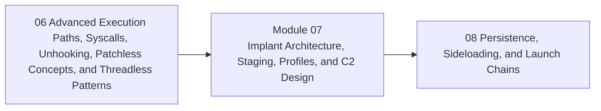

<div align="center">

# Module 07 - Implant Architecture, Staging, Profiles, and C2 Design

*Shift learners from isolated mechanisms to implant-system design using local-only, controlled architecture exercises.*

</div>

---

> **Start Here**
>
> Work through the lessons in order, complete the lab, then submit the module checkpoint evidence. Keep this module local-only, snapshot-backed, and evidence-driven.

## At a Glance

| Area | Details |
|---|---|
| Course | Malware Development and Implant Engineering |
| Module | 07 - Implant Architecture, Staging, Profiles, and C2 Design |
| Role | Shift learners from isolated mechanisms to implant-system design using local-only, controlled architecture exercises. |
| Why here | Learners now understand execution, loading, static visibility, telemetry, and advanced path tradeoffs. |
| Prepares next | Module 08 persistence and launch-chain reasoning. |

| Builds On | Core Artifact | Safety Boundary |
|---|---|---|
| Prior module checkpoint evidence and lab discipline | local-only beacon simulation architecture with component boundaries, task schema, config model, timing model, and observability review | Local-only or isolated lab artifacts |

---

## Module Position



---

## Lesson Path

| Lesson | Role in the Journey | Required practice |
|---|---|---|
| [7.1 - From Payload to Implant: Why Architecture Changes Everything](lessons/module-07-lesson-7-1-from-payload-to-implant-why-architecture-changes-everything.md) | Define implant as a system with lifecycle and state | component boundary sketch |
| [7.2 - Loader, Stager, Stage, Implant, and Capability Boundaries](lessons/module-07-lesson-7-2-loader-stager-stage-implant-and-capability-boundaries.md) | Separate roles that learners often conflate | role taxonomy |
| [7.3 - Reference Implant Architecture Blueprint](lessons/module-07-lesson-7-3-reference-implant-architecture-blueprint.md) | Introduce safe reference architecture | architecture diagram |
| [7.4 - Configuration Design and Runtime Settings](lessons/module-07-lesson-7-4-configuration-design-and-runtime-settings.md) | Teach config as controlled state | config schema worksheet |
| [7.5 - Beacon Loop Anatomy](lessons/module-07-lesson-7-5-beacon-loop-anatomy.md) | Explain tasking loop, sleep, retry, and state | loop diagram |
| [7.6 - Tasking Model and Command Boundaries](lessons/module-07-lesson-7-6-tasking-model-and-command-boundaries.md) | Define benign task structure and constraints | local task schema |
| [7.7 - Transport Abstraction and Local-Only Communication](lessons/module-07-lesson-7-7-transport-abstraction-and-local-only-communication.md) | Separate transport interface from behavior | loopback transport lab |
| [7.8 - Communication Profiles and Traffic Shape](lessons/module-07-lesson-7-8-communication-profiles-and-traffic-shape.md) | Teach headers, cadence, and behavior profiles conceptually | profile comparison |
| [7.9 - Transport Families and Tradeoffs](lessons/module-07-lesson-7-9-transport-families-and-tradeoffs.md) | Discuss HTTP-style, DNS-style, and alternate transports as architecture choices | transport matrix |
| [7.10 - Sleep, Jitter, Retry, Failure Handling, and Safe Test Modes](lessons/module-07-lesson-7-10-sleep-jitter-retry-failure-handling-and-safe-test-modes.md) | Explain timing as reliability and visibility factor | timing profile diagram |
| [7.11 - OPSEC as Engineering Constraint](lessons/module-07-lesson-7-11-opsec-as-engineering-constraint.md) | Teach what not to collect, transmit, or preserve | OPSEC checklist |
| [7.12 - Synthesis: Local-Only Beacon Simulation Design](lessons/module-07-lesson-7-12-synthesis-local-only-beacon-simulation-design.md) | Build a safe architecture plan and analyst view | module checkpoint |

---

## Hands-On Requirement

This module should not be read passively. Each lesson should produce a lab artifact: code, build output, debugger/process/PE observations, a telemetry note, an architecture diagram, or a checkpoint worksheet.

Use this loop throughout the module:

```text
build or prepare -> run or simulate -> inspect -> interpret -> clean up
```

---

## Learning Arcs

### Arc 07A - Implant Architecture

| Lesson | Title | Purpose | Practice |
|---|---|---|---|
| 7.1 | From Payload to Implant: Why Architecture Changes Everything | Define implant as a system with lifecycle and state | component boundary sketch |
| 7.2 | Loader, Stager, Stage, Implant, and Capability Boundaries | Separate roles that learners often conflate | role taxonomy |
| 7.3 | Reference Implant Architecture Blueprint | Introduce safe reference architecture | architecture diagram |

### Arc 07B - Local-Only Beacon Core

| Lesson | Title | Purpose | Practice |
|---|---|---|---|
| 7.4 | Configuration Design and Runtime Settings | Teach config as controlled state | config schema worksheet |
| 7.5 | Beacon Loop Anatomy | Explain tasking loop, sleep, retry, and state | loop diagram |
| 7.6 | Tasking Model and Command Boundaries | Define benign task structure and constraints | local task schema |
| 7.7 | Transport Abstraction and Local-Only Communication | Separate transport interface from behavior | loopback transport lab |

### Arc 07C - Profiles, Timing, and OPSEC

| Lesson | Title | Purpose | Practice |
|---|---|---|---|
| 7.8 | Communication Profiles and Traffic Shape | Teach headers, cadence, and behavior profiles conceptually | profile comparison |
| 7.9 | Transport Families and Tradeoffs | Discuss HTTP-style, DNS-style, and alternate transports as architecture choices | transport matrix |
| 7.10 | Sleep, Jitter, Retry, Failure Handling, and Safe Test Modes | Explain timing as reliability and visibility factor | timing profile diagram |
| 7.11 | OPSEC as Engineering Constraint | Teach what not to collect, transmit, or preserve | OPSEC checklist |
| 7.12 | Synthesis: Local-Only Beacon Simulation Design | Build a safe architecture plan and analyst view | module checkpoint |

---

## Required Artifacts

| Artifact | Path |
|---|---|
| Module lab | [labs/module-07-lab-01-implant-architecture-c2-synthesis.md](labs/module-07-lab-01-implant-architecture-c2-synthesis.md) |
| Module checkpoint | [checkpoints/module-07-checkpoint.md](checkpoints/module-07-checkpoint.md) |
| Reference cheat sheet | [references/module-07-reference-cheat-sheet.md](references/module-07-reference-cheat-sheet.md) |
| Gap analysis | [references/module-07-gap-analysis.md](references/module-07-gap-analysis.md) |

## Optional Deep Dives

- redirector concepts
- TLS fingerprinting concepts
- DNS and DoH tradeoffs
- profile design case studies
- encrypted staging design review

Deep dives are optional. They should not block the core path.

---

## Module Navigation

| Previous | Next |
|---|---|
| [06 - Advanced Execution Paths, Syscalls, Unhooking, Patchless Concepts, and Threadless Patterns](../06-advanced-execution-evasion/README.md) | [08 - Persistence, Sideloading, and Launch Chains](../08-persistence-launch-chains/README.md) |
