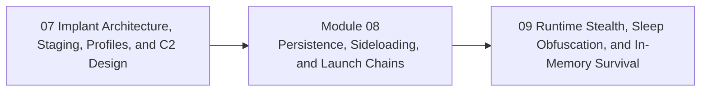

<div align="center">

# Module 08 - Persistence, Sideloading, and Launch Chains

*Teach re-execution, launch chains, and trusted-loading concepts as architectural choices with residue, cleanup, and safety costs.*

</div>

---

> **Start Here**
>
> Work through the lessons in order, complete the lab, then submit the module checkpoint evidence. Keep this module local-only, snapshot-backed, and evidence-driven.

## At a Glance

| Area | Details |
|---|---|
| Course | Malware Development and Implant Engineering |
| Module | 08 - Persistence, Sideloading, and Launch Chains |
| Role | Teach re-execution, launch chains, and trusted-loading concepts as architectural choices with residue, cleanup, and safety costs. |
| Why here | Persistence makes sense after learners understand what an implant lifecycle is preserving. |
| Prepares next | Module 09 runtime stealth and in-memory survival. |

| Builds On | Core Artifact | Safety Boundary |
|---|---|---|
| Prior module checkpoint evidence and lab discipline | persistence and launch-chain design review including purpose, mechanism family, residue, cleanup, telemetry, and justification | Local-only or isolated lab artifacts |

---

## Module Position



---

## Lesson Path

| Lesson | Role in the Journey | Required practice |
|---|---|---|
| [8.1 - Persistence as Re-Execution, Not Magic Survival](lessons/module-08-lesson-8-1-persistence-as-re-execution-not-magic-survival.md) | Define persistence precisely | persistence taxonomy |
| [8.2 - Launch Persistence vs Runtime Stealth](lessons/module-08-lesson-8-2-launch-persistence-vs-runtime-stealth.md) | Separate startup survival from memory concealment | comparison table |
| [8.3 - Common Persistence Surfaces and Reversibility](lessons/module-08-lesson-8-3-common-persistence-surfaces-and-reversibility.md) | Teach registry, task, service, WMI, and startup concepts safely | host-state map and cleanup plan |
| [8.4 - DLL Search Order and Sideloading Fundamentals](lessons/module-08-lesson-8-4-dll-search-order-and-sideloading-fundamentals.md) | Explain search-path reasoning | search-order diagram |
| [8.5 - Trusted Execution Hijacking and Load-Chain Reasoning](lessons/module-08-lesson-8-5-trusted-execution-hijacking-and-load-chain-reasoning.md) | Discuss trust assumptions and staged launch behavior | trust-boundary map |
| [8.6 - Packers, Loaders, and PE Manipulation in Launch Chains](lessons/module-08-lesson-8-6-packers-loaders-and-pe-manipulation-in-launch-chains.md) | Place packing/loading in lifecycle context without duplicating Module 04 | lifecycle placement table |
| [8.7 - Persistence Telemetry and Forensic Residue](lessons/module-08-lesson-8-7-persistence-telemetry-and-forensic-residue.md) | Map persistence to defender observations | telemetry table |
| [8.8 - When Persistence Is Not Worth the Cost](lessons/module-08-lesson-8-8-when-persistence-is-not-worth-the-cost.md) | Teach restraint and design judgement | decision exercise |
| [8.9 - Synthesis: Launch Chain and Persistence Design Review](lessons/module-08-lesson-8-9-synthesis-launch-chain-and-persistence-design-review.md) | Consolidate safe, reversible reasoning | module checkpoint |

---

## Hands-On Requirement

This module should not be read passively. Each lesson should produce a lab artifact: code, build output, debugger/process/PE observations, a telemetry note, an architecture diagram, or a checkpoint worksheet.

Use this loop throughout the module:

```text
build or prepare -> run or simulate -> inspect -> interpret -> clean up
```

---

## Learning Arcs

### Arc 08A - Persistence as Lifecycle Design

| Lesson | Title | Purpose | Practice |
|---|---|---|---|
| 8.1 | Persistence as Re-Execution, Not Magic Survival | Define persistence precisely | persistence taxonomy |
| 8.2 | Launch Persistence vs Runtime Stealth | Separate startup survival from memory concealment | comparison table |
| 8.3 | Common Persistence Surfaces and Reversibility | Teach registry, task, service, WMI, and startup concepts safely | host-state map and cleanup plan |

### Arc 08B - Sideloading and Launch Chains

| Lesson | Title | Purpose | Practice |
|---|---|---|---|
| 8.4 | DLL Search Order and Sideloading Fundamentals | Explain search-path reasoning | search-order diagram |
| 8.5 | Trusted Execution Hijacking and Load-Chain Reasoning | Discuss trust assumptions and staged launch behavior | trust-boundary map |
| 8.6 | Packers, Loaders, and PE Manipulation in Launch Chains | Place packing/loading in lifecycle context without duplicating Module 04 | lifecycle placement table |

### Arc 08C - Residue, Restraint, and Review

| Lesson | Title | Purpose | Practice |
|---|---|---|---|
| 8.7 | Persistence Telemetry and Forensic Residue | Map persistence to defender observations | telemetry table |
| 8.8 | When Persistence Is Not Worth the Cost | Teach restraint and design judgement | decision exercise |
| 8.9 | Synthesis: Launch Chain and Persistence Design Review | Consolidate safe, reversible reasoning | module checkpoint |

---

## Required Artifacts

| Artifact | Path |
|---|---|
| Module lab | [labs/module-08-lab-01-persistence-launch-chains-synthesis.md](labs/module-08-lab-01-persistence-launch-chains-synthesis.md) |
| Module checkpoint | [checkpoints/module-08-checkpoint.md](checkpoints/module-08-checkpoint.md) |
| Reference cheat sheet | [references/module-08-reference-cheat-sheet.md](references/module-08-reference-cheat-sheet.md) |
| Gap analysis | [references/module-08-gap-analysis.md](references/module-08-gap-analysis.md) |

## Optional Deep Dives

- transacted, ghosted, and herpaderped loading concepts
- KnownDLL poisoning as historical boundary topic
- driver and BYOVD concepts as non-core advanced reading

Deep dives are optional. They should not block the core path.

---

## Module Navigation

| Previous | Next |
|---|---|
| [07 - Implant Architecture, Staging, Profiles, and C2 Design](../07-implant-architecture-c2/README.md) | [09 - Runtime Stealth, Sleep Obfuscation, and In-Memory Survival](../09-runtime-stealth/README.md) |
