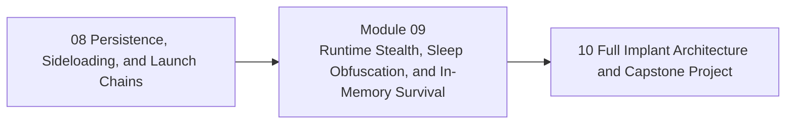

<div align="center">

# Module 09 - Runtime Stealth, Sleep Obfuscation, and In-Memory Survival

*Teach how runtime behavior and memory state change over time, especially during idle periods.*

</div>

---

> **Start Here**
>
> Work through the lessons in order, complete the lab, then submit the module checkpoint evidence. Keep this module local-only, snapshot-backed, and evidence-driven.

## At a Glance

| Area | Details |
|---|---|
| Course | Malware Development and Implant Engineering |
| Module | 09 - Runtime Stealth, Sleep Obfuscation, and In-Memory Survival |
| Role | Teach how runtime behavior and memory state change over time, especially during idle periods. |
| Why here | Learners understand execution, telemetry, implant architecture, and lifecycle controls. |
| Prepares next | Module 10 capstone integration. |

| Builds On | Core Artifact | Safety Boundary |
|---|---|---|
| Prior module checkpoint evidence and lab discipline | active/idle runtime state timeline with memory observations, timing behavior, residual signals, and validation limits | Local-only or isolated lab artifacts |

---

## Module Position



---

## Lesson Path

| Lesson | Role in the Journey | Required practice |
|---|---|---|
| [9.1 - Runtime Threat Model and Dwell-Time Exposure](lessons/module-09-lesson-9-1-runtime-threat-model-and-dwell-time-exposure.md) | Define what runtime stealth is trying to reduce | threat model worksheet |
| [9.2 - Active State vs Idle State](lessons/module-09-lesson-9-2-active-state-vs-idle-state.md) | Separate behavior while working from behavior while sleeping | state transition diagram |
| [9.3 - Memory Regions, Protections, and Runtime Visibility](lessons/module-09-lesson-9-3-memory-regions-protections-and-runtime-visibility.md) | Reconnect memory model to live process inspection | memory visibility map |
| [9.4 - Sleep Behavior, Timing Profiles, and Cadence](lessons/module-09-lesson-9-4-sleep-behavior-timing-profiles-and-cadence.md) | Teach sleep, jitter, and timing as visibility factors | timing profile comparison |
| [9.5 - Sleep Obfuscation Families at a Conceptual Level](lessons/module-09-lesson-9-5-sleep-obfuscation-families-at-a-conceptual-level.md) | Compare families without recipe focus | family matrix |
| [9.6 - Code, Region, Stack, and Context Visibility During Idle States](lessons/module-09-lesson-9-6-code-region-stack-and-context-visibility-during-idle-states.md) | Explain memory and call-stack transformations | active/idle before-after table |
| [9.7 - Timers, Threadpool, Callback, and VEH-Assisted Runtime Patterns](lessons/module-09-lesson-9-7-timers-threadpool-callback-and-veh-assisted-runtime-patterns.md) | Discuss alternate scheduling and control-flow surfaces | scheduling map |
| [9.8 - Behavioral Camouflage and Runtime Stealth Failure Modes](lessons/module-09-lesson-9-8-behavioral-camouflage-and-runtime-stealth-failure-modes.md) | Explain mimicry, crashes, missed cleanup, and residual signals | failure-mode matrix |
| [9.9 - Synthesis: Reconstructing Runtime State Over Time](lessons/module-09-lesson-9-9-synthesis-reconstructing-runtime-state-over-time.md) | Teach timeline reconstruction and validation limits | module checkpoint |

---

## Hands-On Requirement

This module should not be read passively. Each lesson should produce a lab artifact: code, build output, debugger/process/PE observations, a telemetry note, an architecture diagram, or a checkpoint worksheet.

Use this loop throughout the module:

```text
build or prepare -> run or simulate -> inspect -> interpret -> clean up
```

---

## Learning Arcs

### Arc 09A - Runtime Threat Model

| Lesson | Title | Purpose | Practice |
|---|---|---|---|
| 9.1 | Runtime Threat Model and Dwell-Time Exposure | Define what runtime stealth is trying to reduce | threat model worksheet |
| 9.2 | Active State vs Idle State | Separate behavior while working from behavior while sleeping | state transition diagram |
| 9.3 | Memory Regions, Protections, and Runtime Visibility | Reconnect memory model to live process inspection | memory visibility map |

### Arc 09B - Sleep and Memory-State Transitions

| Lesson | Title | Purpose | Practice |
|---|---|---|---|
| 9.4 | Sleep Behavior, Timing Profiles, and Cadence | Teach sleep, jitter, and timing as visibility factors | timing profile comparison |
| 9.5 | Sleep Obfuscation Families at a Conceptual Level | Compare families without recipe focus | family matrix |
| 9.6 | Code, Region, Stack, and Context Visibility During Idle States | Explain memory and call-stack transformations | active/idle before-after table |
| 9.7 | Timers, Threadpool, Callback, and VEH-Assisted Runtime Patterns | Discuss alternate scheduling and control-flow surfaces | scheduling map |

### Arc 09C - Limits and Analyst Reconstruction

| Lesson | Title | Purpose | Practice |
|---|---|---|---|
| 9.8 | Behavioral Camouflage and Runtime Stealth Failure Modes | Explain mimicry, crashes, missed cleanup, and residual signals | failure-mode matrix |
| 9.9 | Synthesis: Reconstructing Runtime State Over Time | Teach timeline reconstruction and validation limits | module checkpoint |

---

## Required Artifacts

| Artifact | Path |
|---|---|
| Module lab | [labs/module-09-lab-01-runtime-stealth-synthesis.md](labs/module-09-lab-01-runtime-stealth-synthesis.md) |
| Module checkpoint | [checkpoints/module-09-checkpoint.md](checkpoints/module-09-checkpoint.md) |
| Reference cheat sheet | [references/module-09-reference-cheat-sheet.md](references/module-09-reference-cheat-sheet.md) |
| Gap analysis | [references/module-09-gap-analysis.md](references/module-09-gap-analysis.md) |

## Optional Deep Dives

- named sleep-obfuscation families
- code caves
- memory reallocation patterns
- working-hours logic
- deeper VEH-assisted flows

Deep dives are optional. They should not block the core path.

---

## Module Navigation

| Previous | Next |
|---|---|
| [08 - Persistence, Sideloading, and Launch Chains](../08-persistence-launch-chains/README.md) | [10 - Full Implant Architecture and Capstone Project](../10-capstone/README.md) |
