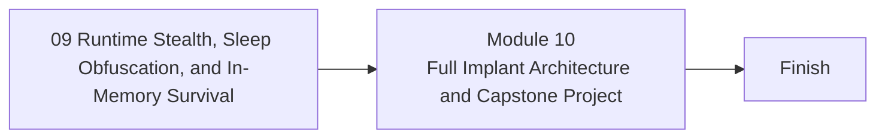

<div align="center">

# Module 10 - Full Implant Architecture and Capstone Project

*Integrate all prior modules into a controlled, local-only reference architecture and evaluate reasoning, not real-world deployability.*

</div>

---

> **Start Here**
>
> Work through the lessons in order, complete the lab, then submit the module checkpoint evidence. Keep this module local-only, snapshot-backed, and evidence-driven.

## At a Glance

| Area | Details |
|---|---|
| Course | Malware Development and Implant Engineering |
| Module | 10 - Full Implant Architecture and Capstone Project |
| Role | Integrate all prior modules into a controlled, local-only reference architecture and evaluate reasoning, not real-world deployability. |
| Why here | Learners now have the foundations, execution models, telemetry reasoning, architecture concepts, persistence tradeoffs, and runtime-state models needed for synthesis. |
| Prepares next | Independent research, detection engineering, reverse engineering, or responsible red-team tooling study. |

| Builds On | Core Artifact | Safety Boundary |
|---|---|---|
| Prior module checkpoint evidence and lab discipline | final evidence pack with architecture diagram, component map, lab notes, telemetry matrix, safety review, analyst review, and design defense | Local-only or isolated lab artifacts |

---

## Module Position



---

## Lesson Path

| Lesson | Role in the Journey | Required practice |
|---|---|---|
| [10.1 - Capstone Scope, Safety Boundary, and Success Criteria](lessons/module-10-lesson-10-1-capstone-scope-safety-boundary-and-success-criteria.md) | Define what the capstone is and is not | capstone charter |
| [10.2 - Final Implant Architecture Blueprint](lessons/module-10-lesson-10-2-final-implant-architecture-blueprint.md) | Create component design and boundaries | architecture diagram |
| [10.3 - Loader, Stager, Beacon, Config, and Lifecycle Milestone Plan](lessons/module-10-lesson-10-3-loader-stager-beacon-config-and-lifecycle-milestone-plan.md) | Plan integration safely | milestone plan |
| [10.4 - Milestone 1: Skeleton, Interfaces, and Safe Test Mode](lessons/module-10-lesson-10-4-milestone-1-skeleton-interfaces-and-safe-test-mode.md) | Validate component boundaries | skeleton review |
| [10.5 - Milestone 2: Local-Only Tasking Loop and Transport](lessons/module-10-lesson-10-5-milestone-2-local-only-tasking-loop-and-transport.md) | Validate benign local tasking | local loop evidence |
| [10.6 - Milestone 3: Config, Timing, and Lifecycle Controls](lessons/module-10-lesson-10-6-milestone-3-config-timing-and-lifecycle-controls.md) | Validate config and cadence | timing evidence |
| [10.7 - Milestone 4: Static and Runtime Visibility Review](lessons/module-10-lesson-10-7-milestone-4-static-and-runtime-visibility-review.md) | Apply prior modules as controlled observations | visibility evidence |
| [10.8 - Telemetry and Analyst Review of the Capstone](lessons/module-10-lesson-10-8-telemetry-and-analyst-review-of-the-capstone.md) | Reverse-analyze the learner's own design | analyst evidence note |
| [10.9 - Operational Safety, OPSEC, and Final Architecture Defense](lessons/module-10-lesson-10-9-operational-safety-opsec-and-final-architecture-defense.md) | Review safe testing, reset, limitations, and tradeoffs | written defense |
| [10.10 - Responsible Research Paths After the Course](lessons/module-10-lesson-10-10-responsible-research-paths-after-the-course.md) | Point learners toward safe specialization paths | learning plan |

---

## Hands-On Requirement

This module should not be read passively. Each lesson should produce a lab artifact: code, build output, debugger/process/PE observations, a telemetry note, an architecture diagram, or a checkpoint worksheet.

Use this loop throughout the module:

```text
build or prepare -> run or simulate -> inspect -> interpret -> clean up
```

---

## Learning Arcs

### Arc 10A - Capstone Design

| Lesson | Title | Purpose | Practice |
|---|---|---|---|
| 10.1 | Capstone Scope, Safety Boundary, and Success Criteria | Define what the capstone is and is not | capstone charter |
| 10.2 | Final Implant Architecture Blueprint | Create component design and boundaries | architecture diagram |
| 10.3 | Loader, Stager, Beacon, Config, and Lifecycle Milestone Plan | Plan integration safely | milestone plan |

### Arc 10B - Controlled Build Milestones

| Lesson | Title | Purpose | Practice |
|---|---|---|---|
| 10.4 | Milestone 1: Skeleton, Interfaces, and Safe Test Mode | Validate component boundaries | skeleton review |
| 10.5 | Milestone 2: Local-Only Tasking Loop and Transport | Validate benign local tasking | local loop evidence |
| 10.6 | Milestone 3: Config, Timing, and Lifecycle Controls | Validate config and cadence | timing evidence |
| 10.7 | Milestone 4: Static and Runtime Visibility Review | Apply prior modules as controlled observations | visibility evidence |

### Arc 10C - Review, Defense, and Next Steps

| Lesson | Title | Purpose | Practice |
|---|---|---|---|
| 10.8 | Telemetry and Analyst Review of the Capstone | Reverse-analyze the learner's own design | analyst evidence note |
| 10.9 | Operational Safety, OPSEC, and Final Architecture Defense | Review safe testing, reset, limitations, and tradeoffs | written defense |
| 10.10 | Responsible Research Paths After the Course | Point learners toward safe specialization paths | learning plan |

---

## Required Artifacts

| Artifact | Path |
|---|---|
| Module lab | [labs/module-10-lab-01-capstone-synthesis.md](labs/module-10-lab-01-capstone-synthesis.md) |
| Module checkpoint | [checkpoints/module-10-checkpoint.md](checkpoints/module-10-checkpoint.md) |
| Reference cheat sheet | [references/module-10-reference-cheat-sheet.md](references/module-10-reference-cheat-sheet.md) |
| Gap analysis | [references/module-10-gap-analysis.md](references/module-10-gap-analysis.md) |

## Optional Deep Dives

- optional persistence branch
- optional runtime branch
- optional profile branch
- optional Rust rewrite branch
- optional detection-engineering branch

Deep dives are optional. They should not block the core path.

---

## Module Navigation

| Previous | Next |
|---|---|
| [09 - Runtime Stealth, Sleep Obfuscation, and In-Memory Survival](../09-runtime-stealth/README.md) | Course complete |
